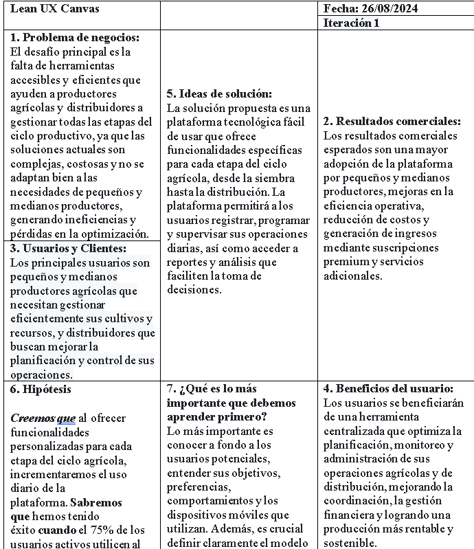
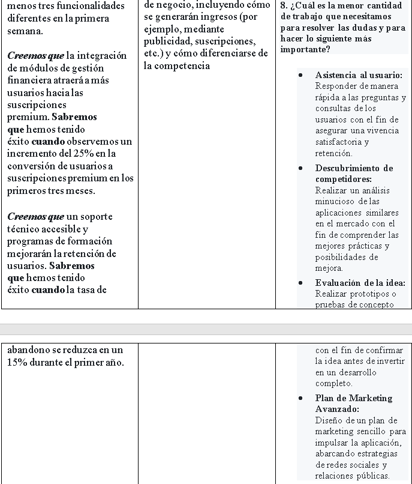
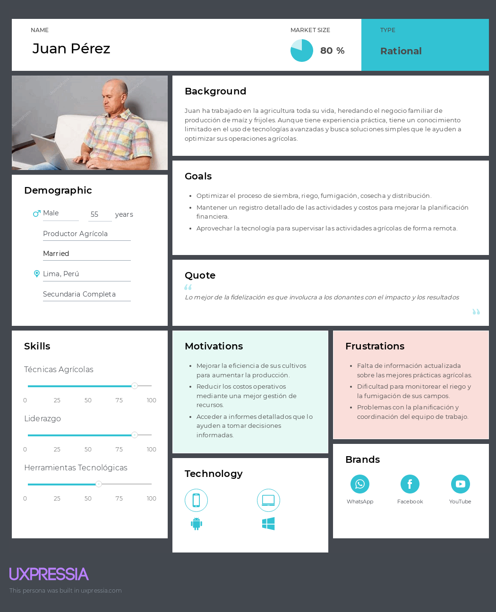
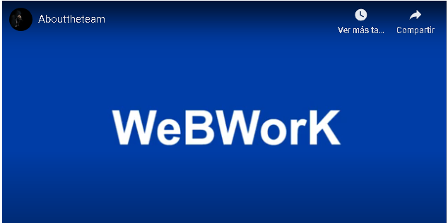

# <center>COURSE PROJECT</center>

<p align="center">
    <strong>Universidad Peruana de Ciencias Aplicadas</strong><br>
    <br>
    <strong>Ingeniería de Software</strong><br>
    <strong>Desarrollo de Aplicaciones Open Source - WX55</strong><br>
    <strong>Profesor: Angel Augusto Velasquez Nuñez </strong><br>
    <br>INFORME DEL TRABAJO FINAL
    <br> 2024 - 2
</p>


# Registro de Versiones del Informe
| Version | Fecha      | Autor             | Descripcion de Modificacion                                                    |
|---------|------------|-------------------|--------------------------------------------------------------------------------|
| 0.0.1   | 17/09/2024 | Gonzalo Quedena   | Agregado del capítulo 1 apartado 1.1 - 1.2 - 1.3                               |
| 0.0.2   | 21/09/2024 | Johan Príncipe    | Agregado del capítulo 2 apartado 2.1 - 2.2 - 2.3                               |
| 0.0.3   | 24/09/2024 | André Alonso      | Agregado del capítulo 3 apartado 3.1 - 3.2 - 3.3 - 3.4                         |
| 0.0.4   | 26/09/2024 | Sebastián Aiquipa | Agregado del capítulo 4 apartado 4.1 - 4.2 - 4.3 - 4.4 - 4.5 - 4.6 - 4.7 - 4.8 |
| 0.0.5   | 28/09/2024 | Alejandro Espino  | Capítulo 5 apartado 5.1 - 5.2 Conclusiones, Anexos, Bibliografía.              |
| 0.0.6   | 22/09/2024 | Gonzalo Quedena   | Agregado de introducción de capítulos 1 2 & sus secciones derivadas            |
| 0.0.7   | 22/09/2024 | André Alonso      | Agregado de introducción de capítulos 3, 4 & sus secciones derivadas           |
| 0.0.8   | 23/09/2024 | Gonzalo Quedena   | Unión de los capítulos 1, 2, 3, 4, 5 y sus secciones respectivas               |
| 0.0.9   | 15/10/2024 | Gonzalo Quedena   | Desarrollo Sprint 3 & Secciones 5.2.3.1, 5.2.3.2, 5.2.3.3                      |
| 0.1.0   | 18/10/2024 | Hardie Holguin    | Desarrollo Sprint 3 & Secciones 5.2.3.4, 5.2.3.5, 5.2.3.6                      |
| 0.1.1   | 19/10/2024 | Alejandro Espino  | Desarrollo Sprint 3 & Secciones 5.2.3.7, 5.2.3.8,                              |
| 0.1.2   | 20/10/2024 | Hardie Holguin    | Video about the product                                                        |


# Project Report Collaboration Insights
Link de la organizacion: https://github.com/orgs/W3bW0rks/repositories  
Link del reporte: https://github.com/W3bW0rks/project-report  
Link Landing Page: https://agrocontrol-landing-page-upc.vercel.app   
URL del repositorio GitHub: https://github.com/orgs/W3bW0rks/repositories

TB1: Todo el equipo de trabajo colaboró en el desarrollo del sistema, dividiendo de manera equitativa las tareas entre los miembros. Además, colaboramos conjuntamente en aspectos clave, como las entrevistas con los usuarios y el desarrollo de la landing page. Este enfoque integral y cooperativo nos permitió garantizar la calidad y eficiencia en todas las etapas del proyecto.  

* Los contenidos asignados a cada miembro fueron redactados y organizados en formato Markdown, y se realizaron commits para asegurar el avance en el repositorio.
* Se generaron los artefactos necesarios utilizando las herramientas recomendadas, obteniendo enlaces de imagen desde la carpeta "assets" ubicada en la rama develop del repositorio del informe.
* Se programaron reuniones para coordinar el avance de los elementos del informe y comunicar los progresos del Sprint 1, cuyo enfoque es la Landing Page.  


TP: Se han cumplido las tareas designadas para la entrega del TP, las cuales han sido debidamente documentadas en el repositorio de GitHub de la organización del equipo.

* Se redactaron y diagramaron los contenidos asignados a cada integrante en formato Markdown, seguido de commits para asegurar el seguimiento del progreso en el repositorio.
* Se generaron los artefactos necesarios utilizando las herramientas recomendadas.
* Se llevaron a cabo reuniones para coordinar el avance de los elementos del informe y comunicar los progresos del Sprint 2, centrado en el desarrollo de la Web App.

TB2: Se han cumplido las tareas asignadas para la entrega del TB2, las cuales han sido debidamente documentadas en el repositorio de GitHub de la organización del equipo.  

* Se prepararon y estructuraron los contenidos asignados a cada miembro del equipo en formato Markdown.
* Se realizaron commits para asegurar el seguimiento del progreso en el repositorio.
* Se generaron los artefactos necesarios utilizando las herramientas recomendadas.
* Se llevaron a cabo reuniones para coordinar el avance de los componentes del informe.
* Se comunicaron los progresos del Sprint 3, que se centró en el desarrollo de la API.  

  

TP: Se han cumplido las tareas asignadas para la entrega del TP, las cuales han sido debidamente documentadas en el repositorio de GitHub de la organización del equipo.
* Se prepararon y estructuraron los contenidos asignados a cada miembro del equipo en formato Markdown.
* Se realizaron commits para asegurar el seguimiento del progreso en el repositorio.
* Se generaron los artefactos necesarios utilizando las herramientas recomendadas.
* Se llevaron a cabo reuniones para coordinar el avance de los componentes del informe.
* Se comunicaron los progresos del Sprint 4, que se centró en el despliegue completo de la aplicación, incluyendo tanto el backend como el frontend.    

<br/>

# Student Outcome
<table>
  <thead>
    <tr>
      <th>Criterio Específico</th>
      <th>Acciones Realizadas</th>
      <th>Conclusiones</th>
    </tr>
  </thead>
  <tbody>
    <tr>
      <td>Comunica oralmente sus ideas y/o resultados con objetividad a público de diferentes especialidades y niveles jerárquicos, en el marco del desarrollo de un proyecto en ingeniería</td>
      <td>
        <strong>Gonzalo Quedena:</strong><br>
         <em>TB1:</em> El equipo de trabajo colaboró de manera conjunta en el desarrollo del sistema, distribuyendo equitativamente las tareas entre sus miembros. Además, trabajamos juntos en aspectos clave como las entrevistas con los usuarios y el desarrollo de la landing page. Este enfoque integral y colaborativo nos permitió asegurar calidad y eficiencia en todas las fases del proyecto. A través de una comunicación clara y objetiva, compartimos nuestras ideas y resultados con públicos de diversas especialidades y niveles jerárquicos durante el desarrollo del proyecto de ingeniería.<br><br>
        <em>TP:</em> Al desarrollar la vista de registro de productos para el proyecto, presenté reportes claros que muestran el avance alcanzado. En las reuniones de seguimiento, fomenté el intercambio de ideas para asegurar que el equipo comprendiera la relevancia de cada componente, fortaleciendo la colaboración y el compromiso con los objetivos del proyecto.<br><br>
         <em>TB2: </em>He comunicado los avances y resultados del desarrollo del backend de manera clara y objetiva, adaptándome a audiencias de diversas especialidades y niveles jerárquicos. Esto ha facilitado una comprensión compartida y alineada del proyecto dentro del equipo de ingeniería.<br><br>
         <strong>Johan Príncipe:</strong><br>
         <em>TB1:</em> Presenté el análisis competitivo y las estrategias de forma clara, adaptada a diferentes niveles jerárquicos. En las entrevistas, expuse los hallazgos clave de manera concisa para facilitar la comprensión de nuestros segmentos objetivos. Durante la fase de needfinding, comuniqué los resultados del User Journey Mapping y Empathy Mapping, asegurando que todos entendieran los insights esenciales para alinear el proyecto.<br><br>
         <em>TP:</em> Al diseñar e implementar formularios y vistas del proyecto, presenté informes claros que destacan los avances de este. Durante reuniones de seguimiento, fomente la retroalimentación, asegurando que mis compañeros entiendan la importancia de cada componente, para fortalecer colaboración y el compromiso con los objetivos del proyecto.<br><br>
        <em>TB2: </em>Para esta entrega, comuniqué y expresé de manera clara el objetivo a lograr. Asimismo, compartí conocimientos para apoyar y aprender junto a mi equipo.<br><br>
        <strong>André Arroyo:</strong><br>
        <em>TB1:</em> Durante esta entrega, presenté el desarrollo del capítulo 3, donde expliqué de forma clara los escenarios To-Be, el mapeo de impacto y el backlog del producto. También expuse los diagramas C4 del capítulo 4, proporcionando una visión general de la arquitectura propuesta para el backend. Finalmente, detallé los apartados 5.1.1, 5.1.2 y 5.1.3 del capítulo 5, cubriendo la configuración del entorno de desarrollo, la gestión del código fuente y las convenciones de estilo.<br><br>
        <em>TP:</em> En esta fase, compartí los avances del capítulo 3 en reuniones de equipo, explicando las nuevas user stories orientadas al front-end, accesibilidad, y la configuración de una API simulada (fake API). Realicé una presentación del navbar y el componente de inicio (home) para los procesos agrícolas, destacando su funcionalidad y cómo cada elemento facilita la usabilidad del sistema. La explicación estructurada de cada componente y su impacto permitió a todos los miembros del equipo, sin importar su especialidad, comprender su relevancia dentro del proyecto y alinear sus esfuerzos.<br><br>
        <em>TB2:</em> Para esta entrega, presenté las nuevas user stories relacionadas con el backend. En particular, abordé mis tareas en los contextos de IAM y Profile, destacando la implementación de aspectos de seguridad como JWT, la encriptación de contraseñas y la proteccion de rutas mediante guard. En reuniones técnicas, adapté la explicación para que los miembros del equipo pudieran entender el rol de estos elementos en la seguridad y su impacto en la integración del sistema. Esta comunicación efectiva ayudó a lograr una comprensión compartida de las medidas de seguridad implementadas.<br><br>
        <strong>Alejandro Espino Flores:</strong><br>
        <em>TB1:</em>  Presenté los diseños de mockups y wireframes de la landing page y la aplicación web de manera clara y estructurada, asegurando que los diferentes miembros del equipo, independientemente de su nivel técnico, comprendieran la propuesta visual y funcional. En reuniones de seguimiento, expuse los principios de diseño y arquitectura de la información, facilitando la toma de decisiones alineadas con las guías de estilo del proyecto. Además, durante las presentaciones a stakeholders, utilicé un lenguaje accesible y objetivos concretos para destacar la importancia de cada componente, fomentando un entendimiento común y alineación con los objetivos del proyecto.<br><br>
        <em>TP:</em> Durante la implementación de las vistas y formularios para la sección de fields, presenté los avances del proyecto de manera clara y estructurada en reuniones de equipo. Realicé demostraciones de las funcionalidades y expliqué el propósito y funcionamiento de cada vista, promoviendo un ambiente de colaboración en el que mis compañeros podían ofrecer retroalimentación. Esto aseguró que todos comprendieran la importancia de cada componente en el contexto del proyecto y fortaleció la alineación con los objetivos establecidos.<br><br>
        <em>TB2:</em>En la desarrollo del backend, me encargué de la implementación de endpoints. En presentaciones y reuniones técnicas, comuniqué los detalles de cada endpoint, resaltando su funcionalidad y su integración con el sistema general. Adapté mi comunicación para que tanto colegas técnicos como aquellos de otras áreas pudieran comprender el impacto de estos desarrollos, asegurando que todos los involucrados en el proyecto compartieran una visión común sobre los resultados alcanzados.<br><br>
        <strong>Hardie Holguin:</strong><br>
        <em>TB2:</em> En el desarrollo de los servicios backend, presenté los endpoints de manejo de payment, explicando su funcionalidad y los datos implicados en cada proceso. Durante las reuniones, adapté el lenguaje técnico para que pudieran entender los beneficios y el impacto de estos servicios en el proyecto. Esta claridad ayudó a unificar la visión entre todos los involucrados, promoviendo una colaboración efectiva y orientada a los objetivos del sistema.<br><br>
      </td>
      <td></td>
    </tr>
    <tr>
      <td>Comunica en forma escrita ideas y/o resultados con objetividad a público de diferentes especialidades y niveles jerárquicos, en el marco del desarrollo de un proyecto en ingeniería</td>
      <td>
        <strong>Gonzalo Quedena:</strong><br>
        <em>TB1:</em> Para esta entrega, se realizó un análisis detallado de las necesidades de los productores agrícolas y distribuidores a través de entrevistas. Además, se implementó un diseño UX/UI apropiado, y se llevó a cabo un análisis exhaustivo de la competencia para identificar las características diferenciadoras de nuestro sistema de gestión agrícola. Estos resultados se comunicaron de manera escrita con objetividad, permitiendo que públicos de diversas especialidades y niveles jerárquicos comprendan el avance del proyecto en ingeniería.<br><br>
         <em>TP:</em> Redacté los informes de progreso sobre el diseño de la vista de registro de productos y el pop-up de detalles, presentando las mejoras de forma clara para facilitar la toma de decisiones y asegurar que el equipo esté alineado con los objetivos del proyecto.<br><br>   
         <em>TB2:</em> El equipo ha comunicado por escrito los avances y resultados del desarrollo del backend de forma objetiva y accesible, adaptando el lenguaje para audiencias de distintas especialidades y niveles jerárquicos. Esto ha permitido una comprensión alineada y clara del proyecto entre todos los involucrados.<br><br>
         <strong>Johan Príncipe:</strong><br>
        <em>TB1:</em> Documenté el análisis competitivo y las entrevistas de forma precisa y accesible para distintos equipos. Esto permitió que los hallazgos fueran fácilmente tomados en cuenta para el desarrollo de la aplicación.<br><br>
	<em>TB1:</em> Redacté los informes de progreso sobre el diseño de formularios y vistas, presenté las mejoras del proyecto para que sean comprensibles. Esto facilita la toma de decisiones y asegura que todos estén alineados con los objetivos del proyecto.<br><br>
        <em>TB2:</em>Se documentó los diferentes archivos dentro del backend para un mejor entendimiento de las funciones de este. Además, se mostraron los resultados de manera eficiente dentro del reporte de la aplicación.<br><br>
        <strong>André Arroyo:</strong><br>
        <em>TB1:</em> En esta entrega, desarrollé el capítulo 3, en el cual identifiqué y documenté los segmentos objetivos y recopilé los requerimientos de software. Realicé diagramas C4 para ilustrar la arquitectura del backend, y documenté detalladamente las tecnologías seleccionadas para el proyecto. También participé en la creación de la landing page, detallando su estructura y propósito en el contexto general del proyecto.<br><br>
        <em>TP:</em> En esta fase, amplié el capítulo 3 agregando user stories que cubren aspectos del front-end, accesibilidad y la configuración de una API simulada (fake API). Además, implementé el navbar y el componente de inicio (home) específico para los procesos agrícolas. Documenté cada componente desarrollado y su funcionalidad para asegurar una comprensión clara del impacto de estas implementaciones.<br><br>
        <em>TB2:</em> En esta entrega, agregué nuevas user stories para el desarrollo del backend. El equipo dividió el backend por bounded contexts; se me asignaron los contextos de IAM y Profile. En ellos, abordé aspectos de seguridad, incluyendo la implementación de JWT y la encriptación de contraseñas, y documenté cada endpoint implementado, especificando su integración en el front-end. Este enfoque facilitó la comprensión de la arquitectura de seguridad y la integración entre el backend y el frontend.<br><br>
        <strong>Alejandro Espino Flores:</strong><br>
        <em>TB1:</em> Documenté el desarrollo del mockup y wireframe de la landing page y la aplicación web, asegurando una estructura visual clara y funcional que sigue las pautas de diseño y arquitectura de la información. En los informes, detallé cada componente del diseño con un lenguaje objetivo y accesible, facilitando la comprensión para públicos de diferentes especialidades. Además, incluí guías de estilo y explicaciones de la arquitectura de la información para garantizar que los lectores, sin importar su nivel técnico, comprendieran la justificación y funcionalidad de las decisiones de diseño.<br><br>
        <em>TP:</em> Durante la implementación de las vistas y formularios para la sección de fields, documenté los avances de manera detallada y clara, asegurando que cada reporte incluyera una descripción funcional de los componentes desarrollados y su relevancia dentro del proyecto. Además, elaboré documentos que explicaban el flujo de datos y la interacción de las vistas con el resto del sistema, facilitando la comprensión de los componentes tanto para el equipo técnico como para los colaboradores de otras áreas. Esta documentación promovió la alineación en el equipo y permitió un seguimiento eficiente de los progresos.<br><br>
        <em>TB2:</em> En el desarrollo del backend, fui responsable de la implementación de los endpoints para fields y worker. Redacté informes técnicos en los que describí la funcionalidad de cada endpoint, incluyendo detalles sobre la estructura de datos y ejemplos de uso. Estos documentos fueron diseñados para ser accesibles a miembros de diferentes especialidades y niveles jerárquicos, de modo que todos los involucrados pudieran entender el impacto y la utilidad de los endpoints en el contexto general del proyecto. La claridad en la comunicación escrita facilitó una integración fluida y la cooperación entre equipos.<br><br>
        <strong>Hardie Holguin:</strong><br>
        <em>TB2:</em> Documenté de manera detallada la implementación de los endpoints para el manejo de payment. Redacté informes claros y comprensibles que incluían ejemplos de uso y estructura de datos, asegurando que tanto los equipos técnicos como otros colaboradores pudieran comprender el impacto y utilidad de cada desarrollo. Esta documentación facilitó la alineación del equipo en relación con las metas del proyecto y promovió una comprensión compartida de los resultados alcanzados.<br><br>
<br><br>
      </td>
      <td></td>
    </tr>
  </tbody>
</table>


# Contenido

[Registro de Versiones del Informe](#registro-de-versiones-del-informe)  
[Project Report Collaboration Insights](#project-report-collaboration-insights)  
[Student Outcome](#student-outcome)

[Capítulo I: Introducción](#capítulo-i-introducción)

[1.1 Startup Profile](#11-startup-profile)  
[1.1.1. Descripción de la Startup](#111-descripción-de-la-startup)  
[1.1.2. Perfiles de integrantes del equipo](#112-perfiles-de-integrantes-del-equipo)  

[1.2. Solution Profile](#12-solution-profile)  
[1.2.1 Antecedentes y problemática](#121-antecedentes-y-problemática)  
[1.2.2 Lean UX Process.](#122-lean-ux-process)  
[1.2.2.1. Lean UX Problem Statements.](#1221-lean-ux-problem-statements)  
[1.2.2.2. Lean UX Assumptions.](#1222-lean-ux-assumptions)  
[1.2.2.3. Lean UX Hypothesis Statements.](#1223-lean-ux-hypothesis-statements)  
[1.2.2.4. Lean UX Canvas.](#1224-lean-ux-canvas)  

[1.3. Segmentos objetivo.](#13-segmentos-objetivo)  

[Capítulo II: Requirements Elicitation & Analysi](#capítulo-ii-requirements-elicitation--analysis)  

[2.1. Competidores](#21-competidores)  
[2.1.1. Análisis competitivo]()  
[2.1.2. Estrategias y tácticas frente a competidores](#211-análisis-competitivo)  

[2.2. Entrevistas](#22-entrevistas)  
[2.2.1. Diseño de entrevistas](#221-diseño-de-entrevistas)    
[2.2.2. Registro de entrevistas](#222-registro-de-entrevistas)   
[2.2.3. Análisis de entrevistas](#223-análisis-de-entrevistas)  

[2.3. Needfinding](#23-needfinding)  
[2.3.1. User Personas](#231-user-personas)  
[2.3.2. User Task Matrix](#232-user-task-matrix)  
[2.3.3. User Journey Mapping](#233-user-journey-mapping)  
[2.3.4. Empathy Mapping](#234-empathy-mapping)  
[2.3.5. As-is Scenario Mapping](#235-as-is-scenario-mapping)  
[2.4. Ubiquitous Language](#24-ubiquitous-language)  

[Capítulo III: Requirements Specificatio](#capítulo-iii-requirements-specification)  

[3.1. To-Be Scenario Mapping](#31-to-be-scenario-mapping)  
[3.2. User Stories](#32-user-stories)  
[3.3. Impact Mapping](#33-impact-mapping)  
[3.4. Product Backlog](#34-product-backlog)  

[Capítulo IV: Product Desig](#capítulo-iv-product-design)  

[4.1. Style Guidelines](#41-style-guidelines)  
[4.1.1. General Style Guidelines](#411-general-style-guidelines)  
[4.1.2. Web Style Guidelines](#412-web-style-guidelines)  

[4.2. Information Architecture](#42-information-architecture)  
[4.2.1. Organization Systems](#421-organization-systems)  
[4.2.2. Labeling Systems](#422-labeling-systems)  
[4.2.3. SEO Tags and Meta Tag](#423-seo-tags-and-meta-tags)  
[4.2.4. Searching Systems](#424-searching-systems)   
[4.2.5. Navigation Systems](#425-navigation-systems)  

[4.3. Landing Page UI Design](#43-landing-page-ui-design)   
[4.3.1. Landing Page Wireframe](#431-landing-page-wireframe)  
[4.3.2. Landing Page Mock-up](#432-landing-page-mock-up) 

[4.4. Web Applications UX/UI Design](#44-web-applications-uxui-design)  
[4.4.1. Web Applications Wireframes](#441-web-applications-wireframes)  
[4.4.2. Web Applications Wireflow Diagrams](#442-web-applications-wireflow-diagrams)  
[4.4.2. Web Applications Mock-ups](#442-web-applications-mock-ups)   
[4.4.3. Web Applications User Flow Diagrams](#443-web-applications-user-flow-diagrams)  

[4.5. Web Applications Prototyping](#45-web-applications-prototyping)  

[4.6. Domain-Driven Software Architecture](#46-domain-driven-software-architecture)  
[4.6.1. Software Architecture Context Diagram](#461-software-architecture-context-diagram)  
[4.6.2. Software Architecture Container Diagrams](#462-software-architecture-container-diagrams)  
[4.6.3. Software Architecture Components Diagrams](#463-software-architecture-components-diagrams)  

[4.7. Software Object-Oriented Design](#47-software-object-oriented-design)  
[4.7.1. Class Diagrams](#471-class-diagrams)  
[4.7.2. Class Dictionary](#472-class-dictionary)  

[4.8. Database Design](#48-database-design)  
[4.8.1. Database Diagram](#481-database-diagram)  

[Capítulo V: Product Implementation, Validation & Deploymen](#capítulo-v-product-implementation-validation--deployment)  

[5.1. Software Configuration Management](#51-software-configuration-management)  
[5.1.1. Software Development Environment Configuration](#511-software-development-environment-configuration)  
[5.1.2. Source Code Management](#512-source-code-management)  
[5.1.3. Source Code Style Guide & Conventions](#513-source-code-style-guide--conventions)  
[5.1.4. Software Deployment Configuration](#514-software-deployment-configuration)  

[5.2. Landing Page, Services & Applications Implementation](#52-landing-page-services--applications-implementation)  
[5.2.1. Sprint ](#52x-sprint-n)  
[5.2.1.1. Sprint Planning n](#52x1-sprint-planning-n)  
[5.2.1.2. Sprint Backlog n](#52x2-sprint-backlog-n)  
[5.2.1.3. Development Evidence for Sprint Review](#52x3-development-evidence-for-sprint-review)  
[5.2.1.4. Testing Suite Evidence for Sprint Review](#52x4-testing-suite-evidence-for-sprint-review)  
[5.2.1.5. Execution Evidence for Sprint Review](#52x5-execution-evidence-for-sprint-review)  
[5.2.1.6. Services Documentation Evidence for Sprint Review](#52x6-services-documentation-evidence-for-sprint-review)  
[5.2.1.7. Software Deployment Evidence for Sprint Review](#52x7-software-deployment-evidence-for-sprint-review)  
[5.2.1.8. Team Collaboration Insights during Sprint](#52x8-team-collaboration-insights-during-sprint)  

[Conclusiones](#conclusiones)  
[Conclusiones y recomendaciones](#conclusiones-y-recomendaciones)   
[Video About-the-Team](#video-about-the-team)  
[Bibliografía](#bibliografía)  
[Anexos](#anexos)  

# Capítulo I: Introducción
## 1.1. Startup Profile  
Sección donde presentamos al Startup y a los miembros que la conforman.  

### 1.1.1. Descripción de la Startup
Nuestra startup está enfocada en la gestión del ciclo agrícola, con el objetivo de facilitar y optimizar las actividades de productores agricolas y distribuidores. A través de un sistema integral, abarcamos todas las etapas clave del proceso agrícola, desde el sembrío hasta la distribución. Este sistema proporciona herramientas que permiten gestionar y supervisar de manera eficiente cada fase del ciclo productivo, incluyendo la siembra, riego, fumigación, recolección y distribución de productos.

El enfoque de la startup es brindar una plataforma robusta que no solo facilite el día a día de agricultores y distribuidores, sino que también impulse la eficiencia en la producción agrícola y optimice la cadena de suministro en el sector.

### Misión
Nuestra misión es transformar el sector agrícola mediante el desarrollo de soluciones tecnológicas accesibles e integradas que permitan a los productores y distribuidores optimizar sus operaciones. Buscamos empoderar a los agricultores, ayudándoles a gestionar de manera eficiente el ciclo productivo, mejorando su rentabilidad y sostenibilidad.

### Visión
Ser la plataforma líder en gestión agrícola, reconocida por nuestra capacidad de simplificar y mejorar las operaciones en el sector, fomentando una agricultura más productiva, eficiente y sostenible para agricultores y distribuidores de todas las escalas.

### 1.1.2. Perfiles de los integrantes del equipo
<table border="1" width="70%" style="text-align:center;">
    <tr align="center">
        <td rowspan="3">
            
        </td>
        <td align="left">
            <b>Nombre y Apellido:</b>
            <br>            
            Johan Principe Godoy
        </td>
    </tr>
    <tr>
        <td align="left">
        <b>Carrera:</b>
        <br>
        Ingeniería de Software
        </td>
    </tr>
    <tr>
        <td align="left">
        <b>Acerca de:</b>
        <br>
		   Soy un estudiante de Ingeniería de Software con conocimientos en lenguajes de programación como C#, Python, JavaScript, entre otros. Me apasiona la tecnología y el desarrollo de software, y estoy interesado en seguir aprendiendo más y desarrollar mis habilidades como programador. Además, soy responsable, proactivo y me gusta trabajar en equipo para lograr los objetivos propuestos.
        </td>
    </tr>
    <tr align="center">
        <td rowspan="3">
            
        </td>
        <td align="left">
            <b>Nombre y Apellido:</b>
            <br>            
            Gonzalo Andre Zavala Quedena
        </td>
    </tr>
    <tr>
        <td align="left">
        <b>Carrera:</b>
        <br>
        Ingeniería de Software
        </td>
    </tr>
    <tr>
        <td align="left">
        <b>Acerca de:</b>
        <br>
            Soy estudiante de Ingeniería de Software en la Universidad Peruana de Ciencias Aplicadas (UPC), con una gran pasión por la tecnología y un fuerte compromiso con el aprendizaje continuo. Estoy enfocado en seguir desarrollándome profesionalmente, adquiriendo conocimientos y habilidades que me permitan enfrentar nuevos desafíos en el mundo del desarrollo de software.
            <b>Habilidades Técnicas:</b>
            <ul>
                <li><b>Lenguajes de Programación:</b> C, C++, Python, C#, JavaScript, TypeScript.</li>
                <li><b>Desarrollo Web:</b> HTML, CSS, Bootstrap, Angular.</li>
                <li><b>Base de Datos</b> MySQL.</li>
            </ul>
        </td>
    </tr>
    <tr align="center">
        <td rowspan="3">
            
        </td>
        <td align="left">
            <b>Nombre y Apellido:</b>
            <br>            
            André Arroyo
        </td>
    </tr>
    <tr>
        <td align="left">
        <b>Carrera:</b>
        <br>
        Ingeniería de Software
        </td>
    </tr>
    <tr>
        <td align="left">
        <b>Acerca de:</b>
        <br>
        Soy estudiante de la carrera de Ingeniería de Software en la UPC. Me considero una persona responsable, estudioso y disciplinado. Desde pequeño siempre he tenido ese interés por la tecnología y dicha curiosidad me ha llevado a elegir esta carrera. Espero en el futuro adquirir los conocimientos necesarios de esta carrera para poder vivir de lo que me gusta.
        </td>
    </tr>
    <tr align="center">
        <td rowspan="3">
            
        </td>
        <td align="left">
            <b>Nombre y Apellido:</b>
            <br>            
            Alejandro Espino Flores
        </td>
    </tr>
    <tr>
        <td align="left">
        <b>Carrera:</b>
        <br>
        Ingeniería de Software 
        </td>
    </tr>
    <tr>
        <td align="left">
        <b>Acerca de:</b>
        <br>
      Estudiante de Ingeniería de Software en la Universidad Peruana de Ciencias Aplicadas (UPC), con sólidos conocimientos en lenguajes de programación como JavaScript, Python y Java. Me destaco por ser una persona responsable e innovadora, con habilidades blandas que facilitan la interrelación y el trabajo en equipo. Mantengo una actitud proactiva en el sector tecnológico, siempre en constante aprendizaje y actualización en    nuevas tecnologías relevantes para el desarrollo de software. Mi enfoque está en contribuir significativamente al éxito de los proyectos a través de la aplicación de mis conocimientos técnicos y mi capacidad para colaborar eficazmente en entornos multidisciplinarios. 
        </td>
    </tr>
    <tr align="center">
        <td rowspan="3">
            
        </td>
        <td align="left">
            <b>Nombre y Apellido:</b>
            <br>   
            Hardie Alfonso Holguín Gamarra
        </td>
    </tr>
    <tr>
        <td align="left">
        <b>Carrera:</b>
        <br>
        Ingeniería de Software
        </td>
    </tr>
    <tr>
        <td align="left">
        <b>Acerca de:</b>
        <br>
      Estoy cursando la carrera de Ingeniería de Software en la UPC y tengo experiencia en lenguajes como C++, Python, JavaScript y C#. Actualmente, estoy enfocado en aprender Java. Creo que la comunicación y el trabajo en equipo con mis compañeros son fundamentales. Estoy decidido a seguir aprendiendo y a avanzar en mi desarrollo profesional.
        </td>
    </tr>
</table>

## 1.2. Solution Profile

### 1.2.1. Antecedentes y problemática
### Antecedentes:
La agricultura sigue siendo una de las principales actividades económicas a nivel global. Sin embargo, muchos productores agrícolas, especialmente los pequeños y medianos, enfrentan dificultades para gestionar eficientemente sus procesos de producción y distribución. La falta de acceso a herramientas de planificación, monitoreo y administración de recursos limita su capacidad para optimizar la producción, lo que a su vez reduce su rentabilidad y sostenibilidad. Además, los distribuidores se ven afectados por problemas de trazabilidad y coordinación en la cadena de suministro, lo que complica la entrega oportuna de productos de calidad al mercado.

### Problemática (5Ws y 2Hs)
### What/Qué
#### ¿Cuál es el problema?
Los productores agrícolas y distribuidores enfrentan desafíos en la gestión eficiente de sus operaciones. Las tareas de planificación, seguimiento de cultivos, administración de recursos y control financiero son ineficaces, lo que provoca pérdidas de tiempo y dinero.

### Where / Dónde
#### ¿Dónde surge el problema?
Este problema es global y afecta tanto a regiones con alta actividad agrícola como a zonas rurales donde el acceso a tecnologías de gestión es limitado.

### Why / Por Qué
#### ¿Cuál es la causa del problema?
La falta de herramientas tecnológicas accesibles y eficientes para monitorear y optimizar cada etapa del ciclo agrícola genera una mala gestión de recursos (semillas, agua, mano de obra) y una baja trazabilidad en la distribución de productos, afectando tanto la productividad como la sostenibilidad de los agricultores y la efectividad de los distribuidores.

### When / Cuándo
#### ¿Cuándo sucede el problema?
Los problemas surgen durante todas las etapas del ciclo agrícola, desde la planificación de la siembra hasta la distribución de productos al mercado, impactando continuamente la producción y la distribución.

### Who / Quién
#### ¿Quiénes están involucrados?
Los agricultores y distribuidores que participan en las diferentes etapas del ciclo agrícola.

### How / Cómo

#### ¿Cómo nos conocieron los usuarios?
Los usuarios nos conocieron principalmente por recomendaciones de otros productores agrícolas y distribuidores que han experimentado mejoras significativas en la gestión de sus operaciones al utilizar nuestra solución. Además, hemos realizado esfuerzos de marketing digital en redes sociales, donde promocionamos casos de éxito

#### ¿Cómo prefieren los usuarios acceder a nuestro servicio?
Los usuarios prefieren acceder a nuestro servicio a través de una aplicación web fácil de usar, que sea accesible desde cualquier dispositivo con conexión a internet, como tablets o computadoras. Este enfoque les permite gestionar y monitorear sus actividades agrícolas de forma remota y en tiempo real, asegurando que puedan adaptar sus operaciones según las necesidades específicas del ciclo productivo.

### How much / Cuánto
La falta de soluciones efectivas provoca pérdidas económicas significativas para los productores agrícolas y a su vez, los distribuidores sufren retrasos y una disminución en la calidad de los productos entregados, impactando su relación con los clientes.

### 1.2.2. Lean UX Process

#### 1.2.2.1. Lean UX Problem statements
##### Domain    
El dominio de este proyecto es la gestión del ciclo agrícola, abarcando todas las etapas desde la siembra hasta la distribución de productos agrícolas, incluyendo la coordinación de actividades, registro de operaciones, gestión de recursos e información financiera.

##### Customer Segments
###### Productores agricolas:  
  Pequeños, medianos y grandes agricultores que necesitan mejorar la planificación, gestión de recursos, y la eficiencia de sus operaciones.


###### Distribuidores:  
  Empresas que dependen de la correcta trazabilidad, calidad y entrega oportuna de productos agrícolas.

##### Pain Points
###### Registro Ineficiente:   
Problemas para registrar de manera precisa y oportuna las actividades agrícolas, lo que dificulta el seguimiento y control.


###### Falta de Coordinación:   
Dificultades en la sincronización de las distintas etapas del ciclo agrícola, resultando en ineficiencias y pérdida de tiempo.


###### Transparencia y Reportes:   
Falta de visibilidad en tiempo real sobre el estado de las operaciones y la capacidad para generar reportes detallados, dificultando la toma de decisiones informadas.


###### Optimización de Recursos:   
Dificultad para planificar y utilizar eficientemente los recursos como agua, fertilizantes y pesticidas, lo que puede llevar a desperdicios y costos innecesarios.


###### Gestión Financiera Deficiente:   
Falta de herramientas para gestionar y controlar la información financiera asociada con las operaciones agrícolas, lo que puede afectar la rentabilidad.

##### Gap
Actualmente, los agricultores y distribuidores carecen de soluciones integrales que cubran todas las etapas del ciclo agrícola desde el cultivo hasta la distribución. Los sistemas existentes suelen estar fragmentados, lo que genera ineficiencias y problemas de coordinación. Además, no había herramientas suficientes para garantizar una gestión eficaz de los recursos y una visión clara de la situación financiera.

##### Visión/Strategy
* Acceder a datos en tiempo real para una toma de decisiones más informada.
* Planificar y monitorear las etapas del proceso agrícola, desde la siembra hasta la distribución.
* Mejorar la eficiencia logística para los distribuidores, asegurando que los productos lleguen a tiempo y en condiciones óptimas.

##### Initial Segment
Compuesto por productores agrícolas pequeños y medianos, que necesitan una solución económica pero efectiva para gestionar sus operaciones diarias, así como distribuidores locales que requieren optimizar su logística y mejorar la trazabilidad de los productos que entregan.

#### 1.2.2.2. Lean UX Assumptions
#### Features
* Gestión de las etapas del ciclo agrícola (siembra, riego, fumigación, recolección, distribución).
* Programación automática de tareas clave (fechas de riego, fumigación, recolección).
* Gestión financiera y control de costos asociados a cada etapa del ciclo agrícola.

#### Business Outcomes
Tenemos como objetivo generar impactos comerciales positivos para los productores y los distribuidores, como:
* Aumento de productividad agrícola, llevando a una mayor rentabilidad para los productores.
* Reducción de costos operativos para agricultores mediante una mejor planificación.
* Mejora en la satisfacción de los usuarios al ofrecer una solución accesible y fácil de usar.

#### Business Assumptions
Suponemos que los usuarios adoptarán tecnología digital, que habrá un mercado en crecimiento y que la conectividad será accesible para todos los usuarios.
* Adaptación a la tecnología de los productores agrícolas y distribuidores para mejorar sus operaciones.
* Crecimiento de mercado con una creciente demanda de herramientas de gestión agrícola, debido a la presión por ser más eficientes y sostenibles.
* La solución será escalable para diferentes tipos de productores y distribuidores, desde pequeñas granjas hasta grandes operaciones agrícolas.

#### User Outcomes
###### Productores agrícolas: 
* Aumento en la eficiencia del uso de recursos, reducción de costos, mayor control sobre las operaciones diarias y una mejor visibilidad de las finanzas agrícolas.

###### Distribuidores: 
* Mejora en la logística de entrega y  reducción de errores en la distribución.

#### User assumptions
* Los usuarios (productores y distribuidores) estarán dispuestos a adoptar herramientas digitales, a pesar de la posible falta de familiaridad inicial.
* La mayoría de los productores y distribuidores tendrán acceso a dispositivos móviles o computadoras con conectividad a internet.
* Los usuarios estarán interesados en invertir tiempo y esfuerzo en aprender y usar la plataforma si perciben que los beneficios a largo plazo superan la inversión inicial.
* Los usuarios buscarán reducir costos y optimizar recursos, por lo que la plataforma se verá como una solución viable para mejorar sus operaciones.

#### ¿Dónde encaja nuestro producto en sus trabajos o vidas?
Se integra directamente en las operaciones diarias de los productores y distribuidores. Para los productores, facilita la planificación, monitoreo y administración de sus recursos y cultivos. Para los distribuidores, nuestro producto se convierte en una herramienta clave para mejorar la logística, asegurando una cadena de suministro más eficiente.

#### ¿Qué problema resuelve nuestro producto?
Resuelve problemas de ineficiencia en la gestión de recursos agrícolas, como la programación de riego, control de fumigación, y seguimiento de la producción. También resuelve la falta de coordinación en distribución, permitiendo que los productos lleguen a su destino de manera oportuna y con menos errores.

#### ¿Cuándo y cómo es usado nuestro producto?
Nuestro producto es utilizado durante todo el ciclo agrícola, desde la planificación de la siembra hasta la distribución de los productos. Los usuarios lo acceden desde dispositivos con conexión a internet para monitorear y gestionar sus operaciones en tiempo real. La programación de riego y fumigación, el control de costos y la gestión de la distribución son ejemplos de actividades diarias en las que el producto es indispensable.

#### ¿Qué características son importantes?
* Gestión y monitoreo en tiempo real de todas las etapas del ciclo agrícola.
* Programación automatizada de tareas clave (riego, fumigación, recolección).
* Control financiero asociado a cada etapa de la producción.

#### ¿Cómo debería verse y comportarse nuestro producto?
Nuestro producto debe tener una interfaz intuitiva y fácil de usar, permitiendo que los usuarios naveguen sin dificultad entre las distintas funcionalidades. La interfaz debe ser limpia, con accesos directos a las tareas más comunes como la programación de riego, seguimiento de recursos y control de distribución.
    
#### 1.2.2.4. Lean UX Hypothesis Statements
### Hipótesis 1:
***Creemos que*** los productores agrícolas adoptarán nuestra plataforma si ofrecemos una solución que les permita gestionar fácilmente las operaciones diarias del ciclo agrícola.

**Sabremos que** hemos tenido éxito **cuando** al menos el 70% de los usuarios activos registren y programen las actividades clave en nuestra plataforma.

### Hipótesis 2:
***Creemos*** los distribuidores agrícolas verán valor en nuestra plataforma si les ayuda a mejorar la planificación y el control de sus operaciones de distribución.

**Sabremos que** hemos tenido éxito **cuando** el 60% de distribuidores mejoren en coordinación y entrega de productos.

### Hipótesis 3:
***Creemos que*** una interfaz de usuario intuitiva incrementará la tasa de adopción de la plataforma entre los pequeños y medianos productores agrícolas.

**Sabremos que** hemos tenido éxito **cuando** más del 80% de los usuarios vean que la plataforma fácil de usar en las primeras dos semanas de uso.

### Hipótesis 4:
***Creemos que*** los usuarios estarán dispuestos a pagar por suscripciones premium si ofrecemos funcionalidades avanzadas como la gestión financiera detallada y reportes personalizados.

**Sabremos que** hemos tenido éxito **cuando** al menos el 30% de los usuarios pasen a una suscripción premium en los primeros seis meses.

### Hipótesis 5:
***Creemos que*** el soporte técnico y la formación a los usuarios reducirán las barreras tecnológicas y aumentarán la retención de clientes.

**Sabremos que** hemos tenido éxito **cuando** la tasa de abandono de la plataforma se reduzca a menos del 10% después del primer año.

#### 1.2.2.4. Lean UX Canvas
En Lean UX Canvas facilitamos la colaboración y el enfoque en el usuario en el diseño de productos, permitiendo a nuestro equipo definir su visión, hipótesis y métricas de éxito de manera ágil.




## 1.3. Segmentos Objetivo
| **Tipo de usuario**    | **Geográfico**                                                                                                                                                                                            | **Psicográfico**                                                                                                                                                                        | **Demográfico**                                                                                                                                                                  |
|------------------------|-----------------------------------------------------------------------------------------------------------------------------------------------------------------------------------------------------------|-----------------------------------------------------------------------------------------------------------------------------------------------------------------------------------------|----------------------------------------------------------------------------------------------------------------------------------------------------------------------------------|
| **Productor Agrícola** | Ubicado en áreas rurales o periurbanas con actividad agrícola. Pueden encontrarse en distintas regiones dependiendo del tipo de cultivo (por ejemplo, regiones de cultivo de granos, frutas, o verduras). | Motivado por la optimización de sus procesos, la mejora de la rentabilidad y la sostenibilidad. Puede valorar la tecnología como una herramienta para mejorar su trabajo.               | - **Edad:** Adultos entre 30 y 60 años. <br> - **Educación:** Desde formación técnica en agricultura hasta educación universitaria en áreas relacionadas con ciencias agrícolas. |
| **Distribuidor**       | Puede estar ubicado en cualquier parte del mundo, dado que la distribución puede abarcar tanto áreas locales como internacionales.                                                                        | Enfocado en la eficiencia logística, la optimización de rutas y el control de inventarios. Valora las herramientas que faciliten la planificación y gestión de la cadena de suministro. | - **Edad:** Adultos entre 25 y 55 años. <br> - **Educación:** Formación en logística o áreas relacionadas con la gestión de la cadena de suministro.                             |

# Capítulo II: Requirements Elicitation & Analysis
## 2.1. Competidores
Después de realizar una investigación de mercado, hemos identificado tres plataformas que ofrecen características similares a las de nuestra aplicación AgroControl para la gestión del ciclo agrícola. Estas plataformas son:
1. **Bushel Farm:**
   Bushel Farm es una plataforma que permite a los productores agricolas gestionar y optimizar sus operaciones agrícolas mediante el seguimiento del clima, monitoreo de rendimiento de cultivos y análisis de datos históricos. Es utilizada principalmente por productores agricolas que buscan mejorar la eficiencia en sus campos a través de herramientas digitales que les ayuden en la toma de decisiones informadas.
<div style="text-align: center;">
    
</div>

2. **Trimble Ag Software:**
Trimble Ag Software ofrece una solución integral para la gestión agrícola, que incluye la planificación de cultivos, seguimiento de insumos, gestión de inventarios y análisis de datos. La plataforma es conocida por su integración con maquinaria agrícola, lo que permite una precisión y optimización superior en las operaciones diarias.
<div style="text-align: center;">
                
</div>

3. **Agroptima:**
Agroptima es una aplicación diseñada para facilitar la gestión de las actividades agrícolas, permitiendo a los productores agricolas registrar todas las operaciones de sus campos, generar informes detallados y gestionar sus finanzas de manera eficiente. Es reconocida por su accesibilidad y facilidad de uso, siendo ideal para pequeños y medianos productores agricolas.
<div style="text-align: center;">
                
</div>

### 2.1.1. Análisis competitivo
<table>
  <tr>
    <th colspan="7" valign="top"><b>Competitive Analysis Landscape</b></th>
  </tr>
  <tr>
    <td colspan="2" rowspan="2">¿Por qué llevar a cabo este análisis?</td>
    <td colspan="5">Escriba en el recuadro la pregunta que busca responder o el objetivo de este análisis.</td>
  </tr>
  <tr>
    <td colspan="5">Este análisis se realizó con la finalidad de poder identificar a nuestros potenciales competidores e idear estrategias y tácticas para diferenciarnos de estos.</td>
  </tr>
  <tr>
    <td colspan="3">(En la cabecera colocar por cada competidor nombre y logo)</td>
    <td colspan="1" valign="top" style="font-weight: bold;">
        AgroControl
        <br>
        <div style="text-align: center; margin-top: 10px;">
                
        </div>
    <td colspan="1" valign="top" style="font-weight: bold;">
    Bushel Farm
    <div style="text-align: center; margin-top: 20px;">
                
        </div>
    </td>
    <td colspan="1" valign="top" style="font-weight: bold;">
      Trimble Ag Software
      <div style="text-align: center; margin-top: 10px;">
                
            </div>
      </td>
    <td colspan="1" valign="top" style="font-weight: bold;" >
      Agroptima
      <div style="text-align: center; margin-top: 10px;">
                
            </div>
    </td>
  </tr>
  <tr>
    <td colspan="1" rowspan="2"><p>Perfil</p></td>
    <td colspan="2">Overview</td>
    <td colspan="1" valign="top">Aplicación integral para la gestión del ciclo agrícola, que optimiza procesos clave como el sembrío, riego y cosecha, adaptándose a las necesidades de productores agricolas y distribuidores.</td>
    <td colspan="1" valign="top">Plataforma que permite a los productores agricolas gestionar sus operaciones agrícolas mediante el seguimiento del clima, rendimiento de cultivos y análisis de datos históricos.</td>
    <td colspan="1" valign="top">Solución integral que combina la planificación agrícola y la gestión de inventarios con la integración de maquinaria, optimizando las operaciones diarias.</td>
    <td colspan="1" valign="top">Aplicación que facilita la gestión de actividades agrícolas, permitiendo registrar operaciones, generar informes y manejar finanzas, especialmente diseñada para pequeños y medianos productores agricolas.</td>
  </tr>
  <tr>
    <td colspan="2">Ventaja competitiva</td>
    <td colspan="1" valign="top">AgroControl proporciona una solución completa para la gestión agrícola, abarcando desde el sembrío hasta el reparto. Su ventaja competitiva radica en ofrecer una plataforma unificada que optimiza todos los procesos agrícolas. Se adapta a las necesidades de productores agricolas y distribuidores con una interfaz intuitiva y funcionalidades específicas para el control de inventario, añadiendo un valor significativo en comparación con otras soluciones disponibles.</td>
    <td colspan="1" valign="top">Bushel Farm destaca por su capacidad para integrar datos climáticos, rendimiento de cultivos y análisis históricos en una sola plataforma. Su ventaja radica en la mejora de la eficiencia mediante el análisis de datos detallados y la toma de decisiones informadas basadas en información en tiempo real.</td>
    <td colspan="1" valign="top">Trimble Ag Software proporciona una solución completa que abarca desde la planificación de cultivos hasta la gestión de inventarios, con una integración destacada con maquinaria agrícola. Esto permite una optimización superior en las operaciones diarias y una precisión que mejora la eficacia de las tareas agrícolas.</td>
    <td colspan="1" valign="top">Agroptima se enfoca en la simplicidad y accesibilidad para pequeños y medianos productores agricolas. Su ventaja es la facilidad de uso para registrar operaciones, generar informes y gestionar finanzas, lo que permite a los usuarios manejar sus actividades agrícolas de manera más eficiente y con menor complejidad.</td>
  </tr>
  <tr>
    <td colspan="1" rowspan="2"><p>Perfil de Marketing</p></td>
    <td colspan="2">Mercado objetivo</td>
    <td colspan="1" valign="top">Productores Agricolas y distribuidores que buscan una solución completa para la gestión del ciclo agrícola, incluyendo sembrío, riego, fumigación, cosecha y reparto.</td>
    <td colspan="1" valign="top">Productores Agricolas que buscan optimizar sus operaciones mediante el seguimiento del clima, rendimiento de cultivos y análisis de datos históricos.</td>
    <td colspan="1" valign="top">Productores Agricolas que necesitan una solución integral para la planificación de cultivos, gestión de insumos e integración con maquinaria agrícola</td>
    <td colspan="1" valign="top">Productores Agricolas pequeños y medianos que desean gestionar sus operaciones, generar informes y manejar finanzas de manera accesible</td>
  </tr>
  <tr>
    <td colspan="2">Estrategias de marketing</td>
    <td colspan="1" valign="top">Campañas de marketing digital dirigidas a productores agricolas y distribuidores, participación en ferias agrícolas y eventos del sector, y presencia en redes sociales.</td>
    <td colspan="1" valign="top">Participación en eventos agrícolas y presencia en redes sociales.</td>
    <td colspan="1" valign="top">Participación en eventos del sector, publicidad en revistas especializadas y presencia en redes sociales</td>
    <td colspan="1" valign="top">Publicidad en redes sociales, colaboraciones con influencers del sector agrícola, y eventos locales.</td>
  </tr>
  <tr>
    <td colspan="1" rowspan="3"><p>Perfil de Producto</p></td>
    <td colspan="2">Productos & Servicios</td>
    <td colspan="1" valign="top">Plataforma integral para la gestión del ciclo agrícola que incluye funcionalidades para sembrío, riego, fumigación, cosecha y reparto. Ofrece herramientas específicas para productores agricolas y distribuidores, incluyendo la gestión de inventarios y la optimización de procesos agrícolas en una sola plataforma.</td>
    <td colspan="1" valign="top">Plataforma digital para la gestión agrícola que permite a los productores agricolas optimizar sus operaciones mediante el seguimiento del clima, monitoreo del rendimiento de cultivos y análisis de datos históricos.</td>
    <td colspan="1" valign="top">Solución integral que combina planificación agrícola, gestión de inventarios, seguimiento de insumos y análisis de datos. Destaca por su integración con maquinaria agrícola para una optimización precisa de las operaciones diarias.</td>
    <td colspan="1" valign="top">Aplicación para la gestión de actividades agrícolas, que facilita el registro de operaciones, la generación de informes y la gestión de finanzas. Diseñada para pequeños y medianos productores agricolas, ofrece una interfaz accesible y herramientas específicas para la administración de campos.</td>
  </tr>
 <tr>
    <td colspan="2">Precios & Costos</td>
    <td colspan="1" valign="top">
        <strong>Productores Agricolas:</strong><br>
        <strong>Plan Básico:</strong> $20 al mes. Permite la gestión de un solo campo de cultivo. Incluye funcionalidades esenciales para sembrío, riego y cosecha.<br>
        <strong>Plan Premium:</strong> $90 al mes. Permite la gestión de dos o más campos de cultivo. Incluye todas las funcionalidades del Plan Básico más herramientas avanzadas para fumigación, cosecha y reparto, análisis de datos avanzados y soporte prioritario.<br><br>
        <strong>Distribuidores:</strong><br>
        <strong>Plan de Gestión Avanzada:</strong> $100 al mes. Incluye funcionalidades completas para el control del inventario, análisis de ventas, y herramientas específicas para la gestión y optimización de la cadena de suministro.
    </td>
    <td colspan="1" valign="top">
	<strong>Plan Gratuito:</strong>Funcionalidades básicas limitadas<br>
        <strong>Planes de Suscripción:</strong>Rango de $25 a $100 al mes, dependiendo de las funcionalidades adicionales y el tamaño de la operación.<br><br>
       </td>
    <td colspan="1" valign="top">Planes Personalizados: Los precios varían según el tamaño de la operación y las funcionalidades requeridas. Generalmente oscilan entre $200 y $500 al mes.</td>
    <td colspan="1" valign="top">
	<strong>Plan Básico:</strong>$30 al mes. Incluye funcionalidades básicas para la gestión de un solo campo.<br>
        <strong>Plan Avanzado:</strong>$80 al mes. Incluye funcionalidades adicionales para la gestión de múltiples campos, finanzas y generación de informes detallados.<br><br>
    </td>
</tr>

  <tr>
    <td colspan="2">Canales de distribución (Web y/o Móvil)</td>
    <td colspan="1" valign="top">Canal de distribución digital web.</td>
    <td colspan="1" valign="top">Accesible vía Web y a través de aplicaciones móviles</td>
    <td colspan="1" valign="top">Ofrece acceso tanto a través de la Web como en dispositivos móviles</td>
    <td colspan="1" valign="top">Disponible en plataformas Web y móvil</td>
  </tr>
</table>

### 2.1.2. Estrategias y tácticas frente a competidores
<table>
<tr>
    <td colspan="1" rowspan="5"><p>Análisis SWOT</p></td>
    <td colspan="6">Realice esto para su startup y sus competidores. Sus fortalezas deberían apoyar sus oportunidades y contribuir a lo que ustedes definen como su posible ventaja competitiva.</td>
  </tr>
  <tr>
    <td colspan="2">Fortalezas</td>
    <td colspan="1" valign="top">Ofrece una solución integral para todo el ciclo agrícola en una sola plataforma, destacando en la optimización de procesos y en funcionalidades específicas para distribuidores, con una interfaz intuitiva.</td>
    <td colspan="1" valign="top">Sobresale por su sistema avanzado de seguimiento climático y de cultivos, facilitando la toma de decisiones con su análisis de datos históricos, lo que mejora la eficiencia en la gestión agrícola.</td>
    <td colspan="1" valign="top">Destaca por su integración completa de planificación y gestión agrícola con maquinaria avanzada, optimizando la precisión y eficiencia operativa.</td>
    <td colspan="1" valign="top">Se distingue por su facilidad de uso y enfoque en pequeños y medianos productores agricolas, ofreciendo una gestión simple de operaciones y finanzas.</td>
  </tr>
  <tr>
    <td colspan="2">Debilidades</td>
    <td colspan="1" valign="top">Carece de integración con maquinaria agrícola y podría enfrentar dificultades para escalar sus servicios a grandes distribuidores.</td>
    <td colspan="1" valign="top">Puede tener limitaciones en la integración con maquinaria agrícola y carece de funcionalidades avanzadas para la gestión de inventarios y distribución.</td>
    <td colspan="1" valign="top">Puede ser costoso y complejo para pequeños productores agricolas debido a su enfoque en soluciones integrales y la integración de maquinaria avanzada.</td>
    <td colspan="1" valign="top">Podría ser menos adecuada para grandes operaciones agrícolas y carece de herramientas avanzadas para el análisis de datos y la optimización de la cadena de suministro.</td>
  </tr>
  <tr>
    <td colspan="2">Oportunidades</td>
    <td colspan="1" valign="top">Tiene la oportunidad de expandirse al integrar tecnologías avanzadas como IoT y Big Data, así como de atraer a grandes distribuidores mediante la escalabilidad de sus servicios y funcionalidades personalizadas.</td>
    <td colspan="1" valign="top">Puede aprovechar el crecimiento de la digitalización en la agricultura y expandir su presencia en mercados internacionales mediante la mejora de sus herramientas de análisis de datos y su integración con otras tecnologías agrícolas.</td>
    <td colspan="1" valign="top">Tiene la oportunidad de consolidar su liderazgo mediante la expansión de sus funcionalidades y la integración con nuevas tecnologías emergentes, así como fortalecer su presencia en mercados en desarrollo.</td>
    <td colspan="1" valign="top">Puede crecer al expandir su oferta de funcionalidades y mejorar su accesibilidad para más tipos de usuarios, así como aprovechar la creciente demanda de soluciones accesibles y fáciles de usar en el mercado agrícola.</td>
  </tr>
  <tr>
    <td colspan="2">Amenazas</td>
    <td colspan="1" valign="top">La integración incompleta con maquinaria agrícola y los desafíos de escalabilidad para grandes distribuidores representan amenazas significativas. La plataforma también debe enfrentar la competencia de soluciones más establecidas que ofrecen características más avanzadas.</td>
    <td colspan="1" valign="top">Puede enfrentar amenazas relacionadas con la rápida evolución tecnológica y la necesidad de mantenerse al día con nuevas herramientas y funcionalidades. Además, la creciente competencia en el mercado de gestión agrícola podría limitar su capacidad para captar nuevos usuarios.</td>
    <td colspan="1" valign="top">La complejidad y el costo de sus soluciones pueden ser una barrera para pequeños productores agricolas y nuevos entrantes en el mercado. También enfrenta riesgos asociados con la integración de múltiples tecnologías y la necesidad de continuar innovando para mantener su liderazgo.</td>
    <td colspan="1" valign="top">La falta de personalización avanzada y la posible saturación del mercado con aplicaciones similares pueden limitar su capacidad para diferenciarse. Además, la dependencia de características básicas puede hacer que la plataforma sea menos atractiva para usuarios con necesidades más complejas.</td>
  </tr>
</table>

## 2.2. Entrevistas
### 2.2.1. Diseño de entrevistas
En esta sección se han definido una serie de preguntas para nuestros segmentos objetivos, con la finalidad de obtener información cualitativa como opiniones y descripciones. Esta información será de gran ayuda en el desarrollo de nuestra solución.

**Preguntas generales:**

1. ¿Cuál es tu nombre?
2. ¿Qué edad tienes?
3. ¿Dónde vives actualmente?
4. ¿A qué te dedicas?
5. ¿Cual es el navegador (browser) que más usas?
6. ¿Cual es el dispositivo que más usas?

**Preguntas Segmento 1: Productores Agricolas**

1. ¿Cuáles son los principales desafíos que enfrentas en la gestión de tus campos de cultivo?
2. ¿Qué herramientas utilizas actualmente para la gestión de tus operaciones agrícolas?
3. ¿Qué funcionalidades consideras más importantes en una aplicación de gestión agrícola?
4. ¿Qué aspectos te gustaría mejorar en las herramientas actuales que usas?
5. ¿Con qué frecuencia utilizas tecnología para la gestión de tus cultivos?
6. ¿Qué tipo de datos o información te gustaría que te proporcionara una aplicación de gestión agrícola?
7. ¿Cómo manejas actualmente el seguimiento de tus gastos e ingresos relacionados con la agricultura?
8. ¿Qué tipo de análisis o reportes serían útiles para ti en una plataforma de gestión agrícola?
9. ¿Cómo te gustaría que una aplicación te ayude en la toma de decisiones para la gestión de tus campos?

**Preguntas Segmento 2: Distribuidores**

1. ¿Cuáles son los mayores retos en la gestión del inventario y las ventas en tu negocio?
2. ¿Qué sistemas usas actualmente para el control del inventario y las ventas?
3. ¿Qué características consideras imprescindibles en una herramienta de gestión para distribuidores?
4. ¿Cómo te gustaría que se integren las funcionalidades de la aplicación con tus procesos actuales?
5. ¿Qué mejorarías en los sistemas actuales que utilizas para la gestión de inventarios?
6. ¿Con qué frecuencia revisas o actualizas el inventario en tu sistema actual?
7. ¿Qué tipo de reportes o análisis de ventas encuentras más útiles para tu negocio?
8. ¿Cómo manejas actualmente la comunicación y coordinación con los productores agricolas?
9. ¿Qué tipo de soporte adicional o capacitación consideras necesaria para una nueva herramienta de gestión?
10. ¿Cómo prefieres que una aplicación te ayude a optimizar la cadena de suministro y la gestión de ventas?


### 2.2.2 Registro de entrevistas.

Link Entrevistas: https://shorturl.at/Nxe2d

**Segmento Productor Agricola:**

**Entrevista 1:**

Nombres: Isidro 

Apellidos: Principe Ramirez

Edad: 65 años

Lugar de residencia: Lima, Peru

Evidencia de la entrevista:


Timing Entrevista: 00:05 - 06:30

Resumen de la entrevista:
El señor Isidro Principe Ramirez, un productor agrícola de 65 años de Lima, Perú, nos compartió algunos de los desafíos que enfrenta en la gestión de sus cultivos. Señaló que uno de los mayores retos es mantener un control preciso de las distintas etapas del proceso agrícola, como las fechas de fumigación y el manejo de los insumos. Actualmente, utiliza un cuaderno para registrar esta información, pero expresó interés en adoptar soluciones tecnológicas que le ayuden a optimizar esta tarea.

Además, comentó que utiliza diversas herramientas agrícolas, como mochilas a motor y otras maquinarias, para el manejo de sus campos. En cuanto a la toma de decisiones, manifestó que le gustaría recibir informes detallados sobre el estado de sus cultivos para poder hacer un mejor seguimiento y planificar de manera más eficiente.

Características observadas:

Personalidad: Proactivo, con disposición hacia el uso de tecnología para mejorar sus procesos.
Influencias: Limitado uso de herramientas tecnológicas, pero abierto al cambio.
Canales de interacción: Actualmente utiliza herramientas manuales, pero con interés en digitalización.
Dispositivos: Sin mención específica de dispositivos, pero se podría inferir que es usuario potencial de software en dispositivos móviles.

**Entrevista 2:**

Nombres: Fidel 

Apellidos: Godoy Zevallos

Edad: 60 años

Lugar de residencia: Lima, Peru

Evidencia de la entrevista:


Timing Entrevista: 06:31 - 13:51

Resumen de la entrevista:
El señor Fidel Godoy Zevallos, un productor agrícola de 60 años de Lima, Perú, compartió que su desafío más significativo en la gestión agrícola es el registro de operaciones y gastos. Aunque utiliza Excel para este propósito, considera que esta herramienta no es muy efectiva.

Se mostró interesado en mejorar el sistema de riego para sus cultivos y en utilizar herramientas tecnológicas que faciliten una mejor cosecha. Además, enfatizó la importancia de recibir información sobre el clima, la calidad del suelo y otros factores relevantes para tomar decisiones informadas en la gestión de sus cultivos.

Características observadas:

Personalidad: Reflexivo, con interés en la mejora continua de su gestión agrícola.
Influencias: Uso limitado de herramientas tecnológicas, busca alternativas más eficientes.
Canales de interacción: Principalmente herramientas manuales, con apertura hacia la digitalización.
Dispositivos: Sin mención específica de dispositivos, pero potencialmente un usuario de software agrícola en dispositivos móviles.

Resumen de la entrevista:
La señora Elizabeth Caro, productora agrícola de 59 años, nos compartió los desafíos que enfrenta en la gestión de sus cultivos, siendo el más destacado la irregularidad en la entrega de agua para riego, tanto por parte de las autoridades como en años de sequía. Utiliza principalmente mano de obra para tareas como el sembrado, limpieza, arado, mantenimiento y cosecha, empleando herramientas manuales como lampas, picos, machetes y javas para almacenar sus productos.

Elizabeth considera esencial contar con una aplicación de gestión agrícola que le brinde información sobre la producción nacional de frutas y semillas, como mangos, uvas, paltas y naranjas, para facilitar la comercialización de sus cultivos. Aunque está satisfecha con las herramientas manuales que utiliza, siente que necesita mayor acceso a información para mejorar la venta de sus productos.

Su uso de tecnología se limita a buscar en Internet sobre plagas que pueden afectar sus cultivos. En términos de necesidades tecnológicas, le gustaría tener una aplicación que le permita llevar un control preciso del inventario de cosechas y ventas, así como calcular las utilidades netas después de deducir los gastos operativos, como el pago a trabajadores.

Actualmente, gestiona manualmente el seguimiento de ingresos y gastos relacionados con la agricultura, contabilizando la cantidad de jabas producidas y vendidas, así como los gastos en personal. Sería útil para ella contar con una plataforma que ofrezca reportes detallados sobre ventas en términos de unidades y valores, así como sobre gastos en insumos y mantenimiento del cultivo. Además, desearía que la aplicación la apoye en la toma de decisiones estratégicas, facilitando la exhibición de sus productos y permitiendo que sus socios tengan acceso en tiempo real a la información de ventas, tanto en unidades como en valores, optimizando así el control y la gestión financiera de su producción agrícola.

Características observadas:

Personalidad: Proactiva y con interés en optimizar su gestión agrícola.
Influencias: Uso limitado de tecnología, busca herramientas que faciliten la toma de decisiones.
Canales de interacción: Predominantemente manuales, con un interés en digitalización.
Dispositivos: Sin mención específica de dispositivos, pero potencialmente abierta al uso de software en dispositivos móviles para la gestión agrícola.

**Segmento Distribuidor:**

**Entrevista 1:**

Entrevistas #01: **William Ramos** (**28 años - Surco**) - **29 de agosto del 2024** 


Timing Entrevista: 22:40 - 32:51

Resumen de la entrevista: La entrevista se ha realizado al distribuidor William Ramos de 28 años, quien cuenta con experiencia en la distribución de semillas, fumigantes y fertilizantes para el sector agrícola. William nos comenta que enfrenta muchos problemas al momento de inventariar una gran cantidad de pedidos, teniendo que realizar inventarios por región, departamentos y meses. Anteriormente, utilizaba hojas de Excel, pero debido a la gran cantidad de datos, optó por usar varias hojas en Google Drive, aprovechando su capacidad de almacenamiento.

Respecto a las funcionalidades que le gustaría tener, menciona que desea poder registrar los gastos e ingresos para poder evaluar la utilidad obtenida. También le gustaría clasificar los productos, incluyendo diferentes tipos de semillas, fumigantes y fertilizantes. Además, comenta que sería útil realizar el inventario directamente en la plataforma, evitando la búsqueda en múltiples carpetas y problemas de almacenamiento. William también desea tener la capacidad de observar en qué lugares realiza más ventas y registrar incidentes en la entrega del producto, como rupturas o robos.

En cuanto a la comunicación con sus clientes, William utiliza redes sociales como Instagram y TikTok, pero para compras en grandes cantidades, prefiere comunicarse por correo electrónico o WhatsApp. Su navegador preferido es Google Chrome, y aunque dispone de celular y computadora, utiliza principalmente la computadora.

Finalmente, expresa que estaría dispuesto a utilizar un software que le ayude a optimizar las ventas y el inventario, siempre que cumpla con las funcionalidades que mencionó anteriormente.

Características observadas:

Personalidad: Proactivo, busca optimizar procesos y abierto a nuevas tecnologías. 
Influencias: Limitado por herramientas actuales, pero con disposición al cambio. 
Canales de interacción: Utiliza redes sociales y aplicaciones de mensajería, además de correo electrónico. 
Dispositivos: Principalmente utiliza computadora, pero también tiene acceso a un celular.

**Entrevista 2:**

Nombre: **Jorge** 

Apellido: **Gonzales**

Edad: **52 años**

Lugar de residencia: **Lima, Perú**


Timing Entrevista: 32:52 - 38:52

Resumen de la entrevista: La entrevista se ha realizado al distribuidor Jorge Gonzales de 52 años, quien se encuentra en el sector de productos alimenticios. Jorge enfrenta retos en la gestión de inventario, principalmente en mantener el equilibrio entre oferta y demanda, así como la precisión en los registros y evitar el exceso y escasez de inventario. Actualmente, utiliza sistemas de gestión combinados con hojas de cálculo, aunque estos no siempre son ágiles ni ofrecen las capacidades necesarias para optimizar sus procesos.

Además, el mayorista busca una solución que se integre fácilmente con sus procesos actuales, permitiendo la sincronización automática de datos entre ventas e inventario, y que ofrezca una interfaz más intuitiva y personalizable. Los reportes detallados de ventas, análisis de márgenes de beneficio y las tendencias de ventas a lo largo del tiempo son funcionalidades clave que deben incorporarse, ya que son esenciales para la toma de decisiones estratégicas.

En cuanto a la comunicación, actualmente es manual y se realiza a través de la aplicación WhatsApp. Jorge considera que necesita plataformas que mejoren la coordinación, como un sistema de mensajería directa o alertas automatizadas para sincronizar órdenes y entregas.

Características observadas:

Personalidad: Organizado, busca soluciones que optimicen la gestión y la toma de decisiones. 
Influencias: Limitado por la combinación de herramientas actuales, pero abierto a nuevas integraciones. 
Canales de interacción: Utiliza WhatsApp para la comunicación, pero busca mejorar la coordinación.
Dispositivos: Usa principalmente un celular pero tambien se apoya con una tablet.

### 2.2.3 Análisis de entrevistas.
Análisis de Entrevistas

En esta sección se analizan las características comunes identificadas en las entrevistas realizadas a productores agrícolas y distribuidores, con el objetivo de construir arquetipos representativos de cada segmento. Se presentan estadísticas que sustentan estas observaciones, haciendo énfasis en las características objetivas y subjetivas.

### Segmento: Productores Agrícolas

### Desafíos en la Gestión de Cultivos:

#### Control de Etapas de Cultivo:
- **Objetiva:** El 100% de los productores mencionaron dificultades en el control de las distintas etapas del cultivo, evidenciando la falta de un sistema eficiente.
- **Subjetiva:** Los productores expresan frustración por el uso de métodos manuales, lo que afecta su capacidad de gestión.

### Necesidades Tecnológicas:

#### Interés en Aplicaciones de Gestión:
- **Objetiva:** El 100% de los entrevistados manifestó interés en herramientas tecnológicas que optimicen la gestión agrícola.
- **Subjetiva:** Hay un deseo común de modernizar sus procesos, lo que refleja una apertura al cambio y la innovación.

### Herramientas Utilizadas:

#### Mano de Obra y Herramientas Manuales:
- **Objetiva:** Todos los productores utilizan herramientas manuales para el cultivo y la cosecha.
- **Subjetiva:** Hay un reconocimiento de que estas herramientas son limitantes y no les permiten maximizar su eficiencia.

### Segmento: Distribuidores

### Gestión de Inventario:

#### Dificultades en el Inventario:
- **Objetiva:** El 100% de los distribuidores mencionó problemas para mantener un inventario equilibrado entre oferta y demanda.
- **Subjetiva:** Expresan preocupación por la falta de precisión en sus registros, lo que impacta en su rentabilidad.

### Funcionalidades Deseadas:

#### Integración y Automatización:
- **Objetiva:** El 100% busca soluciones que integren ventas e inventario con sincronización automática de datos.
- **Subjetiva:** Los distribuidores sienten que la falta de una solución adecuada limita su capacidad de respuesta y adaptación al mercado.

### Canales de Comunicación:

#### Uso de Redes Sociales y Aplicaciones de Mensajería:
- **Objetiva:** Todos los distribuidores utilizan WhatsApp y redes sociales para comunicarse con sus clientes.
- **Subjetiva:** Hay un sentimiento de que la comunicación actual es insuficiente para gestionar pedidos de gran volumen, lo que indica la necesidad de mejores herramientas de coordinación.


# Capítulo II: Requirements Elicitation & Analysis
## 2.3. Needfinding
### 2.3.1. User Personas
En esta sección se presentarán las fichas de User Persona, las cuales son representaciones ficticias de los usuarios basadas en los hallazgos obtenidos a partir de las entrevistas realizadas. Estas fichas se centran en los segmentos objetivos identificados, incluyendo productores agrícolas y distribuidores. La elaboración de estas User Personas se fundamenta en el análisis de las características comunes y necesidades detectadas en las entrevistas, así como en la observación de la competencia. Al comprender mejor a nuestros usuarios, podremos diseñar soluciones más efectivas y alineadas con sus expectativas y desafíos, lo que resulta fundamental para el desarrollo de nuestra aplicación. Cada ficha incluirá detalles sobre las características demográficas, motivaciones, frustraciones y necesidades específicas de cada arquetipo, asegurando que nuestras decisiones de diseño se basen en información relevante y real.

**Segmento Productor Agricola:**  

Las User Personas desarrolladas para AgroControl representan los perfiles más relevantes de los usuarios identificados a partir de un exhaustivo análisis de entrevistas y estudios de la competencia. Estas personas capturan las motivaciones, desafíos, y comportamientos de los productores agrícolas y distribuidores, quienes son los usuarios principales de la plataforma.



**Segmento Distribuidor:**  

El perfil de María Rodríguez, una distribuidora, resalta la necesidad de mejorar la gestión de inventarios y la planificación de entregas, motivada por el deseo de incrementar ventas y optimizar su negocio. Por otro lado, Juan Pérez, un productor agrícola, refleja las preocupaciones de los agricultores en la automatización de procesos como riego y fumigación, buscando reducir costos y mejorar la eficiencia operativa. Ambos perfiles fueron construidos para guiar el diseño del sistema, asegurando que la plataforma AgroControl responda adecuadamente a sus necesidades específicas y se alinee con las mejores prácticas del mercado.


### 2.3.2. User Task Matrix

En esta sección se presenta el User Task Matrix, que concentra las tareas que los User Personas realizan para cumplir sus objetivos. Se consideran dos segmentos: productores agrícolas y distribuidores. Las tareas identificadas son realizadas independientemente de la existencia de soluciones de software.

| **Task**                                  | **Productor Agrícola** | 	              | **Distribuidor** |                |
|-------------------------------------------|------------------------|----------------|------------------|----------------|
|                                           | **Frequency**          | **Importance** | **Frequency**    | **Importance** |
| Monitorear el clima                       | High                   | High        	  | Medium           | High           |
| Comunicar con compradores                 | Medium                 | Medium      	  | Medium           | Medium         |
| Controlar inventario                      | Low                    | High        	  | High             | High           |
| Planificar la siembra                     | Medium                 | High        	  | Low              | Medium         |
| Supervisar el crecimiento de los cultivos | High                   | High        	  | Low              | Medium         |
| Realizar pedidos a proveedores            | -                      | -           	  | Medium           | High           |
| Registrar gastos e ingresos               | Medium                 | High        	  | High             | High           |
| Evaluar el rendimiento de los productos   | Medium                 | Medium      	  | Medium           | Medium         |
| Gestionar relaciones con proveedores      | Low                    | Medium      	  | High             | High           |
| Analizar tendencias de ventas             | Low                    | Medium      	  | High             | High           |

### Explicación

Al analizar las tareas identificadas en el User Task Matrix, se pueden resaltar varias observaciones significativas sobre los segmentos de productores agrícolas y distribuidores.

#### Tareas con Mayor Frecuencia e Importancia

1. **Controlar inventario**: Esta tarea es crucial para ambos segmentos, ya que los productores deben asegurarse de tener los insumos necesarios, mientras que los distribuidores necesitan mantener un balance adecuado entre oferta y demanda. La alta importancia en ambas partes resalta la necesidad de una gestión eficiente de los recursos.

2. **Registrar gastos e ingresos**: La contabilidad es vital para evaluar la rentabilidad. Ambos segmentos deben llevar un control riguroso de sus finanzas, lo que subraya la necesidad de herramientas que faciliten este proceso.

3. **Monitorear el clima**: Aunque su frecuencia es alta para los productores y media para los distribuidores, ambos segmentos reconocen que el clima afecta directamente sus operaciones. Esto crea una interconexión en la toma de decisiones que influye en la producción y en la logística de distribución.

#### Principales Diferencias

- **Planificar la siembra**: Esta tarea es de alta importancia para los productores, ya que impacta directamente en la cosecha. En contraste, los distribuidores la consideran menos relevante, pues su enfoque se centra en la comercialización de los productos una vez cosechados.

- **Realizar pedidos a proveedores**: Esta actividad es esencial para los distribuidores, pero no se aplica directamente a los productores, quienes se concentran en el manejo de sus cultivos y la relación con los proveedores de insumos.

#### Coincidencias

Ambos segmentos comparten una necesidad de **gestionar relaciones con proveedores** y **evaluar el rendimiento de los productos**. La gestión eficaz de estas relaciones no solo asegura la calidad de los insumos para los productores, sino que también permite a los distribuidores ofrecer productos competitivos en el mercado. Además, tanto productores como distribuidores muestran interés en **analizar tendencias de ventas**, lo que refleja una orientación hacia la adaptación y la mejora continua en sus respectivas estrategias.

Estas coincidencias y diferencias subrayan la interdependencia entre la producción y la distribución en el sector agrícola, destacando la importancia de desarrollar soluciones que aborden las necesidades específicas de cada segmento, al tiempo que facilitan una colaboración efectiva entre ellos.

### 2.3.3. User Journey Mapping

La sección de User Journey Maps muestra el recorrido completo de los usuarios de AgroControl, abarcando desde el primer contacto con la app hasta su abandono. Este mapeo destaca las acciones, metas, emociones, y problemas experimentados por los productores agrícolas y distribuidores, así como oportunidades para mejorar su experiencia.


Para los **Productores Agrícolas**, el journey empieza con el descubrimiento de la app a través de marketing o recomendaciones y avanza hasta su uso para gestionar cultivos. Las emociones varían desde la ansiedad inicial hasta la alegría por mejorar su productividad. Los problemas incluyen dudas sobre los costos y dificultades en la personalización de funciones, lo que sugiere oportunidades como ofrecer pruebas gratuitas y mejorar la capacitación.

**Segmento Productor Agricola:**


El journey de los **Distribuidores** inicia al conocer la app en ferias o a través de socios comerciales. Pasan de la aceptación inicial a la satisfacción al mejorar la gestión de inventarios y entregas, pero pueden experimentar frustración por la falta de funciones avanzadas o personalización. Las oportunidades identificadas incluyen asistentes de configuración y características adaptadas a diferentes tamaños de negocios.


**Segmento Distribuidor:**


### 2.3.4. Empathy Mapping

En esta sección se presentan los Empathy Maps para cada User Persona, que ayudan a entender sus experiencias y emociones. Se colocó al User Persona en el centro y se recolectaron observaciones del equipo sobre lo que necesita hacer, dice y siente. También se identificaron sus preocupaciones y cómo nuestra solución puede ayudar. A continuación, se incluyen las capturas de los Empathy Maps realizados.

#### **Segmento Productor Agricola:**  
Juan Pérez es un productor agrícola que ha trabajado en la agricultura toda su vida, heredando el negocio familiar. Aunque cuenta con experiencia en producción, su conocimiento en tecnología es limitado. Sus objetivos incluyen optimizar procesos agrícolas, mantener un registro detallado de costos y aprovechar la tecnología para supervisar actividades de forma remota. Juan busca mejorar la eficiencia de sus cultivos, reducir costos operativos y contar con informes detallados. Se enfrenta a frustraciones como la falta de información actualizada y problemas de planificación.  


    
#### **Segmento Distribuidor:**  
María Rodríguez es propietaria de una tienda de insumos agrícolas con experiencia en ventas y distribución. Con estudios en administración, su enfoque es utilizar la tecnología para mejorar la eficiencia de su negocio. Sus metas son automatizar la gestión de inventarios, obtener datos para ajustar estrategias y mantener una comunicación eficaz con proveedores. María está motivada por incrementar ventas, mejorar la satisfacción del cliente y expandir su negocio. Enfrenta retos como la pérdida de ventas por errores en inventario y la falta de visibilidad en tiempo real del mercado.  

<br/>  

#### **Proceso de Elaboración:**

1. **Preparación y Enfoque en el User Persona**: Cada mapa comenzó con la identificación del User Persona en el centro:
- **Juan Pérez**: Productor agrícola en Lima, enfocado en mejorar la gestión de su campo y la adopción de nuevas tecnologías.
- **Carlos Ramírez**: Distribuidor de insumos agrícolas que busca optimizar la logística de su negocio y satisfacer mejor a sus clientes.  

2. **Captura de Observaciones**:  
   Para cada User Persona, se recopilaron observaciones del equipo en las secciones del Empathy Map:

    - **¿Con quién estamos empatizando?**:  
      Juan es un agricultor con desafíos en la gestión eficiente del campo, mientras que Carlos se enfoca en la distribución efectiva de productos agrícolas.

    - **¿Qué necesitan hacer?**:
        - **Juan**: Gestionar eficientemente el campo, controlar los costos y acceder a herramientas para monitorear los cultivos.
        - **Carlos**: Mantener el control del inventario, coordinar con clientes y programar entregas de manera eficiente.

    - **¿Qué están viendo?**:
        - **Juan**: Observa un clima impredecible y una competencia que utiliza tecnología avanzada.
        - **Carlos**: Percibe una creciente demanda de productos y competencia que optimiza la logística.

    - **¿Qué están escuchando?**:
        - **Juan**: Escucha consejos de otros productores y preocupaciones sobre la planificación de recursos.
        - **Carlos**: Recibe comentarios de clientes sobre la rapidez de las entregas y sugerencias de su equipo.

    - **¿Qué están diciendo?**:
        - **Juan**: Expresa dificultades para obtener datos que guíen sus decisiones agrícolas.
        - **Carlos**: Habla sobre la necesidad de mejorar el control del inventario y la organización de las entregas.

    - **¿Qué están haciendo?**:
        - **Juan**: Supervisa el campo y busca formas de reducir costos.
        - **Carlos**: Supervisa la entrada y salida de productos, negociando y ajustando rutas de entrega.

    - **¿Cómo se sienten y qué piensan?**:
        - **Juan**: Siente la necesidad de innovar para reducir costos, pero enfrenta ansiedad por la adopción de nuevas tecnologías.
        - **Carlos**: Siente presión por mejorar la eficiencia y teme perder clientes por problemas logísticos.

3. **Identificación de Pains y Gains**:
    - **Pains**:
        - **Juan**: Tiempo limitado y dificultad para centralizar información y optimizar procesos.
        - **Carlos**: Problemas para mantener un control preciso del inventario y gestionar múltiples pedidos.

    - **Gains**:
        - **Juan**: Incremento de la productividad y mejora en el uso de los recursos.
        - **Carlos**: Mejor control del inventario y reducción del estrés operativo.

Estos Empathy Maps proporcionan una guía visual y detallada sobre las necesidades y desafíos de los usuarios, ayudando a AgroControl a desarrollar soluciones más alineadas con sus expectativas y mejorar la experiencia del usuario en la plataforma.


### 2.3.5. As-is Scenario Mapping

En esta sección se presentan los As-Is Scenario Maps para cada User Persona, que muestran cómo interactúan actualmente con sus procesos. El equipo siguió un proceso que incluyó preparación, lluvia de ideas individual y revisión. Se identificaron las fases del proceso y se etiquetaron áreas donde se necesita aprender más. A continuación, se incluyen las capturas de los As-Is Scenario Maps elaborados.

### **Segmento Productor Agricola:**  
El productor agrícola realiza la siembra, riego y fumigación con métodos básicos, reflexionando sobre las condiciones del suelo y el clima. Su principal preocupación es lograr una buena cosecha y distribución, enfrentando frustraciones y estrés por la eficiencia y los costos.  


### **Segmento Distribuidor:**  
El distribuidor gestiona inventarios y ventas de manera manual, centrando sus esfuerzos en mejorar la eficiencia y satisfacción del cliente. Se enfrenta a desafíos como la rotación de inventario y ajustes en las estrategias de ventas, sintiendo estrés y frustración por la rentabilidad.   


### 2.4. Ubiquitous Language.

En esta sección se presenta un glosario de términos utilizados en el dominio agrícola, con definiciones claras y sin ambigüedades. Este glosario facilita la comunicación entre los miembros del equipo y los stakeholders, asegurando un entendimiento común de los conceptos relevantes al problema y la solución.

| **Term (English)**        | **Término (Español)**        | **Definition (Definición en Español)**                                                                  |
|---------------------------|------------------------------|---------------------------------------------------------------------------------------------------------|
| **Crop Management**       | **Gestión de Cultivos**      | Conjunto de prácticas para optimizar el crecimiento, riego, y protección de los cultivos.               |
| **Inventory Control**     | **Control de Inventario**    | Proceso de monitoreo y regulación de los insumos y productos almacenados para la distribución.          |
| **Supply Chain**          | **Cadena de Suministro**     | Serie de procesos involucrados en la producción y distribución de productos agrícolas.                  |
| **Yield Analysis**        | **Análisis de Rendimiento**  | Evaluación de la producción obtenida de los cultivos para optimizar las futuras cosechas.               |
| **Soil Analysis**         | **Análisis de Suelo**        | Estudio de las propiedades del suelo para determinar su fertilidad y necesidad de insumos.              |
| **Logistics Management**  | **Gestión Logística**        | Organización y control de las rutas de entrega y transporte de productos agrícolas.                     |
| **Sustainability**        | **Sostenibilidad**           | Prácticas agrícolas enfocadas en minimizar el impacto ambiental y asegurar la viabilidad a largo plazo. |
| **Resource Optimization** | **Optimización de Recursos** | Uso eficiente de agua, fertilizantes y mano de obra para maximizar la producción agrícola.              |
| **Pest Control**          | **Control de Plagas**        | Métodos para prevenir o eliminar plagas que afectan los cultivos, garantizando la salud de las plantas. |
| **Market Trends**         | **Tendencias del Mercado**   | Análisis de los cambios y patrones de demanda en el sector agrícola para ajustar la producción.         |


# Capítulo III: Requirements Specification
Esta sección está diseñada para permitir al equipo formalizar los requisitos de los productos digitales basándose en el análisis de la información recopilada durante las investigaciones previas. Comienza con una introducción general que contextualiza el proceso de especificación y se divide en To-Be Scenario Mapping, User Stories, Impact Map y Product Backlog.
Cada una de estas subsecciones contribuye a definir los requisitos de manera clara y estructurada, facilitando el desarrollo del producto conforme a las expectativas y objetivos del proyecto.
## 3.1. To-Be Scenario Mapping.
En esta sección se presentan los To-Be Scenario Mapping para cada segmento objetivo donde se reflejarán, a partir de los As-is Scenario Mapping, la experiencia de usuario ideal si se resuelven los puntos de dolor y necesidades. La herramienta empleada para su desarrollo ha sido Miro.

### Segmento 1: Productor agricola  
El uso de registros detallados en cada fase de producción, desde la siembra hasta la distribución, permite planificar con eficiencia y optimizar el uso de recursos como agua y fertilizantes. Esto no solo mejora la productividad y el control operativo, sino que también reduce el estrés y genera satisfacción al ofrecer una mejor organización y resultados visibles.  

  

### Segmento 2: Distribuidor  
La plataforma facilita una gestión eficiente del inventario, controlando el stock en tiempo real y mejorando las ventas a través de herramientas de promoción efectivas. Además, el análisis detallado de ventas permite tomar decisiones informadas, superando las expectativas y aumentando la rentabilidad, lo que motiva un uso continuado del sistema.  


## 3.2. User Stories.
Redactamos historias de usuarios que nos ayuden a generar funciones del software que estamos desarrollando para los usuarios finales. Las épicas identificadas son: Landing page, Autenticación y perfil de usuario, Funcionalidades del productor agricola, Funcionalidades del distribuidor, Preferencias de la aplicación y Backend API

|Epic / Story ID|Título|Descripción|Criterio de aceptación|Relacionado con (Epic ID)|
| :- | :- | :- | :- | :- |
|**Epic 1: Landing page**<br>**Como** visitante<br>**Quiero** visualizar una página<br>**Para** saber acerca de la aplicación e ingresar a la aplicación|||||
|E1-US101|<p>Barra de navegación en landing page</p>|**Como** visitante **quiero** una barra de navegación de landing page **para** tener accesos directos a la información de la aplicación |<p>**Escenario 1: El usuario quiere saber cómo funciona la aplicación**</p><p>**Dado que** el visitante se encuentra en el landing page</p><p>**Y** se dirige en la barra de navegación</p><p>**Cuando** presiona la opción “Características del producto”</p><p>**Entonces** es dirigido a la sección de características del producto.</p><p>**Escenario 2: El usuario quiere saber los testimonios de usuario que utilizaron la aplicación**</p>**Dado que** el visitante se encuentra en el landing page</p><p>**Y** se dirige en la barra de navegación</p><p>**Cuando** presiona la opción “Testimonios”</p><p>**Entonces** es dirigido a la sección de Testimonios</p><p>**Escenario 3: El usuario quiere hacer preguntas frecuentes de la aplicación**</p><p>**Dado que** el visitante se encuentra en el landing page</p><p>**Y** se dirige en la barra de navegación</p><p>**Cuando** presiona la opción “Preguntas Frecuentes”</p><p>**Entonces** es dirigido a la sección de Preguntas Frecuentes.</p>|1|
|E1-US102|Sección hero de landing page	|**Como** visitante **quiero** visualizar una sección hero en el landing page **para** tener una idea sobre lo que ofrece la aplicación|<p>**Escenario 1: El usuario se encuentra en la sección de hero**</p><p>**Dado que** el visitante se encuentra en el landing page</p><p>**Cuando** se encuentra en la sección de hero</p><p>**Entonces** visualiza una presentación de la aplicación.</p>|1|
|E1-US103|Sección de caracteristicas del producto de landing page|**Como** visitante **quiero** visualizar características de la aplicación en el landing page **para** saber sobre las características que ofrece la aplicación</p><p></p>|<p>**Escenario 1: El usuario se encuentra en la sección de características del producto**</p><p>**Dado que** el visitante se encuentra en el landing page</p><p>**Cuando** se encuentra en la sección del producto</p><p>**Entonces** visualiza características de la aplicación.</p><p></p>|1|
|E1-US104|Sección de testimonios en landing page|**Como** visitante **quiero** visualizar testimonios de usuarios que utilizaron la aplicación **para** saber sobre experiencias reales de usuarios</p><p></p>|<p>**Escenario 1: El usuario se encuentra en la sección de testimonios**</p><p>**Dado** que el visitante se encuentra en el landing page</p><p>**Cuando** se encuentra en la sección de testimonios</p><p>**Entonces** visualiza testimonios de usuario que utilizaron la aplicación.</p><p></p>|1|
|E1-US105|Sección de planes en landing page|**Como** visitante **quiero** visualizar los planes que ofrece la aplicación **para** considerar adquirir la membresía</p>|<p>**Escenario 1: El usuario se encuentra en la sección de planes**</p><p>**Dado** que el visitante se encuentra en el landing page</p><p>**Cuando** se encuentra en la sección de planes</p><p>**Entonces** visualiza los planes que la aplicación ofrece para funciones premium.</p><p></p>|1|
|E1-US106|Sección de footer a la aplicación en landing page|**Como** visitante **quiero** visualizar la sección de footer **para** acceder a links de la página</p>|<p>**Escenario 1: El usuario se encuentra en la sección de footer en landing page**</p><p>**Dado** que el visitante se encuentra en el landing page</p><p>**Cuando** se encuentra en la sección de footer</p><p>**Entonces** visualiza links de navegación.</p><p></p>|1|
|E1-US107|Sección para conocer al equipo de trabajo|**Como** visitante **quiero** conocer más sobre el equipo que desarrolla la aplicación **para** adquirir confianza de dicho equipo de trabajo.|<p>**Escenario 1: Visualización correcta**</p><p>**Dado que** el visitante se encuentra en el landing page</p><p>**Cuando** seleccione la sección “Sobre Nosotros” en la barra de navegación</p><p>**Entonces** se muestra la sección para conocer más sobre el equipo de trabajo.</p>|1|
|**Epic 2: Autenticación y perfil del usuario**<br>**Como** productor agricola o distribuidor<br>**Quiero** autenticar y configurar mi perfil del usuario<br>**Para** ingresar a la aplicación|||||
|E2-US101|Registro e inicio de sesión|**Como** usuario **quiero** tener en la app un apartado de inicio de sesión **para** que se guarde mi información|<p>**Escenario 1: Usuario ingresa a la aplicación, y se encuentra con el inicio de sesión**</p><p>**Dado que** el usuario ya está en el inicio de sesión </p><p>**Cuando** el usuario haga click en registrarse </p><p>**Entonces** el sistema le mostrará un apartado donde podrá llenar su información</p><p>**Escenario 2: Usuario se registra** </p><p>**Dado que** el usuario ya se encuentra en el apartado de registro </p><p>**Cuando** el usuario complete todo el formulario de registro</p><p>**Entonces** el sistema guardará todos sus datos</p>|2|
|E2-US102|Formulario de login|**Como** usuario de la página web **quiero** ingresar con mi cuenta con la cual me registre **para** usar las herramientas a mi disposición.|<p>**Escenario 1: Iniciar sesión**</p><p>**Dado que** el usuario se encuentra en el formulario “Login”</p><p>**Cuando** ingrese el correo electrónico y contraseña</p><p>**Entonces** puede ingresar a la app de manera exitosa</p>|2|
|E2-US103|Recuperación de contraseñas |**Como** usuario **quiero** que la aplicación tenga un apartado que me permita recuperar mi contraseña en caso me olvide **para** ingresar a mi cuenta de usuario|<p>**Escenario 1: Usuario recupera su contraseña** </p><p>**Dado que** el usuario está en la parte de inicio en el log in </p><p>**Cuando** coloque una contraseña errónea más de 4 veces </p><p>**Entonces** la aplicación mostrará un aviso de recuperación de contraseña con el correo brindado anteriormente </p><p>**Escenario 2: Usuario olvidó su contraseña y no puede entrar a su cuenta**</p><p>**Dado que** el usuario olvida su contraseña y no puede entrar a su cuenta</p><p>**Cuando** el usuario entre a su correo y no logre cambiar su contraseña </p><p>**Entonces** la aplicación mostrará un mensaje para que se contacte con soporte técnico  </p>|2|
|**Epic 3: Funcionalidades del productor agricola**<br>**Como** productor agricola <br>**Quiero** funcionalidades de apoyo en la gestión del ciclo agrícola<br>**Para** mejorar el rendimiento de los cultivos       |||||
|E3-US101|Crear campos de cultivo|**Como** productor agricola **quiero** crear campos de cultivo **para** poder monitorear facilmente el proceso agricola del campo|<p>**Escenario 1: Creación del campo de cultivo**</p><p>**Dado que** el productor agricola inicia sesion en la aplicación </p><p>**Cuando** esta en la pantalla de inicio, debe ver la opción "+”, al seleccionarla, se muestra un formulario a completar que incluye: nombre de la semilla, cantidad de semillas sembradas, costo total de las semillas, nombre de los trabajadores y pago total de los trabajadores</p><p>**Y** después de completar el formulario y confirmar la publicación</p><p>**Entonces** puede ver la información del formulario creado.</p><p>**Escenario 2: Edición del campo de cultivo**</p><p>**Dado que** el productor agricola inicia sesion en la aplicación</p><p>**Cuando**  esta en la pantalla de inicio y ya ha creado el campo</p><p>**Entonces** se muestra la opción “Editar” con el cual puede editar la información del campo</p>|3|
|E3-US102|Barra de navegación del productor agricola |**Como** productor agricola **quiero** una barra de navegación **para** poder tener acceso directos a la informacion de la web app|<p>**Escenario 1: El productor agrícola quiere ver los campos registrados**</p><p>**Dado que** el productor agrícola ingresa a la aplicación **Y** se dirige a la barra de navegación</p><p>**Cuando** presiona la opción "Campos"</p><p>**Entonces** es dirigido a la sección de Campos</p><p>**Escenario 2: El productor agrícola quiere acceder a la tienda**</p>**Dado que** el productor agrícola ingresa a la aplicación **Y** se dirige a la barra de navegación</p><p>**Cuando** presiona la opción "Tienda"</p><p>**Entonces** es dirigido a la sección de Tiendas</p><p>**Escenario 3: El productor agrícola quiere gestionar el sistema de riego**</p><p>**Dado que** el productor agrícola ingresa a la aplicación **Y** se dirige en la barra de navegación</p><p>**Cuando** presiona la opción "Riego"</p><p>**Entonces** es dirigido a la sección de Riego.</p><p>**Escenario 4: El productor agrícola quiere gestionar el tratamiento**</p><p>**Dado que** el productor agrícola ingresa a la aplicación **Y** se dirige en la barra de navegación</p><p>**Cuando** presiona la opción "Tratamiento"</p><p>**Entonces** es dirigido a la sección de Tratamiento.</p><p>**Escenario 5: El productor agrícola quiere gestionar la cosecha**</p><p>**Dado que** el productor agrícola ingresa a la aplicación **Y** se dirige en la barra de navegación</p><p>**Cuando** presiona la opción "Cosecha"</p><p>**Entonces** es dirigido a la sección de Cosecha</p><p>**Escenario 6:El productor agrícola quiere gestionar sus finanzas**</p><p>**Dado que** el productor agrícola ingresa a la aplicación **Y** se dirige en la barra de navegación</p><p>**Cuando** presiona la opción "Finanzas"</p><p>**Entonces** es dirigido a la sección de Finanzas</p><p>**Escenario 7:El productor agrícola quiere salir de la aplicación**</p><p>**Dado que** el productor agrícola ingresa a la aplicación **Y** se dirige en la barra de navegación</p><p>**Cuando** presiona la opción "Salir"</p><p>**Entonces** saldra de la aplicación</p>|3|
|E3-US103|Pantalla de inicio del proceso agricola |**Como** productor agricola  **quiero** visualizar todos los registros de los cultivos que he creado **para** poder ver fácilmente el progreso de los mismos|<p>**Escenario 1: Visualización de los cultivos en la pantalla de inicio**</p><p>**Dado que** el productor agricola inicia sesion en la aplicación</p><p>**Cuando** está en la pantalla de inicio</p><p>**Entonces** puede ver todos los registros de cultivos que ha creado</p>|3|
|E3-US104|Programacion de fecha de riego de cultivos|**Como** productor agricola **quiero** funcionalidades de apoyo en el riego de cultivos **para** mejorar el cuidado de los cultivos|</p><p>**Escenario 1: Creación de fechas de riego de cultivo**</p><p>**Dado que** el productor agricola inicia sesion en la aplicación</p><p>**Cuando** accede a la opción “Riego” y presiona el boton "Agregar", se muestra un formulario y un calendario donde debe ingresar: las fechas de riego (de color celeste), nombre del campo, nombre de los trabajadores y el pago total de los trabajadores</p><p>**Y** después de completar el formulario y confirmar la publicación</p><p>**Entonces** se muestra una lista con la informacion del formulario</p><p>**Escenario 2: Eliminacion de fechas de riego de cultivo**</p><p>**Dado que** el productor agricola inicia sesion en la aplicación</p><p>**Cuando** accede a la opción “Riego” y ya ha programado las fechas de riego, se muestra la opción “Borrar” **Y** al seleccionarlo</p><p>**Entonces** se elimina de la lista la fecha seleccionada </p>|3|
|E3-US105|Compra de productos para cultivos|**Como** productor agricola **quiero** realizar compras de manera online **para** usarlos en mis cultivos|</p><p>**Escenario 1: Compra exitosa del producto**</p><p>**Dado que** el productor agricola inicia sesion en la aplicación</p><p>**Cuando**acceda a la opción “Tienda”, los productos tienen la opción “Comprar” **Y** si el agricultor tiene el monto suficiente </p><p>**Entonces** la compra es exitosa</p><p>**Escenario 2: Compra no exitosa del producto**</p>**Dado que** el productor agricola inicia sesion en la aplicación</p><p>**Cuando** acceda a la opción “Comprar productos”, los productos tienen la opción “Comprar” **Y** si el agricultor no tiene el monto suficiente</p><p>**Entonces** la compra no es exitosa</p>|3|
|E3-US106|Programacion de fechas de tratamiento|**Como** productor agricola **quiero** funcionalidades de apoyo en el proceso de tratamiento **para** mejorar el cuidado de los cultivos|<p>**Escenario 1: Creación de las fechas de fumigación**</p><p>**Dado que** el productor agricola inicia sesion en la aplicación</p><p>**Cuando** accede a la opción “Tratamiento” **Y** presiona el boton "Agregar", se muestra un calendario y un formulario donde debe ingresar: las fechas de fumigacion(color gris),el tiempo, el nombre de los trabajadores, el pago total de los trabajadores y el tipo debe ser fumigación **Y** después de completar el formulario y confirmar la publicación</p><p>**Entonces** se muestra en la lista la informacion del formulario</p><p>**Escenario 2: Creación de las fechas de fertilización**</p><p>**Dado que** el productor agricola inicia sesion en la aplicación</p><p>**Cuando** accede a la opción “Tratamiento” **Y** presiona el boton "Agregar", se muestra un calendario y un formulario donde debe ingresar: las fechas de fumigacion(color verde),el tiempo, el nombre de los trabajadores, el pago total de los trabajadores y el tipo debe ser fertilización **Y** después de completar el formulario y confirmar la publicación</p><p>**Entonces** se muestra en la lista la informacion del formulario</p><p>**Escenario 2: Eliminación de las fechas del tratamiento**</p><p>**Dado que** el productor agricola inicia sesion en la aplicación</p><p>**Cuando** accede a la opción “Tratamiento” y ya ha creado las fechas de Tratamiento, se muestra la opción "Borrar" **Y** al seleccionarlo</p><p>**Entonces** se elimina de la lista la fecha seleccionada</p>|3|
|E3-US107|Proceso de recolección de la cosecha|**Como** productor agricola  **quiero** funcionalidades de apoyo en la recolección de la cosecha **para** ver la productividad del trabajo elaborado|<p>**Escenario 1: Visualización de la información de recolección de la cosecha**</p><p>**Dado que** el productor agricola inicia sesion en la aplicación</p><p>**Cuando** acceda a la opción “Recolección”, se muestra un formulario donde debe ingresar: el nombre de la caja, el peso de la caja y la fecha de recolección</p><p>**Y** después de haber completado el formulario y confirmado la publicación</p><p>**Entonces** puede visualizar en la lista la información del formulario</p>|3|
|E3-US108|Proceso de análisis financiero de los cultivos|**Como** productor agricola **quiero** un análisis financiero **para** visualizar la utilidad del trabajo elaborado|<p>**Escenario 1: Añadir ganancia del producto**</p><p>**Dado que** el productor agricola inicia sesion en la aplicación</p><p></p>**Cuando** acceda a la opción “Finanzas”, debe registrar en la lista: el nombre del producto, la fecha de siembra, el peso de la caja y el precio por kg</p><p>**Y** después de haber completado el formulario y confirmado la publicación</p><p>**Entonces** puede visualizar la utilidad obtenida</p><p>**Escenario 2: Eliminación de la ganacia del producto**</p><p>**Dado que** el productor agricola inicia sesion en la aplicación</p><p>**Cuando** acceda a la opción “Finanzas” y ya ha registrado la ganacia del producto, se muestra la opcion "Borrar" **Y** al seleccionarlo</p><p>**Entonces** se elimina de la lista el producto seleccionado</p>|3|
|**Epic 4: Funcionalidades del distribuidor**<br>**Como** distribuidor<br>**Quiero** funcionalidades que me ayuden a gestionar mi tienda<br>**Para** mejorar las ventas de los productos de mi tienda|||||
|E4-US101|Pantalla de inicio del distribuidor|**Como** distribuidor **quiero** gestionar mi tienda virtual **para** administrar de manera eficiente el inventario y los precios.|<p>**Escenario 1: Visualización de los productos de la tienda**</p><p>**Dado que** el distribuidor inicia sesion en la aplicación</p><p>**Cuando** esta en la pantalla de inicio</p><p>**Entonces** puede visualizar todos los productos que ha creado</p>|4|
|E4-US102|Crear productos en la tienda|**Como** distribuidor **quiero** crear productos en la tienda virtual **para** poder venderlos|<p>**Escenario 1: Creacion de productos en de la tienda**</p><p>**Dado que** el distribuidor inicia sesion en la aplicación</p><p>**Cuando** esta en la pantalla de inicio, se muestra la opción “Añadir producto”, al seleccionarlo se muestra un formulario donde debe ingresar: nombre del producto, cantidad del producto y coste total del producto</p><p>**Y** después de haber  completado el formulario y confirmado la publicación</p><p>**Entonces** puede visualizar todos los productos que ha ingresado</p><p>**Escenario 2: Edición de los productos**</p><p>**Dado que** el distribuidor inicia sesion en la aplicación</p><p>**Cuando** ya ha registrado sus productos, se muestra la opción “editar producto”, al seleccionarlo, puede editar el precio del producto o añadir más cantidad</p><p>**Y**  después de haber  completado el formulario y confirmado la publicación</p><p>**Entonces** puede visualizar los cambios que ha realizado</p>|4|
|E4-US103|Análisis de producto de la tienda|**Como** distribuidor **quiero** analizar los productos de mi tienda y su disponibilidad **para** optimizar mis decisiones de compra y maximizar mis ventas|<p>**Escenario 1: Visualización de los productos más vendidos**</p><p>**Dado que** el distribuidor inicia sesion en la aplicación</p><p>**Cuando** acceda a la opción “Productos más vendidos”</p><p>**Entonces** puede visualizar  todos los productos ordenados del más vendido al menos vendido</p><p>**Escenario 2: Visualización de disponibilidad del producto**</p><p>**Dado que** el distribuidor inicia sesion en la aplicación</p><p>**Cuando** acceda a la opción “Baja disponibilidad”</p><p>**Entonces** visualizará los productos ordenados de menor cantidad a mayor cantidad</p>|4|
|E4-US104|Proceso de análisis financiero de la tienda|**Como** distribuidor **quiero** un análisis financiero **para** visualizar la utilidad de mi tienda|<p>**Escenario 1: Visualización de la utilidad**</p><p>**Dado que** el distribuidor inicia sesion en la aplicación</p><p>**Cuando** acceda a la opción “Análisis financiero”</p><p>**Entonces** puede visualizar la utilidad obtenida</p>|4|
|E4-US105|Ofertas de la tienda de distribuidores|**Como** distribuidor **quiero** crear ofertas **para** captar el interés de mi público|<p>**Escenario 1: Creación de oferta**</p><p>**Dado que** el distribuidor inicia sesion en la aplicación</p><p>**Cuando** acceda a la opción “Crear ofertas”, al seleccionarlo tendrá que ingresar: los productos, la cantidad del producto y el nuevo precio</p><p>**Entonces** puede visualizar la información de la oferta creada</p><p>**Escenario 2: Análisis de ofertas**</p><p>**Dado que** soy distribuidor **Y** he iniciado sesión en la aplicación</p><p>**Cuando** acceda a la opción “Análisis de ofertas”</p><p>**Entonces** puede ver las ofertas más vendidas y la cantidad de comprada</p>|4|
|**Epic 5: Preferencias en la aplicación**<br>**Como** usuario<br>**Quiero** configurar preferencias en la aplicación<br>**Para** tener una mejor experiencia en la aplicación según mis preferencias|||||
|E5-US101|Preferencia de idioma|**Como** usuario **quiero** configurar preferencias de idioma **para** utilizar la aplicación según mi preferencia de idioma|<p>**Escenario 1: Modo predeterminado de preferencia de idioma**</p><p>**Dado que** el usuario no haya realizado cambios de preferencias de idioma a la aplicación</p><p>**Cuando** ingrese a la aplicación </p><p>**Entonces** el idioma predeterminado es inglés</p><p>**Escenario 2: Cambio de preferencias de idioma en la aplicación**</p><p>**Dado que** el usuario se encuentra en la sección de configuraciones de idioma</p><p>**Cuando** selecciona un idioma</p><p>**Entonces** la idioma de la aplicación se cambia al idioma seleccionado.</p>|5|
|E5-US102|Página no encontrada|**Como** usuario **quiero** ser informado de una página no encontrada en la aplicación **para** darme cuenta que estoy en una pagina errónea y volver al inicio. |<p>**Escenario 1: Error 404**</p><p>**Dado que** el usuario se encuentre en la aplicación</p><p>**Cuando** ingrese a una ruta que no existe</p><p>**Entonces** aparece una página que informa al usuario que la página no ha sido encontrada</p><p>**Y** aparece una opción para ser redirigido a la página principal.</p>|5|
|**Epic 6: Backend API**<br>**Como** desarrollador<br>**Quiero** utilizar un backend api<br>**Para** que los usuarios puedan interactuar con la aplicación |||||
|E6-TS101|Crear API Fake|**Como** desarrollador **quiero** crear una API fake **para** poder avanzar el desarrollo de la web app|<p>**Escenario 1: Creación de la API Fake**</p><p>**Dado que** desarrollador crea una API Fake</p><p>**Cuando** realice el consumo del API Fake</p><p>**Entonces** recibe datos simulados correctamente desde la API Fake y puede usarlos para desarrollar la web app </p>|6|
|E6-TS102|Registrar usuario atraves de la APIRESTful|**Como** desarrollador **quiero** registrar al usuario atraves de la API **para** persistir su informacion en la base de datos|<p>**Escenario 1: Registrar Productor Agricola**</p><p>**Dado que** el endpoint "/api/v1/sing-up/agricultural-producer esta disponible</p><p>**Cuando** envia la solicitud POST con los siguientes datos:nombre completo, correo, contraseña, ciudad, pais, numero celular, rol y dni </p><p>**Entonces** recibe una respuesta con estado 201 con el mensaje "El productor agricola ha sido registrado exitosamente"</p><p>**Escenario 2: Registrar Distribuidor**</p><p>**Dado que** el endpoint "/api/v1/sing-up/distributor esta disponible</p><p>**Cuando** envia la solicitud POST con los siguientes datos:nombre completo, correo, contraseña, ciudad, pais, numero celular, rol, nombre de la compañia y numero RUC </p><p>**Entonces** recibe una respuesta con estado 201 con el mensaje "El distribuidor ha sido registrado exitosamente"</p>|6|
|E6-TS103|Iniciar sesion del usuario atraves de la APIRESTful|**Como** desarrollador **quiero** logear al usuario atraves de la API **para** brindarle acceso a la aplicación|<p>**Escenario 1: Logear Usuario**</p><p>**Dado que** el endpoint "api/v1/sign-in esta disponible</p><p>**Cuando** envia la solicitud POST con los siguientes datos: correo y contraseña</p><p>**Entonces** recibe una respuesta con estado 201 y recibe un recurso con los sigueintes datos: id, correo, rol y json web token </p>|6|
|E6-TS104|Obtener informacion del usuario atraves de la APIRESTful|**Como** desarrollador **quiero** obtener informacion del usuario atraves de la API **para** mostrar los datos en la aplicación|<p>**Escenario 1: Obtener informacion del Productor agricola**</p><p>**Dado que** el endpoint "api/v1/profile/agricultural-producer/{userId} esta disponible</p><p>**Cuando** envia la solicitud GET con los siguientes datos: userId</p><p>**Entonces** recibe una respuesta con estado 200 y recibe un recurso productor agricola con los sigueintes datos: nombre completo, correo, ciudad, pais, numero celular y dni</p><p>**Escenario 1: Obtener informacion del Distribuidor**</p><p>**Dado que** el endpoint "api/v1/profile/distributor/{userId} esta disponible</p><p>**Cuando** envia la solicitud GET con los siguientes datos: userId</p><p>**Entonces** recibe una respuesta con estado 200 y recibe un recurso distribuidor con los sigueintes datos: nombre completo, ciudad, pais, numero celular, nombre de la compañia y numero RUC</p>|6|
|E6-TS105|Crear campo atraves de la APIRESTful|**Como** desarrollador **quiero** crear campo atraves de la API **para** registrarlo en la base de datos |<p>**Escenario 1: Crear Campo**</p><p>**Dado que** el endpoint "api/v1/field" esta disponible</p><p>**Cuando** envia la solicitud POST con los siguientes atributos: producerId, fieldName, location, size</p><p>**Entonces** recibe una respuesta con estado 201 y recibe un recurso field con los siguientes atributos: producerId, fieldName, location, size </p>|6|
|E6-TS106|Obtener informacion del campo atraves de la APIRESTful|**Como** desarrollador **quiero** obtener la informacion del campo atraves de la API **para** mostrar los datos en la aplicación |<p>**Escenario 1: Obtener Lista de campos**</p><p>**Dado que** el endpoint "api/v1/field/{producerId}" esta disponible</p><p>**Cuando** envia la solicitud GET con los siguientes parametros: producerId</p><p>**Entonces** recibe una respuesta con estado 200 y recibe un recurso field con los siguientes atributos: producerId, fieldName, location, size </p>|6|
|E6-TS107|Eliminar informacion del campo atraves de la APIRESTful|**Como** desarrollador **quiero** eliminar la informacion del campo atraves de la API **para** eliminar los datos en la aplicación |<p>**Escenario 1: Obtener Lista de campos**</p><p>**Dado que** el endpoint "api/v1/field/{producerId}" esta disponible</p><p>**Cuando** envia la solicitud GET con los siguientes parametros: producerId</p><p>**Entonces** recibe una respuesta con estado 200 y recibe un recurso field con los siguientes atributos: producerId, fieldName, location, size </p>|6|
|E6-TS108|Editar informacion del campo atraves de la APIRESTful|**Como** desarrollador **quiero** editar la informacion del campo atraves de la API **para** editar los datos en la aplicación |<p>**Escenario 1: Editar campos**</p><p>**Dado que** el endpoint "api/v1/field/{id}" esta disponible</p><p>**Cuando** envia la solicitud PUT con los siguientes parametros: id</p><p>**Entonces** recibe una respuesta con estado 200 y recibe un recurso field con los siguientes atributos: id, producerId, fieldName, location, size </p>|6|
|E6-TS109|Crear proceso agricola atraves de la APIRESTful|**Como** desarrollador **quiero** crear el proceso agricola atraves de la API **para** registrarlo en la base de datos|<p>**Escenario 1: Crear Proceso Agricola**</p><p>**Dado que** el endpoint "api/v1/agricultural-processes" esta disponible</p><p>**Cuando** envia la solicitud POST con los siguientes atributos: fieldId</p><p>**Entonces** recibe una respuesta con estado 201 y recibe un recurso agricultural activity </p>|6|
|E6-TS110|Crear actividad en el proceso agricola|**Como** desarrollador **quiero** crear actividades agricolas atraves de las API **para** registrarlo en la base de datos|<p>**Escenario 1: Agregar actividad de  Irrigation**</p><p>**Dado que** el endpoint "api/v1/agricultural-process/add-activty" esta disponible</p><p>**Cuando** envia la solicitud POST con los siguientes parametros: agriculturalProcessId, date, hoursIrrigated</p><p>**Entonces** recibe una respuesta con estado 201 y devuelve un recurso agricultural activty</p><p>**Escenario 2: Agregar actividad de seeding**</p><p>**Dado que** el endpoint "api/v1/agricultural-process/add-activty" esta disponible</p><p>**Cuando** envia la solicitud POST con los siguientes parametros: agriculturalProcessId, date, plantType</p><p>**Entonces** recibe una respuesta con estado 201 y devuelve un recurso agricultural activity</p><p>**Escenario 3: Agregar actividad de Crop Treatment**</p><p>**Dado que** el endpoint "api/v1/agricultural-process/add-activty" esta disponible</p><p>**Cuando** envia la solicitud POST con los siguientes parametros: agriculturalProcessId, date, treatmentType</p><p>**Entonces** recibe una respuesta con estado 201 y devuelve un recurso agricultural activity</p><p>**Escenario 4: Agregar actividad de Harvest**</p><p>**Dado que** el endpoint "api/v1/agricultural-process/add-activty" esta disponible</p><p>**Cuando** envia la solicitud POST con los siguientes parametros: agriculturalProcessId, date, quantityInKg, pricePerKg</p><p>**Entonces** recibe una respuesta con estado 201 y devuelve un recurso agricultural activity</p>|6|
|E6-TS111|Crear recurso en la actividad atraves de la APIRESTful|**Como** desarrollador **quiero** crear recurso en la actividad atraves de la API **para** registrarlo en la base de datos|<p>**Escenario 1: Agregar recurso a la actividad**</p><p>**Dado que** el endpoint "api/v1/agricultural-process/activty/add-resource" esta disponible</p><p>**Cuando** envia la solicitud POST con los siguientes atributos: resourceId, cost, quantity, activityId, agriculturalProcessId</p><p>**Entonces** recibe una respuesta con estado 201 y devuelve un recurso agricultural activty</p>|6|
|E6-TS112|Obtener informacion del proceso agricola por campo atraves de la APIRESTful|**Como** desarrollador **quiero** obtener la informacion del proceso agricola por campo atraves de la API **para** mostrar los datos en la aplicación |<p>**Escenario 1: Obtener informacion la actividad agricola por campo**</p><p>**Dado que** el endpoint "api/v1/agricultural-process/field/{fieldId}" esta disponible</p><p>**Cuando** envia la solicitud GET con los siguientes parametros:fieldId</p><p>**Entonces** recibe una respuesta con estado 200 y recibe un recurso agricultural activity</p>|6|
|E6-TS113|Obtener informacion del proceso agricola por identificador del proceso agricola atraves de la APIRESTful|**Como** desarrollador **quiero** obtener la informacion del proceso agricola por identificador del proceso agricola atraves de la API **para** mostrar los datos en la aplicación |<p>**Escenario 1: Obtener informacion la actividad agricola por identificador del proceso agricola**</p><p>**Dado que** el endpoint "api/v1/agricultural-process/{agriculturalProcessId}" esta disponible</p><p>**Cuando** envia la solicitud GET con los siguientes parametros: agriculturalProcessId</p><p>**Entonces** recibe una respuesta con estado 200 y recibe un recurso agricultural activity</p>|6|
|E6-TS114|Obtener informacion de la actividad agricola atraves de la APIRESTful|**Como** desarrollador **quiero** obtener la informacion de la actividad agricola atraves de la API **para** mostrar los datos en la aplicación |<p>**Escenario 1: Obtener informacion la actividad agricola**</p><p>**Dado que** el endpoint "api/v1/agricultural-process/{agriculturalProcessId}/activities/{activityType}" esta disponible</p><p>**Cuando** envia la solicitud GET con los siguientes parametros: activityType y agriculturalProcessId</p><p>**Entonces** recibe una respuesta con estado 200 y recibe un recurso agricultural activity</p>|6|
|E6-TS115|Obtener informacion de la ultima actividad agricola atraves de la APIRESTful|**Como** desarrollador **quiero** obtener la informacion de la ultima actividad agricola atraves de la API **para** mostrar los datos en la aplicación |<p>**Escenario 1: Obtener informacion de la utlima actividad agricola**</p><p>**Dado que** el endpoint "api/v1/agricultural-process/{agriculturalProcessId}/last-activity/{activityType}" esta disponible</p><p>**Cuando** envia la solicitud GET con los siguientes parametros:activityType, agriculturalProcessId</p><p>**Entonces** recibe una respuesta con estado 200 y recibe un recurso agricultural activity</p>|6|
|E6-TS116|Terminar la plantación atraves de la APIRESTful|**Como** desarrollador **quiero** terminar la plantacion atraves de la API **para** mostrar los datos en la aplicación |<p>**Escenario 1: Terminiar Plantación**</p><p>**Dado que** el endpoint "api/v1/agricultural-process/finish" esta disponible</p><p>**Cuando** envia la solicitud PUT con los siguientes datos: seedingId, finishDate</p><p>**Entonces** recibe una respuesta con estado 200 y recibe un recurso seeding con los sigueintes datos: seedingId, finishDate</p>|6|
|E6-TS117|Editar la informacion de la actividad del proceso agricola atraves de la APIRESTful|**Como** desarrollador **quiero** editar la informacion de la actividad atraves de la API **para** mostrar los datos en la aplicación |<p>**Escenario 1: Editar informacion de la actividad del proceso agricola**</p><p>**Dado que** el endpoint "api/v1/agricultural-process/activity/{activityId}/execute" esta disponible</p><p>**Cuando** envia la solicitud PUT con los siguientes atributos: agriculturalProcessId, activityId, action</p><p>**Entonces** recibe una respuesta con estado 200 y recibe un recurso agricultural activity</p>|6|
|E6-TS118|Agregar trabajador atraves de la APIRESTful|**Como** desarrollador **quiero** agregar trabajador atraves de la API **para** registrarlo en la base de datos|<p>**Escenario 1: Agregar Trabajadores**</p><p>**Dado que** el endpoint "api/v1/workers esta disponible</p><p>**Cuando** envia la solicitud POST con los siguientes datos: producerId, fullName, documentNumber</p><p>**Entonces** recibe una respuesta con estado 201 y recibe un recurso worker con los siguientes datos: producerId, fullName, documentNumber</p>|6|
|E6-TS119|Obtener trabajadores atraves de la APIRESTful|**Como** desarrollador **quiero** obtener información de los trabajadores atraves de la API **para** registrarlo en la base de datos|<p>**Escenario 1: Obtener Lista de informacion de los trabajadores**</p><p>**Dado que** el endpoint "api/v1/workers/{producerId} esta disponible</p><p>**Cuando** envia la solicitud GET con los siguientes datos: producerId</p><p>**Entonces** recibe una respuesta con estado 200 y recibe un recurso worker con los siguientes datos: producerId, fullName, documentNumber</p>|6|
|E6-TS120|Eliminar Trabajador atraves de la APIRESTful|**Como** desarrollador **quiero** eliminar trabajador atraves de la API **para** eliminar los datos en la aplicación|<p>**Escenario 1: Eliminar trabajador**</p><p>**Dado que** el endpoint "api/v1/workers/{id} esta disponible</p><p>**Cuando** envia la solicitud DELETE con los siguientes datos: id, producerId</p><p>**Entonces** recibe una respuesta con estado 200 y recibi el recurso worker con los siguientes datos: producerId, fullName, documentNumber </p>|6|
|E6-TS121|Agregar payment atraves de la APIRESTful|**Como** desarrollador **quiero** agregar payment atraves de la API **para** registrarlo en la base de datos|<p>**Escenario 1: Agregar Trabajadores**</p><p>**Dado que** el endpoint "api/v1/payments esta disponible</p><p>**Cuando** envia la solicitud POST con los siguientes datos: subscriptionId, date, state, cardHolderName, cardNumber, ExpireDate, cvv</p><p>**Entonces** recibe una respuesta con estado 201 y recibe un recurso payment con los siguientes datos: subscriptionId, date, state, cardHolderName, cardNumber, ExpireDate, cvv</p>|6|
|E6-TS122|Obtener payment atraves de la APIRESTful|**Como** desarrollador **quiero** obtener información de los payment atraves de la API **para** registrarlo en la base de datos|<p>**Escenario 1: Obtener informacion del payment por id**</p><p>**Dado que** el endpoint "api/v1/payemnts/{id} esta disponible</p><p>**Cuando** envia la solicitud GET con el siguiente parametro: id</p><p>**Entonces** recibe una respuesta con estado 200 y recibe un recurso payment con los siguientes datos: id,subscriptionId, date, state, cardHolderName, cardNumber, ExpireDate, cvv</p><p>**Escenario 2: Obtener informacion del payment por suscriptionId**</p><p>**Dado que** el endpoint "api/v1/payments/subscription/{subscriptionId} esta disponible</p><p>**Cuando** envia la solicitud GET con el siguiente parametro: subscriptionId</p><p>**Entonces** recibe una respuesta con estado 200 y recibe un recurso payment con los siguientes datos: id, subscriptionId, date, state, cardHolderName, cardNumber, ExpireDate, cvv</p>|6|
|E6-TS123|Crear financiamiento atraves de la APIRESTful|**Como** desarrollador **quiero** crear dato de financiamiento atraves de la API **para** registrarlo en la base de datos|<p>**Escenario 1: Crear dato de financiamiento**</p><p>**Dado que** el endpoint "api/v1/finances esta disponible</p><p>**Cuando** envia la solicitud POST con los siguientes datos: userId, type, value</p><p>**Entonces** recibe una respuesta con estado 201 y recibi un recurso finance con los siguientes datos: id, userId, date, type, value</p>|6|
|E6-TS124|Obtener datos de financiamiento atraves de la APIRESTful|**Como** desarrollador **quiero** obtener datos de financiamiento atraves de la API **para** mostrar los datos en la aplicación|<p>**Escenario 1: Obtener lista de informacion de financiamiento**</p><p>**Dado que** el endpoint "api/v1/finances/{userId} esta disponible</p><p>**Cuando** envia la solicitud GET con los siguientes datos: userId</p><p>**Entonces** recibe una respuesta con estado 200 y recibe un recurso finance con los siguientes datos: id, userId, date, type, value</p>|6|
|E6-TS125|Crear producto atraves de la APIRESTful|**Como** desarrollador **quiero** crear productos atraves de la API **para** registrarlo en la base de datos|<p>**Escenario 1: Crear productos**</p><p>**Dado que** el endpoint "api/v1/products esta disponible</p><p>**Cuando** envia la solicitud POST con los siguientes atributos: userId, name, quantityPerUnit, unitPrice, quantity, photoUrl</p><p>**Entonces** recibe una respuesta con estado 201 con el mensaje "La fecha de financiamiento ha sido creada exitosamente"</p>|6|
|E6-TS126|Obtener productos atraves de la APIRESTful|**Como** desarrollador **quiero** obtener productos atraves de la API **para** mostrar los datos en la aplicación|<p>**Escenario 1: Obtener informacion de los productos**</p><p>**Dado que** el endpoint "api/v1/products/user/{userId}" esta disponible</p><p>**Cuando** envia la solicitud GET con el siguiente parametro: userId</p><p>**Entonces** recibe una respuesta con estado 200 y recibe un recurso product con los siguientes datos: id,userId, name, quantityPerUni, unitPrice, quantity, photoUrl </p>|6|
|E6-TS127|Obtener producto por nombre atraves de la APIRESTful|**Como** desarrollador **quiero** obtener productos por nombre atraves de la API **para** mostrar los datos en la aplicación|<p>**Escenario 1: Obtener informacion del producto por nombre**</p><p>**Dado que** el endpoint "api/v1/products/name/{name}" esta disponible</p><p>**Cuando** envia la solicitud GET con el siguiente parametro: name</p><p>**Entonces** recibe una respuesta con estado 200 y recibe un recurso product con los siguientes datos: id,userId, name, quantityPerUni, unitPrice, quantity, photoUrl </p>|6|
|E6-TS128|Editar producto atraves de la APIRESTful|**Como** desarrollador **quiero** editar la informacion del producto atraves de la API **para** mostrar la modificación de datos en la aplicación|<p>**Escenario 1: Editar informacion del producto**</p><p>**Dado que** el endpoint "api/v1/products/{id}" esta disponible</p><p>**Cuando** envia la solicitud PUT con los siguientes atributos: id, userId, name, quantityPerUni, unitPrice, quantity, photoUrl</p><p>**Entonces** recibe una respuesta con estado 200 y recibe el recurso product con los siguientes datos: id,userId, name, quantityPerUni, unitPrice, quantity, photoUrl</p>|6|
|E6-TS129|Editar cantidad del producto atraves de la APIRESTful|**Como** desarrollador **quiero** editar la cantidad del producto atraves de la API **para** mostrar la modificación de datos en la aplicación|<p>**Escenario 1: Editar cantidad del producto**</p><p>**Dado que** el endpoint "api/v1/products/{id}/update-quantity" esta disponible</p><p>**Cuando** envia la solicitud PUT con los siguientes atributos: action, quantity</p><p>**Entonces** recibe una respuesta con estado 200 y recibe el recurso product con los siguientes datos: id,userId, name, quantityPerUni, unitPrice, quantity, photoUrl</p>|6|
|E6-TS130|Actualizar la información de un producto para el propietario atraves de la APIRESTful|**Como** desarrollador **quiero** actualizar la información de un producto para el propietario atraves de la API **para** mostrar la modificación de datos en la aplicación|<p>**Escenario 1: Actualizar informacion del producto para el propietario**</p><p>**Dado que** el endpoint "api/v1/products/update-product-owner" esta disponible</p><p>**Cuando** envia la solicitud PUT con los siguientes atributos: userId, productId</p><p>**Entonces** recibe una respuesta con estado 200 y recibe el recurso product con los siguientes datos: id,userId, name, quantityPerUni, unitPrice, quantity, photoUrl</p>|6|
|E6-TS131|Crear subscripcion atraves de la APIRESTful|**Como** desarrollador **quiero** crear subscripcion atraves de la API **para** registrarlo en la base de datos|<p>**Escenario 1: Crear subscripcion**</p><p>**Dado que** el endpoint "api/v1/subscriptions esta disponible</p><p>**Cuando** envia la solicitud POST con los siguientes atributos: planType, userId, status, cost</p><p>**Entonces** recibe una respuesta con estado 201 y recibe un recurso subscription con los siguientes datos: id, planType, userId, startDate, renewalDate, status, cost</p>|6|
|E6-TS132|Obtener subscripción atraves de la APIRESTful|**Como** desarrollador **quiero** obtener información de la subscripcion atraves de la API **para** registrarlo en la base de datos|<p>**Escenario 1: Obtener informacion de la subscipcion por id**</p><p>**Dado que** el endpoint "api/v1/subscriptions/{id} esta disponible</p><p>**Cuando** envia la solicitud GET con el siguiente parametro: id</p><p>**Entonces** recibe una respuesta con estado 200 y recibe un recurso subscription con los siguientes datos: id, planType, userId, startDate, renewalDate, status, cost</p><p>**Escenario 2: Obtener informacion del payment por userId**</p><p>**Dado que** el endpoint "api/v1/subscriptions/user/{userId} esta disponible</p><p>**Cuando** envia la solicitud GET con el siguiente parametro: userId</p><p>**Entonces** recibe una respuesta con estado 200 y recibe un recurso subscription con los siguientes datos: id, planType, userId, startDate, renewalDate, status, cost</p>|6|
|E6-TS133|Renovar suscripción atraves de la APIRESTful|**Como** desarrollador **quiero** renovar la suscripcion atraves de la API **para** mostrar la modificación de datos en la aplicación|<p>**Escenario 1: Renovar la subcripción**</p><p>**Dado que** el endpoint "api/v1/subscriptions/{id}/renew" esta disponible</p><p>**Cuando** envia la solicitud PUT con el siguiente parametro: id y el atributo renewalDate</p><p>**Entonces** recibe una respuesta con estado 200 y recibe el recurso subscription con los siguientes datos: id, planType, userId, startDate, renewalDate, status, cost</p>|6|
|E6-TS134|Actualizar plan de susbcripcion atraves de la APIRESTful|**Como** desarrollador **quiero** actaulizar el plan de suscripcion atraves de la API **para** mostrar la modificación de datos en la aplicación|<p>**Escenario 1: Actualizar plan de subcripción**</p><p>**Dado que** el endpoint "api/v1/subscriptions/{id}/update-plan-type" esta disponible</p><p>**Cuando** envia la solicitud PUT con el siguiente parametro: id y el atributo plantType</p><p>**Entonces** recibe una respuesta con estado 200 y recibe el recurso subscription con los siguientes datos: id, planType, userId, startDate, renewalDate, status, cost</p>|6|

## 3.3. Impact Mapping.
A continuación, toca analizar cómo se relacionan nuestras metas de negocios con los principales entregables de nuestro proyecto. Se eligieron las user stories de mayor importancia para el proceso de nuestro aplicativo y su impacto a futuro.

**Segmento Objetivo: Productor Agricola**  


  

**Segmento Objetivo: Distribuidores**  


## 3.4. Product Backlog.
Captura del tablero de Product Backlog en Trello:


**Link de Trello:** [Product Backlog WebWorks Trello](https://trello.com/b/UmnID3DF/webworks-product-backlog)
|# Orden|User story ID|Título|Descripción|Story Points (1 / 2 / 3 / 5 / 8)|
| :- | :- | :- | :- | :- |
|1|E1-US101|Barra de navegación en landing page|**Como** visitante **quiero** una barra de navegación de landing page **para** tener accesos directos a la información de la aplicación |1|
|2|E1-US102|Sección hero de landing page|**Como** visitante **quiero** visualizar una sección hero en el landing page **para** tener una idea sobre lo que ofrece la aplicación|2|
|3|E1-US103|Sección caracteristicas del producto de landing page|**Como** visitante **quiero** visualizar características de la aplicación en el landing page **para** saber sobre las características que ofrece la aplicación|2|
|4|E1-US104|Sección de testimonios en landing page|**Como** visitante **quiero** visualizar testimonios de usuarios que utilizaron la aplicación **para** saber sobre experiencias reales de usuarios|2|
|5|E1-US105|Sección de planes en landing page|**Como** visitante **quiero** visualizar los planes que ofrece la aplicación **para** considerar adquirir la membresía|2|
|6|E1-US106|Sección de footer a la aplicación en landing page|**Como** visitante **quiero** visualizar la sección de footer **para** acceder a links de la página|2|
|7|E1-US107|Sección para conocer al equipo de trabajo|**Como** visitante **quiero** conocer más sobre el equipo que desarrolla la aplicación **para** adquirir confianza de dicho equipo de trabajo.|2|
|8|E6-TS101|Crear API Fake|**Como** desarrollador **quiero** crear una API fake **para** poder avanzar el desarrollo de la web app|2|
|9|E2-US101|Registro e inicio de sesión|**Como** usuario **quiero** tener en la app un apartado de inicio de sesión **para** que se guarde mi información|3|
|10|E2-US102|Formulario de login|**Como** usuario de la página web, **quiero** ingresar con mi cuenta con la cual me registre **para** usar las herramientas a mi disposición.|3|
|11|E2-US103|Recuperación de contraseñas |**Como** usuario **quiero** que la aplicación tenga un apartado que me permita recuperar mi contraseña en caso me olvide **para** ingresar a mi cuenta de usuario|3|
|12|E3-US101|Crear campos de cultivo|**Como** productor agricola **quiero** crear campos de cultivo **para** poder monitorear facilmente el proceso agricola del campo|3|
|13|E3-US102|Barra de navegación del productor agricola|**Como** productor agrícola **quiero** una barra de navegación **para** poder tener acceso directos a la informacion de la web app |3|
|14|E3-US103|Pantalla de inicio del proceso agricola|**Como** productor agrícola **quiero** visualizar todos los registros de los cultivos que he creado **para** poder ver fácilmente el progreso de los mismos|3|
|15|E3-US104|Programacion de fecha de riego de cultivos|**Como** productor agrícola **quiero** funcionalidades de apoyo en el riego de cultivos **para** mejorar el cuidado de los cultivos|5|
|16|E3-US105|Compra de productos para cultivos|**Como** productor agrícola **quiero** realizar compras de manera online **para** usarlos en mis cultivos|5|
|17|E3-US106|Programacion de fechas de tratamiento|**Como** productor agrícola **quiero** funcionalidades de apoyo en el proceso de fumigación **para** mejorar el cuidado de los cultivos|5|
|18|E3-US107|Proceso de recolección de la cosecha|**Como** productor agrícola **quiero** funcionalidades de apoyo en la recolección de la cosecha **para** gestionar de manera eficiente el inventario y los preciosver la productividad del trabajo elaborado.|5|
|19|E3-US108|Proceso de análisis financiero de los cultivos|**Como** productor agrícola **quiero**un análisis financiero **para** visualizar la utilidad del trabajo elaborado |5|
|20|E5-US101|Preferencia de idioma|**Como** usuario **quiero**un análisis financiero **para** visualizar la utilidad del trabajo elaborado |2|
|21|E5-US102|Página no encontrada|**Como** usuario **quiero** ser informado de una página no encontrada en la aplicación **para** darme cuenta que estoy en una pagina errónea y volver al inicio|2|
|22|E4-US101|Pantalla de inicio del distribuidor|**Como** distribuidor **quiero** gestionar mi tienda virtual **para** administrar de manera eficiente el inventario y los precios|5|
|23|E4-US102|Crear productos en la tienda|**Como** distribuidor **quiero** analizar los productos de mi tienda y su disponibilidad **para** optimizar mis decisiones de compra y maximizar mis ventas|5|
|24|E4-US102|Análisis de producto de la tienda|**Como** distribuidor **quiero** crear productos en la tienda virtual **para** poder venderlos|5|
|25|E4-US103|Proceso de análisis financiero de la tienda|**Como** distribuidor **quiero** un análisis financiero **para** visualizar la utilidad de mi tienda|5|
|26|E4-US104|Ofertas de la tienda de distribuidores|**Como** distribuidor **quiero** crear ofertas **para** captar el interés de mi público|3|
|27|E6-TS102|Registrar usuario atraves de la APIRESTful|**Como** desarrollador **quiero** registrar al usuario atraves de la API **para** persistir su informacion en la base de datos|5|
|28|E6-TS103|Iniciar sesion del usuario atraves de la APIRESTful|**Como** desarrollador **quiero** logear al usuario atraves de la API **para** brindarle acceso a la aplicación|5|
|29|E6-TS104|Obtener informacion del usuario atraves de la APIRESTful|**Como** desarrollador **quiero** obtener informacion del usuario atraves de la API **para** mostrar los datos en la aplicación|2|
|30|E6-TS105|Crear campo atraves de la APIRESTful|**Como** desarrollador **quiero** crear campo atraves de la API **para** registrarlo en la base de datos|3|
|31|E6-TS106|Obtener informacion del campo atraves de la APIRESTful|**Como** desarrollador **quiero** obtener la informacion del campo atraves de la API **para** mostrar los datos en la aplicación|2|
|32|E6-TS107|Eliminar informacion del campo atraves de la APIRESTful|**Como** desarrollador **quiero** eliminar la informacion del campo atraves de la API **para** eliminar los datos en la aplicación|3|
|33|E6-TS108|Editar informacion del campo atraves de la APIRESTful**Como** desarrollador **quiero** editar la informacion del campo atraves de la API **para** editar los datos en la aplicación|3|
|34|E6-TS109|Crear proceso agricola atraves de la APIRESTful|**Como** desarrollador **quiero** crear el proceso agricola atraves de la API **para** registrarlo en la base de datos|2|
|35|E6-TS110|Crear actividad en el proceso agricola|**Como** desarrollador **quiero** crear actividades agricolas atraves de las API **para** registrarlo en la base de datos|5|
|36|E6-TS111|Crear recurso en la actividad|**Como** desarrollador **quiero** crear recurso en la actividad atraves de la API **para** registrarlo en la base de datos|3|
|37|E6-TS112|Obtener informacion del proceso agricola por campo atraves de la APIRESTful|**Como** desarrollador **quiero** obtener la informacion del proceso agricola por campo atraves de la API **para** mostrar los datos en la aplicación|2|
|38|E6-TS113|Obtener informacion del proceso agricola por identificador del proceso agricola atraves de la APIRESTful|**Como** desarrollador **quiero** obtener la informacion del proceso agricola por identificador del proceso agricola atraves de la API **para** mostrar los datos en la aplicación|2|
|39|E6-TS114|Obtener informacion de la actividad agricola atraves de la APIRESTful|**Como** desarrollador **quiero** obtener la informacion de la actividad agricola atraves de la API **para** mostrar los datos en la aplicación|2|
|40|E6-TS115|Obtener informacion de la ultima actividad agricola atraves de la APIRESTful|**Como** desarrollador **quiero** obtener la informacion de la ultima actividad agricola atraves de la API **para** mostrar los datos en la aplicación|3|
|41|E6-TS116|Terminar la plantación atraves de la APIRESTful|**Como** desarrollador **quiero** terminar la plantacion atraves de la API **para** mostrar los datos en la aplicación|3|
|42|E6-TS117|Editar la informacion de la actividad del proceso agricola atraves de la APIRESTful|**Como** desarrollador **quiero** editar la informacion de la actividad atraves de la API **para** mostrar los datos en la aplicación|3|
|43|E6-TS118|Agregar trabajador atraves de la APIRESTful|**Como** desarrollador **quiero** agregar trabajador atraves de la API **para** registrarlo en la base de datos|3|
|44|E6-TS119|Obtener trabajadores atraves de la APIRESTful|**Como** desarrollador **quiero** obtener información de los trabajadores atraves de la API **para** registrarlo en la base de datos|2|
|45|E6-TS120|Eliminar Trabajador atraves de la APIRESTful|**Como** desarrollador **quiero** eliminar trabajador atraves de la API **para** eliminar los datos en la aplicación|3|
|46|E6-TS121|Agregar payment atraves de la APIRESTful|**Como** desarrollador **quiero** agregar payment atraves de la API **para** registrarlo en la base de datos|3|
|47|E6-TS122|Obtener payment atraves de la APIRESTful|**Como** desarrollador **quiero** obtener información de los payment atraves de la API **para** registrarlo en la base de datos|3|
|48|E6-TS123|Crear financiamiento atraves de la APIRESTful|**Como** desarrollador **quiero** crear dato de financiamiento atraves de la API **para** registrarlo en la base de datos|3|
|49|E6-TS124|Obtener datos de financiamiento atraves de la APIRESTful|**Como** desarrollador **quiero** obtener datos de financiamiento atraves de la API **para** mostrar los datos en la aplicación|2|
|50|E6-TS125|Crear producto atraves de la APIRESTful|**Como** desarrollador **quiero** crear productos atraves de la API **para** registrarlo en la base de datos|3|
|51|E6-TS126|Obtener productos atraves de la APIRESTful|**Como** desarrollador **quiero** obtener productos atraves de la API **para** mostrar los datos en la aplicación|2|
|52|E6-TS127|Obtener producto por nombre atraves de la APIRESTful|**Como** desarrollador **quiero** obtener productos por nombre atraves de la API **para** mostrar los datos en la aplicación|2|
|53|E6-TS128|Editar producto atraves de la APIRESTful|**Como** desarrollador **quiero** editar la informacion del producto atraves de la API **para** mostrar la modificación de datos en la aplicación|3|
|54|E6-TS129|Editar cantidad del producto atraves de la APIRESTful|**Como** desarrollador **quiero** editar la cantidad del producto atraves de la API **para** mostrar la modificación de datos en la aplicación|3|
|55|E6-TS130|Actualizar la información de un producto para el propietario atraves de la APIRESTful|**Como** desarrollador **quiero** actualizar la información de un producto **para** el propietario atraves de la API para mostrar la modificación de datos en la aplicación|3|
|56|E6-TS131|Crear subscripcion atraves de la APIRESTful|**Como** desarrollador **quiero** crear subscripcion atraves de la API **para** registrarlo en la base de datos|3|
|57|E6-TS132|Obtener subscripción atraves de la APIRESTful|**Como** desarrollador **quiero** obtener información de la subscripcion atraves de la API **para** registrarlo en la base de datos|2|
|58|E6-TS133|Renovar suscripción atraves de la APIRESTful|**Como** desarrollador **quiero** renovar la suscripcion atraves de la API **para** mostrar la modificación de datos en la aplicación|3|
|59|E6-TS134|Actualizar plan de susbcripcion atraves de la APIRESTful|**Como** desarrollador **quiero** actaulizar el plan de suscripcion atraves de la API **para** mostrar la modificación de datos en la aplicación|3|


# Capítulo IV: Product Design
## 4.1. Style Guidelines.
### 4.1.1. General Style Guidelines.
Descripcion del porque estos elementos seran importantes

### Colores
La paleta de colores de **AgroControl** se compone de cuatro colores principales:

| Color Name     | Hex Code | RGB                | Uso Principal                               |
|----------------|----------|--------------------|---------------------------------------------|
| White          | #FFFFFF  | rgb(255, 255, 255) | Texto en fondos oscuros, fondos secundarios |
| Midnight Green | #043A3A  | rgb(4, 58, 58)     | Fondos primarios, encabezados               |
| Emerald        | #2FB95D  | rgb(47, 185, 93)   | Botones, elementos destacados               |
| Davy's Gray    | #525252  | rgb(82, 82, 82)    | Texto en fondos claros, bordes              |

<p align="center">
  
</p>

### Tipografía
Se emplean dos fuentes principales en toda la identidad visual de AgroControl:

- **Raleway**: Usada para títulos, subtítulos y elementos destacados.
  - Tamaños utilizados: 
    - 64px para títulos principales.
    - 38px para subtítulos.
    - 21px para encabezados menores.

- **Mulish**: Utilizada para el cuerpo de texto y subtítulos menores.
  - Tamaños utilizados:
    - 16px para el cuerpo del texto y descripciones.


### Marca
El logotipo principal de **AgroControl** está compuesto por las palabras "Agro" y "Control". La palabra "Agro" se muestra en color blanco (#FFFFFF) y la palabra "Control" en color esmeralda (#2FB95D). El logotipo se presenta en dos variaciones principales:

1. **Color completo:** Utilizado en fondos claros.
2. **Versión invertida:** Utilizado en fondos oscuros, con la palabra "Agro" en blanco y "Control" en esmeralda.  

<p align="center">
  
</p>

## Background

**Fondos Primarios, Secundarios y Terciarios**  
Utilizamos una combinación de colores para los fondos según el propósito de la sección:

- **Fondo Primario:** Midnight Green (#043A3A)
- **Fondo Secundario:** Blanco (#FFFFFF)
- **Fondo Terciario:** Davy's Gray (#525252)

## Text Styles

**Estilos de Texto**  
Los estilos de texto siguen la jerarquía visual y la tipografía especificada en las pautas generales:

- **H1:** 64px, Raleway, Midnight Green (#043A3A)
- **H2:** 38px, Raleway, Midnight Green (#043A3A)
- **H3:** 24px, Raleway, Midnight Green (#043A3A)
- **Párrafo (p):** 16px, Mulish, Davy's Gray (#525252)
- **Enlaces (a):** 16px, Mulish, Emerald (#2FB95D) 


## Button Styles

**Estilos de Botón y Controles**  
Los botones y otros controles interactivos tienen una apariencia clara y coherente:

- **Botón Principal:** Fondo esmeralda (#2FB95D), texto blanco (#FFFFFF)
- **Botón Secundario:** Fondo blanco (#FFFFFF), borde esmeralda (#2FB95D), texto esmeralda (#2FB95D)
- **Dropdowns y Switches:** Combina Davy's Gray (#525252) para fondo y esmeralda (#2FB95D) para acentos


## Icons

**Iconos**  
Los iconos utilizados están diseñados para un fondo blanco (#FFFFFF) con acentos en Midnight Green (#043A3A) y esmeralda (#2FB95D).

## Misc

**Componentes Misceláneos**  
Esta categoría incluye elementos como la barra de navegación, carruseles y otros componentes interactivos.

- **Nav Bar:** Fondo Midnight Green (#043A3A) con enlaces en blanco (#FFFFFF)
- **Slideshow:** Transiciones suaves con botones de navegación en esmeralda (#2FB95D)


### 4.1.2. Web Style Guidelines.

AgroControl ofrece una experiencia coherente, intuitiva y visualmente atractiva, optimizando la interacción en una variedad de dispositivos y tamaños de pantalla.
El diseño debe ajustarse a diferentes tamaños de pantalla sin sacrificar la funcionalidad o estética. Se ha seleccionado el patrón F como el principal esquema de escaneo visual en nuestras interfaces, alineado con los hábitos naturales de lectura de los usuarios. Esto asegura que los usuarios encuentren rápidamente la información más relevante

## 4.2. Information Architecture.
### 4.2.1. Organization Systems.
## 4.2.1 Sistemas de Organización

#### Descripción General
Para garantizar una experiencia de usuario óptima, hemos implementado diferentes sistemas de organización dentro de la interfaz de **AgroControl**. Estos sistemas están diseñados para mejorar la navegabilidad y asegurar que los usuarios encuentren fácilmente la información y las herramientas que necesitan.

#### Tipos de Sistemas de Organización

##### 1. Jerárquico
El sistema de organización jerárquico se utiliza en la mayoría de las páginas clave de AgroControl. Este sistema estructura el contenido de manera que se distinga el nivel de importancia mediante diferencias físicas como tamaño, color, contraste y alineación. Por ejemplo, los títulos y subtítulos más importantes se presentan en tamaños y colores más destacados.

##### 2. Secuencial
En las secciones donde los usuarios necesitan seguir un proceso paso a paso, como el registro o la configuración de su cuenta, se emplea un sistema de organización secuencial. Este enfoque guía a los usuarios a través de un camino específico hacia su objetivo, proporcionando el contenido necesario en cada paso del proceso.

##### 3. Matricial
Para los usuarios que prefieren una navegación más personalizada, se implementa un sistema matricial en áreas específicas, como la búsqueda de artículos en el blog. Este sistema permite a los usuarios elegir cómo desean navegar por el contenido, ya sea de manera alfabética, cronológica o por tema.

#### Aplicación en la Interfaz de AgroControl
Estos sistemas de organización se combinan de manera efectiva para proporcionar una interfaz intuitiva y accesible. Los usuarios pueden moverse fluidamente por la plataforma, ya sea que estén siguiendo un proceso guiado o explorando el contenido a su manera.
#### 4.2.2. Labeling Systems.
The labeling system aims at uniting the data effectively and represent them in simple way and avoid confusing great amount of information. A widely adopted way to achieve this is by creating the labels which represent loads of data in few words.


### 4.2.3. SEO Tags and Meta Tags

**Meta & SEO (Search Engine Optimization) Tags:**  sirven para que la pagina web sea encontrada facilmente es lo que sale al encontrar la pagina en el buscador (se ponen en el <"head">)
* **Titulo**: ```<title>AgroControl - Gestiona Todo Tu Ciclo Agrícola con Eficiencia</title> ```
* **Descripcion**: ```<meta name="description" content="AgroControl te ayuda a gestionar cada etapa del proceso agrícola, desde el sembrío hasta la distribución, de manera simple y efectiva."> ```
* **Palabras Clave:** ``` <meta name="keywords" content="agricultura, gestión agrícola, software agrícola, eficiencia agrícola, AgroControl">```

### 4.2.4. Searching Systems.

**¿Qué se busca?:**  
El sistema de búsqueda de **AgroControl** permite a los usuarios buscar información clave relacionada con la gestión agrícola, como guías, artículos de blog, servicios específicos, o detalles sobre cómo usar la aplicación.

**¿Qué resultados se mostrarán?:**  
Los resultados de la búsqueda incluirán una lista de artículos relevantes, páginas de servicio, secciones de ayuda, y cualquier contenido relacionado con las palabras clave ingresadas por el usuario. Los resultados se mostrarán en orden de relevancia, destacando los más cercanos a los términos de búsqueda.

**Interfaz de búsqueda:**  
La interfaz de búsqueda de **AgroControl** está diseñada para ser intuitiva y fácil de usar. Un campo de búsqueda prominente se encuentra en la parte superior de la página, permitiendo a los usuarios ingresar términos rápidamente. Mientras el usuario escribe, se despliegan sugerencias automáticas para ayudar a refinar la búsqueda. Los filtros adicionales permiten a los usuarios ordenar los resultados por categoría, fecha o relevancia, asegurando que encuentren exactamente lo que necesitan con el mínimo esfuerzo.


### 4.2.5. Navigation Systems.

### Hierarchical Navigation System
El sistema de navegación jerárquico en **AgroControl** organiza la navegación desde la página principal hasta las páginas de destino específicas. Los usuarios pueden comenzar en la página de inicio y desde allí acceder a secciones clave como "Servicios", "Blog", o "Contacto", permitiendo un flujo de navegación claro y estructurado.

### Global Navigation System
Como complemento del sistema jerárquico, **AgroControl** utiliza un sistema de navegación global que facilita el movimiento vertical dentro de una misma página. A través de un menú de navegación fijo, los usuarios pueden desplazarse por las diferentes secciones de la página, manteniendo siempre la opción de regresar a la página principal desde cualquier punto.

### Local Navigation System
El sistema de navegación local se utiliza para permitir a los usuarios moverse entre sub-sitios o páginas secundarias dentro de **AgroControl**. Este sistema complementa la navegación global, proporcionando enlaces directos a otras páginas relevantes, como la página de detalles de un servicio específico o un artículo del blog, asegurando una experiencia de navegación fluida y coherente.
## 4.3. Landing Page UI Design.
Enlace al Landing Page: 

https://agrocontrol-landing-page.vercel.app/index.html

### 4.3.1. Landing Page Wireframe.
la pagina donde te registras y ves info del web app (te manda al web app)

## 1. Hero
El Hero es la sección principal y destacada de la landing page, captando la atención del usuario con un llamado a la acción o una introducción a la aplicación.


---

## 2. Agricultores - Wireframe
Este wireframe muestra la estructura de la página destinada a los agricultores, incluyendo las secciones y funcionalidades específicas para este grupo de usuarios.

  
---

## 3. Distribuidores - Wireframe
En este wireframe se presenta la página dedicada a los distribuidores, destacando las funcionalidades y el diseño pensado para ellos.


---

## 4. Gallery
Aquí se encuentra la sección de galería, donde se mostrarán imágenes relacionadas con la aplicación o los servicios ofrecidos.


---

## 5. Plan Agricultor
Este wireframe ilustra el plan diseñado para los agricultores, detallando precios y características específicas del plan.

  

---

## 6. Plan Distribuidor
Similar al plan de agricultores, este wireframe muestra los detalles del plan pensado para los distribuidores, con su propia estructura y características.


---

## 7. Testimonial
La sección de testimoniales muestra opiniones y comentarios de usuarios satisfechos, proporcionando credibilidad y confianza en la aplicación.  

  

---


## 8. Contact Us
Este wireframe detalla la página de contacto, donde los usuarios pueden encontrar información para comunicarse con la empresa.

  

---

## 9. Footer
El footer incluye enlaces rápidos, información de contacto y otras secciones relevantes para la navegación del usuario en toda la aplicación.


---

### 4.3.2. Landing Page Mock-up.
Mockup es todo lo relacionado al diseño de la pagina

## 1. Hero
El Hero es la sección principal y destacada de la landing page, captando la atención del usuario con un llamado a la acción o una introducción a la aplicación.

  

---

## 2. Agricultores - Wireframe
Este wireframe muestra la estructura de la página destinada a los agricultores, incluyendo las secciones y funcionalidades específicas para este grupo de usuarios.

  

---

## 3. Distribuidores - Wireframe
En este wireframe se presenta la página dedicada a los distribuidores, destacando las funcionalidades y el diseño pensado para ellos.

  

---

## 4. Gallery
Aquí se encuentra la sección de galería, donde se mostrarán imágenes relacionadas con la aplicación o los servicios ofrecidos.


---

## 5. Plan Agricultor
Este wireframe ilustra el plan diseñado para los agricultores, detallando precios y características específicas del plan.


---

## 6. Plan Distribuidor
Similar al plan de agricultores, este wireframe muestra los detalles del plan pensado para los distribuidores, con su propia estructura y características.


---

## 7. Testimonial
La sección de testimoniales muestra opiniones y comentarios de usuarios satisfechos, proporcionando credibilidad y confianza en la aplicación.


---


## 8. Contact Us
Este wireframe detalla la página de contacto, donde los usuarios pueden encontrar información para comunicarse con la empresa.

  

---

## 9. Footer
El footer incluye enlaces rápidos, información de contacto y otras secciones relevantes para la navegación del usuario en toda la aplicación.

  


## 4.4. Web Applications UX/UI Design.

AgroControl es una plataforma de gestión que facilita diversos procesos, como la administración de campos, horarios e inventarios. Su diseño busca ser atractivo y coherente, además de funcional e intuitivo, garantizando que los usuarios puedan interactuar de manera eficiente con las herramientas ofrecidas.
En cuanto a la experiencia de usuario, se ha priorizado una navegación intuitiva que permite registrar campos, programar plantaciones, riegos, fertilización y fumigación de manera sencilla. Además de controlar y registrar las cosechas y ganancias derivadas de estas.
Se han empleado elementos visuales claros, como botones, tablas de registro y menús bien definidos, para asegurar que los usuarios puedan realizar sus tareas sin complicaciones. Además, la plataforma proporciona una visualización de datos principal que permite acceder rápidamente a información clave, como la plantación en curso y los horarios de los próximos procesos a realizar.


### 4.4.1. Web Applications Wireframes.

Enlace Figma: https://shorturl.at/EgCQ3


**Inicio Sesion**  
La primera pantalla que interactua el usuario. En esta, el usuario podra iniciar sesion en AgroControl. Ademas de opciones de regsitrarse, sino cuenta con una subscripcion, y opciones de recuperacion de contraseña.

  

**Registro usuario**

La pantalla de registro, permite al usuario crear un cuenta en AgroControl. Mediante un formulario, se le solicita sus datos personales. Ademas, define el rol que cumple, ya sea "Agricultor" o "Distribuidor, con sus respectivos planes.  


**Fields**  

Pantalla de control y visualizacion de los fields registrados por el usuario. En el se puede crear un nuevo campo o "Field" e interactuar con la tarjeta para visualizar los procesos activos y las funcionalidades de la plataforma.


**Home Field**

Pantalla donde se visualiza un panel de control de los diferentes procesos en funcionamiento. En el podemos diferenciar los principales funcionamientos que ofrece la plataforma, como el comienzo de una plantacion, añadir a trabajadores, agendar horarios de riego, fertilizacion y fumigacion.  


**Home Field Menu**

Barra lateral de navegacion. En el se visualiza las funcionalidades de la plataforma. Nos permite dirigirnos a vistas más detalladas de cada proceso.  


**Irrigation**

Pantalla de registro y creacion de procesos de riego. Los datos que se visualizan son el día de inicio de proceso, horas demandadas y los trabajadores involucrados.  

    

**Fumigation & Fertilization**  

Pantalla de registro y creacion de procesos de fumigación y fertilización. Los datos que se visualizan son el dia de inicio del proceso, horas que tomara el trabajo, el tipo de proceso, ya sea "Fertilization" o "Fumigation", y los trabajadores involucrados.    


**Harvest**

Pantalla de registro de cosecha en la tabla "Harvest". Sirve como control de las cosechas realizadas en el "Field". Los datos identificados son el dia de registro, el peso de la cosecha y el precio por unidad.


**Finances**

Pantalla de registro de la finanzas del field del usuario. Nos permite visualizar las ganacias y la cantidad vendido de cosecha en una fecha determinada. Podemos visualizar los datos de fecha de registro, costo total y ganancias.  


**Workers**

Pantalla de registro de trabajadroes. En el nos permite visualizar y manejar los trabajadores que esten relacionados a nuestro field. Los datos solicitados son el nombre del trabajador, numero telefonico y el numero de documento de identidad.  


**Store**

Pantalla de la tienda virtual de la aplicacion AgroControl. Nos muestra los diferentes objetos publicados por los usuarios, ya sean "Agricultores" o "Distribuidores".  


### 4.4.2. Web Applications Wireflow Diagrams.

Enlace Lucidchart: https://shorturl.at/MMpXU

**Agregar nueva cosecha en tabla "Harvest"**

En este flujo especificamos el proceso de agregar los datos de la cosecha realizada en nuestro "Field". Registramos el nombre del producto cosechado, la fecha en que fue realizada, el peso total recogido y el precio por unidad.


**Crear nueva plantacion en "Planting"**

Este flujo muestra el proceso de inicio de una plantacion, que se esta realizando en un "Field". Registramos el producto a plantar y la fecha de inicio del proceso. Por ultimo es mostrado en el Panel principal en una tabla.


**Crear nuevo "Field"**

La primera funcionalidad que interactua el usuario. En este flujo se crea un campo "Field", con los datos del nombre, el tamaño del campo en hectareas y la locacion del campo. Por ultimo se visualizara en el Inicio, los diferentes campos registrados.


**Agregar nuevos datos de finanzas en "Finances"**

Funcionalidad de agregar y monitorear las finanzas relacionadas al campo trabajado. Los datos ingresados son la fecha del registro, el costo total, el ingreso total y las ganancias. Estos datos se visualizaran en la tabla "Finances", permitiendo un control sencillo.


**Agregar nuevo proceso de fumigacion y fertilizacion en "Fumigation & Fertilization"**

Funcionalidad de agregar y monitorear los procesos de fumigacion y fertilizacion realizados en el campo trabajado. Los datos son registrados en la tabla "Fumigation & Fertilization" para un control total. Esto nos permite conocer la fecha en la cual se realizara el proceso, el tipo de proceso "Fumigation" o "Fertilization", las horas trabajadas, los trabajadores involucrados y los productos utilizados.


**Agregar nuevo proceso de riego en "Irrigation"**

Funcionalidad de agregar y monitorear los procesos de riego planificados para el campo. Se agregan a la tabla "Irrigation" y se muestran los procesos registrados para tener un control total. Los datos solicitados son la fecha programada del proceso, las horas demandadas y los trabajadores involucrados.


**Agregar nuevo trabajador de cultivo en "Workers"**

Funcionalidad de registro de trabajadores relacionados al campo del usuario. En el tenemos un control de los trabajadores involucrados en los diferentes procesos del campo, además de contar con sus datos personales. Esto nos permite la facil asignacion de trabajadores a diferentes procesos.


### 4.4.3. Web Applications Mock-ups.

Link Figma: https://shorturl.at/EgCQ3  

**Inicio Sesion**
La pantalla de inicio de sesión de AgroControl está diseñada con simplicidad y accesibilidad en mente. Es el primer punto de contacto del usuario con la aplicación AgroControl.  


**Registro usuario**  
La pantalla de registro de AgroControl permite a los usuarios seleccionar su rol de Agricultor o Distribuidor mediante dos radio buttons.   


**Fields**  
La pantalla de Fields permite al usuario registra y visualizar los campos a su disposición. En el podemos ver los nombres, el tamaño y la localización de esta.  


**Home Field**  
Pantalla de visualización de datos principales como el inicio de una plantación con sus datos respectivos, además de los horarios registrados para los procesos de riego, fertilización y fumigación. 

  

**Home Field Menu**  
Se visualiza en la zona derecha un menú de navegación donde nos permite visualizar y dirigirnos a las diferentes funcionalidades de la aplicación.  


**Irrigation**  
Pantalla de visualización y registro de procesos de riego. Se puede monitorear el horario de inicio del proceso, las horas destinadas y los trabajadores involucrados.  


**Fumigation & Fertilization**  
La pantalla Fumigation & Fertilization permite visualizar y monitorear los diferentes procesos agendados. Se registra el día y las horas dedicadas para el proceso.   


**Harvest**  
Pantalla Harvest permite registrar las cosechas realizadas, con el peso de la cosecha y el precio por unidad.  


**Finances**  
En Finances se puede visualizar una tabla que permite registrar y monitorear el día de registro de las ganancias generadas por la venta de los productos vendidos.  
  

**Workers**  
Pantalla de visualización de trabajadores registrados al Field. Se registra el nombre, su número telefónico y documento de identidad.  


**Store**  
Pantalla de la tienda interna de los usuarios. En ella podemos ver los productos publicados por Agricultores y Distribuidores, y realizar compras de estos.  


### 4.4.4. Web Applications User Flow Diagrams.

Enlace LucidChart: https://shorturl.at/MMpXU  

**Agregar nueva cosecha en tabla "Harvest"**  
En este flujo especificamos el proceso de agregar los datos de la cosecha realizada en nuestro "Field". Registramos el nombre del producto cosechado, la fecha en que fue realizada, el peso total recogido y el precio por unidad.  


**Crear nueva plantacion en "Planting"**  
Este flujo muestra el proceso de inicio de una plantacion, que se esta realizando en un "Field". Registramos el producto a plantar y la fecha de inicio del proceso. Por ultimo es mostrado en el Panel principal en una tabla.  


**Crear nuevo "Field"**  
La primera funcionalidad que interactua el usuario. En este flujo se crea un campo "Field", con los datos del nombre, el tamaño del campo en hectareas y la locacion del campo. Por ultimo se visualizara en el Inicio, los diferentes campos registrados.   


**Agregar nuevos datos de finanzas en "Finances"**  
Funcionalidad de agregar y monitorear las finanzas relacionadas al campo trabajado. Los datos ingresados son la fecha del registro, el costo total, el ingreso total y las ganancias. Estos datos se visualizaran en la tabla "Finances", permitiendo un control sencillo.  


**Agregar nuevo proceso de fumigacion y fertilizacion en "Fumigation & Fertilization"**  
Funcionalidad de agregar y monitorear los procesos de fumigacion y fertilizacion realizados en el campo trabajado. Los datos son registrados en la tabla "Fumigation & Fertilization" para un control total. Esto nos permite conocer la fecha en la cual se realizara el proceso, el tipo de proceso "Fumigation" o "Fertilization", las horas trabajadas, los trabajadores involucrados y los productos utilizados.  


**Agregar nuevo proceso de riego en "Irrigation"**  
Funcionalidad de agregar y monitorear los procesos de riego planificados para el campo. Se agregan a la tabla "Irrigation" y se muestran los procesos registrados para tener un control total. Los datos solicitados son la fecha programada del proceso, las horas demandadas y los trabajadores involucrados.  


**Agregar nuevo trabajador de cultivo en "Workers"**  
Funcionalidad de registro de trabajadores relacionados al campo del usuario. En el tenemos un control de los trabajadores involucrados en los diferentes procesos del campo, además de contar con sus datos personales. Esto nos permite la facil asignacion de trabajadores a diferentes procesos.  


## 4.5. Web Applications Prototyping.

**Crear y agregar un "Field"**  
El prototipo desarrollado presenta el flujo completo para la creación de un campo agricola, una funcionalidad central para los agricultores.
Desde la pantalla principal, el usuario puede agregar y acceder a un formulario de creación de campos haciendo click en el botón de accion con el simbolo "+".

El formulario de creación de campo incluye los siguientes campos obligatorios:

- Nombre del Campo: El usuario ingresa el nombre que quiere asignar al campo
- Tamaño del Campo: Ingresado en hectareas
- Ubicación del Campo: Ingresa la ubicacion geografica.

Después de crear un campo, el usuario regresa a la pantalla principal, donde los campos registrados se muestran en formato de cards. Están diseñadas con un estilo claro y visualmente atractivo, organizadas en grillas que responde a los diferentes tamaños de pantalla. Los usuarios pueden interactuar con las cards para ver más detalles de los procesos o eliminarlo.


Video: https://shorturl.at/D5nOI

**Registro de proceso de fumigacion y fertilizacion en la tabla "Fumigation & Fertilization"**

El presente prototipo se evidencia el flujo de registro del proceso de fumigacion y fertilizacion. Desde la pantalla de "Fumigation & Fertilization", el usuario puede agregar mediante un formulario los siguientes datos:

- Fecha del proceso: Seleccion de fecha de inicio del proceso.
- Horas trabajadas: Ingresa las horas que conlleva dicho proceso
- Tipo de proceso: Seleccion entre los procesos de "Fumigation" y "Fertilization"
- Productos utilizados: Productos del inventario del agricultor
- Trabajadores: Los trabajadores involucrados en el procesos.

Despues de crear el proceso, se visualiza en la tabla "Fumigation & Fertilization".


Video: https://shorturl.at/iygAV

**Registro y visualizacion de las finanzas del usuario relacionadas a un campo**

Esta característica se diseñó considerando criterios de interacción que maximizan la claridad y facilidad de uso.
Desde la pantalla principal del campo, el usuario accede a la sección de finanzas mediante una pestaña claramente identificada como "Finanzas", ubicada en el menú lateral o directamente dentro de la card del campo.
El usuario tiene la opción de agregar un nuevo dato. Los campos a completar incluyen:

- Fecha de registro: Fecha de registro de inicio del proceso.
- Costo Total: El costo total de los procesos realizados en el campo.
- Ingreso Total: El ingreso total por proceso de plantacion.
- Ganancias: Las ganancias obtenidas del proceso.


Video: https://shorturl.at/Y5MGc

**Registro de proceso de riego en la tabla "Irrigation"**

El flujo representa el  registrar y visualizar los datos relacionados con el riego de sus campos, lo que les permite un mejor control sobre el uso del agua y las fechas programadas para futuras irrigaciones. Estos registros se almacenan en la tabla llamada "Irrigation".
En la pantalla de riego, se presenta un botón prominente llamado "Add" que abre un formulario de ingreso de datos. Se abre un formulario donde el usuario debe llenar la siguiente información:

- Fecha de riego: Selecciona mediante un calendario.
- Duracion: Cantidad de tiempo que dura el riego.
- Trabajadores: Los trabajadores involucrados con el proceso


Video: https://shorturl.at/GkG2u

**Registro de cosecha realizada en la tabla "Harvest"**

El registro de la cosecha es un proceso que permite rastrear las cantidades recolectadas y sus valores comerciales. Los datos se almacenan en una tabla denominada "Harvest". En esta tabla, el usuario puede registrar la fecha de la cosecha, el peso total recolectado, y el precio por unidad de peso.

- Fecha de la cosecha: Se selecciona desde un calendario.
- Peso total: Ingresado en kilogramos o la unidad de peso utilizada por el agricultor
- Precio por unidad de peso: El precio que se espera recibir por cada unidad del peso total cosechado.


Video: https://shorturl.at/Vioq8

**Registro de proceso de plantación de producto en el campo.**

El registro del proceso de plantación sigue un flujo secuencial. Este enfoque guía a los agricultores a través de un formulario simple y ordenado, permitiendo que la información esencial del proceso de plantación sea registrada de manera clara y concisa. Además, la tabla que almacena esta información les permite acceder rápidamente a los datos de plantaciones anteriores.

Desde la pantalla principal de AgroControl, el usuario selecciona el campo en el que desea registrar la plantación. En la vista de ese campo, se presenta una opción en el menú o en las cards de acciones rápidas llamada "Create Planting".

El formulario contiene los siguientes campos esenciales para el registro:

- Fecha de inicio: Se especifica el inicio del proceso de plantación 
- Semillas plantadas: Descripción de las semillas utilizadas
- Cantidad: Especifica la cantidad utilizada para el proceso
- Costo: Especifica el costo total del uso de las semillas
- Workers: Ingresar los workers involucrados en el proceso


Video: https://t.ly/ZSkcb

**Registro y visualizacion de trabajadores relacionados a los procesos del campo, en la tabla "Workers".**

El manejo de los trabajadores es un aspecto clave en la gestión agrícola. AgroControl permite a los agricultores registrar a los trabajadores asignados a sus campos, ingresando información básica como el nombre, el teléfono, y el documento de identidad de cada trabajador.
El sistema utiliza un enfoque jerárquico y secuencial para la gestión de los trabajadores. Los usuarios pueden registrar la información de sus trabajadores de manera sencilla y visualizarla en una tabla organizada, permitiendo tanto la actualización como la eliminación de registros.

El formulario permite registrar los siguientes datos básicos de cada trabajador:

- Nombre del trabajador.
- Teléfono de contacto.
- Documento de identidad.


Video: https://shorturl.at/3LBmG  

## 4.6. Domain-Driven Software Architecture.
La arquitectura de software basada en el dominio, un enfoque que centra el diseño y desarrollo del software en el conocimiento del dominio específico del negocio, se presenta en esta sección. Este método facilita la comunicación entre desarrolladores y expertos del dominio y permite la creación de sistemas más alineados con las necesidades y procesos comerciales. A continuación se presentan los diagramas y contextos delimitados que conforman la arquitectura de software de nuestro proyecto.

### 4.6.1. Software Architecture Context Diagram.  
El diagrama de contexto del sistema muestra la relación entre el sistema y los actores externos, proporcionando una visión general de la arquitectura del sistema y sus interacciones con el entorno externo.  

   
### 4.6.2. Software Architecture Container Diagrams.
Las aplicaciones web, las bases de datos, los microservicios y cómo se comunican entre sí se muestran en los diagramas de contenedores. Estos diagramas destacan las responsabilidades y las interacciones de cada contenedor, ofreciendo una visión general de la arquitectura del sistema.  


### 4.6.3. Software Architecture Components Diagrams.  
Los diagramas de componentes de la arquitectura de software se presentan en esta sección. Estos diagramas muestran los diversos componentes del sistema, sus funciones y cómo interactúan entre sí.

#### IAM Bounded Context


#### Profile Bounded Context


#### Field Bounded Context


#### Agricultrual Process Bounded Context


#### Store Bounded Context


#### Subscription Bounded Context


#### Financial Bounded Context


## 4.7. Software Object-Oriented Design.
El diseño orientado a objetos (OOD) organiza el software en torno a objetos que combinan datos y funciones. Basado en principios como la abstracción, encapsulamiento, herencia y polimorfismo, OOD facilita la creación de sistemas modulares, reutilizables y fáciles de mantener.  

### 4.7.1. Class Diagrams.  
Los diagramas de clases representan la estructura de un sistema orientado a objetos, mostrando clases, atributos, métodos y sus relaciones, facilitando la comprensión de la arquitectura del software.  


### 4.7.2. Class Dictionary.

**User**  
Clase representa a los usuarios del sistema

**Farmer**  
Representa a los usuarios agricultores
**Distributor**  
Representa a los usuarios distribuidores

**Field**  
Representa la tierra de cultivo del usuario "Farmer"

**IrrigationSchedule**  
Representa la funcion de horario de riego de un campo

**FertilizationSchedule**  
Representa la funcion de horario de fertilizacion de un campo

**FumigationSchedule**  
Representa la funcion de horario de fumigación de un campo

**Harvest**  
Representa la cosecha realizada en un campo

**Product**  
Representa un producto disponible en la tienda de un distribuidor

**Offer**  
Representa una oferta especial en la tienda de un distribuidor

**Subscription**  
Representa la suscripción de un usuario, que define el acceso a funcionalidades

**UserFactory**  
Instancias para "Farmer" y "Distributor"  

## 4.8. Database Design.  
### 4.8.1. Database Diagram.  
Visualizamos la estructura de una base de datos, mostrando entidades, atributos y relaciones, lo que ayuda a comprender la organización y el flujo de información en el sistema.  


# Capítulo V: Product Implementation, Validation & Deployment
## 5.1. Software Configuration Management.
### 5.1.1. Software Development Environment Configuration.

A continuación, daremos a conocer los productos de software que hemos utilizado para el desarrollo de nuestro proyecto.

**Project Management**				

- **Whatsapp:** [https://web.whatsapp.com/](https://web.whatsapp.com/)

    La plataforma de Whatsapp se empleó para realizar la organización de tareas para el equipo, así como también para poder ayudarnos entre nosotros ante cualquier duda que se tuviera en el trabajo.
- **Discord:** [https://discord.com/](https://discord.com/)

    La plataforma Discord se empleó para poder realizar las reuniones de forma virtual, en dichas reuniones dábamos un reporte sobre el avance de las tareas que se nos habían asignado, así como también se usó para la elaboración de idea de negocio.

**Product UX/UI Design**

- **Miro:** [https://www.miro.com](https://www.miro.com)
    
    La plataforma Miro se empleó para el desarrollo del Lean ux canvas, Análisis de competidores,  As-is Scenario mapping, To-be Scenery mapping.

- **Uxpresia:** [https://uxpressia.com/**](https://uxpressia.com/)

    La plataforma Uxpresia se empleó para la elaboración del User Persona, Empathy maps, Journey Maps e Impact maps.

- **Figma:** [https://www.figma.com/](https://www.figma.com/)

    La plataforma figma se empleó para el desarrollo wireframes y mock up del landing page, y para los wireframes, mock up y prototyping del web applications. 

**Software Development**

- **Landing Page**

  Para el desarrollo de nuestro landing page se usará HTML5, CSS y Javascript.

- **Frontend Web Application**

  Se ha utilizado a Angular como framework de Javascript. En adición, para la implementación de componentes reutilizables y accesibles se usó Angular Material como biblioteca de componentes UI. 

**Software Testing**

Para la realización de pruebas de testeo de software  que se ha utilizado para el landing page y  la aplicación web hemos empleado las herramientas de desarrollador de los siguientes navegadores web: Google Chrome (<https://www.google.com/chrome/>), Microsoft Edge (<https://www.microsoft.com/en-us/edge>) y Mozilla Firefox (<https://www.mozilla.org/en-US/firefox/browsers/>). Asimismo, dichos navegadores cuentan con aplicaciones desktop y móviles las cuales son totalmente gratuitas y por consiguientes accesible para todas las personas.

**IDE's de desarrollo**

- **Webstorm:** [https://www.jetbrains.com/webstorm/](https://www.jetbrains.com/webstorm/)

    Webstorm es un IDE enfocado al desarrollo de frontend y posee una gran cantidad de herramientas que pueden agilizar el proceso de desarrollo. Para poder usar Webstorm es necesario tener una licencia

**Software Deployment**

- **Github Pages:** [https://pages.github.com/?(null)](https://pages.github.com/?\(null\))

    La plataforma Github pages se empleó para el deployment del landing page, para ello fue necesario vincular el repositorio de github con github pages. De esta manera, Github Pages se encargará automáticamente del deploy de la página.

**Software Documentation**

- **Github:** [https://github.com/](https://github.com/)

    La plataforma Github se empleó para la creación de documentación de nuestro proyecto, así como del landing page. Se optó por esta plataforma porque permite el desarrollo colaborativo entre desarrolladores. La evidencia de commits demuestra la participación que ha tenido cada uno de los integrantes en el desarrollo del proyecto.

- **Structurizr:** [https://structurizr.com/](https://structurizr.com/)

    La plataforma Structurizr se empleó para la creación de los diagramas C4 de nuestro proyecto, para la elaboración de los diagramas se necesita emplear una sintaxis similar a un lenguaje de programación.

- **Vertabelo:** [https://vertabelo.com/](https://vertabelo.com/)

    La plataforma Vertabelo es una aplicación web colaborativa la cual ha sido empleada para la elaboración del diseño de base de datos.

### 5.1.2. Source Code Management.
El manejo y la organización de las diferentes modificaciones se llevaron a cabo mediante una organización del startup en Github.

**Organization:** https://github.com/W3bW0rks 

**Landing Page Repository:** https://github.com/W3bW0rks/agrocontrol-landing-page

Asimismo, para llevar a cabo un mejor control de cómo crear ramas y realizar cambios en el código fuente, se procedió a utilizar GitFlow.

De este modo, se tenían 2 ramas principales: main y develop.

•	**main:** En esta rama almacenaremos las versiones oficiales de nuestro repositorio que ya deben pasar a producción.

•	**develop:** Esta rama se utilizará como rama de integración para las “feature” branches. Una vez el “head” alcance un estado estable y el equipo lo considere listo para ser lanzado, se unirá a la rama release.

**Ramas auxiliares:**

•	**feature:** En estas ramas trabajaremos las features que se unirán a la rama develop. Estas son las características funcionales que piden los usuarios tanto en landing page y web application. Por ejemplo, las ramas feature/login harán referencia al componente de login en la web app. 

•	**release:** Esta rama será utilizada para preparar el lanzamiento de una nueva versión en la rama “master”. En ella se podrá corregir pequeños bugs y preparar datos de la versión. Esta rama liberará la rama “develop” de estas preparaciones, evitando el retraso en el desarrollo mientras se prepara el lanzamiento.

•	**hotfix:** La utilizaremos cuando nuestra última versión en la rama “master” necesite actualizarse debido a un error o bug crítico que no puede esperar a un siguiente lanzamiento para solucionarse.

**Commit Conventions:**

El formato de nuestros commits sigue la estructura de los “Conventional Commits” en su versión 1.0.0 (https://www.conventionalcommits.org/en/v1.0.0/) con el objetivo de proporcionar una lectura sencilla de los mismos. Por ello seguimos el siguiente formato:

**< type >[optional scope]: < description >**

Donde:

•	type: Especifica el tipo de cambio realizado, únicamente puede ser feat, fix, docs, etc.

•	scope: Es el alcance que tiene nuestro commit.

•	description: Es un breve resumen de los cambios de código.

**Release Versioning Conventions:**

Para el formato de versiones se aplicará “Semantic Versioning 2.0.0”. Dónde las versiones siguen el formato de (X.Y.Z). En dónde:

•	**X:** Representa una versión mayor. Aquí se encuentran los cambios que no son compatibles con las versiones anteriores. Empezando desde 0 para el desarrollo inicial y 1 cuando esté disponible al público para ser usado. Por convención Y y Z se reinician a 0 cuando este incremente.

•	**Y:** Versión menor. Aquí se encuentran los cambios que sí son compatibles con las versiones anteriores. Además, se incluirán los commits desde las “release branches” cada vez que se agreguen nuevas funcionalidades. Por convención Z se reiniciará a 0 cuando este incremente.

•	**Z:** Parches y correcciones de errores menores. Aquí se incluyen los commits realizados desde la “hotfix branch” que se acaban haciendo merge al “master”.


### 5.1.3. Source Code Style Guide & Conventions.

**HTML:** [https://www.w3schools.com/html/html5_syntax.asp](https://www.w3schools.com/html/html5_syntax.asp)

**Index.html:**
Es la página por defecto dentro de los directorios de los servidores de cualquier sitio web que se carga siempre que se solicita un dominio y no se especifica el nombre de un archivo en específico. Y en la mayoría de los casos el propio servidor web es el que se encarga de buscar el archivo index.
**Convenciones de HTML:**

- Se debe declarar el tipo de documento en la primera línea: < !DOCTYPE html >
- Se recomienda usar minúsculas en las etiquetas y estructuras: < body > < p >
- Se recomienda cerrar todas las etiquetas y estructuras: < p >This is a paragraph. < /p >
- Se recomienda usar minúsculas en los atributos: < a href="https://www.google.com/html/" >
- Se recomienda usar comillas en los valores de atributo: < table class="striped" >
- Se debe especificar el alt, ancho y alto de las imágenes: < img src="html5.gif" alt="HTML5" style="width:128px; height:128px" >
- Se recomienda no usar espacios a la hora de usar el signo “=”: < link rel="stylesheet" href="styles.css" >
- Solo se debe usar líneas en blaco para facilitar la lectura de bloques de códigos grandes o lógicos
- No se debe omitir el elemento < title > ya que es vital para el motor de búsqueda, así como también se recomienda que el contenido de los < title > sea preciso y significativo: < title >HTML Style Guide and Coding Conventions< /title >
- No se recomienda omitir las etiquetas < html > y < body > ya que puede producir errores en navegadores antiguos y puede bloquear el software DOM y XML.
- Se debe usar el atributo lang para declarar el idioma de la página web: < html lang="en-us" >
- Se debe utilizar el atributo meta para una interpretación adecuada e indexación correcta en los motores de búsqueda: < meta charset="UTF-8" >

**CSS:** [https://google.github.io/styleguide/htmlcssguide.html](https://google.github.io/styleguide/htmlcssguide.html)

**Style.css:**
El estilo de cascada (CSS) se puede usar para estilos de texto, por ejemplo, cambiar de color y el tamaño de los encabezados, enlaces, entre otras cosas.

**Convenciones de CSS**

- Utilizar el protocolo HTTPS para imágenes y otros archivos multimedia: @import 'https://fonts.googleapis.com/css?family=Open+Sans’; Todo el código debe estar en minúsculas como nombres de elementos HTML, atributos, valores de atributo, entre otros: color: #e5e5e5;
- El nombre de una clase debe transmitir lo que hace de la forma más breve posible ya que de esta manera se apoya la comprensibilidad y eficiencia del código: navegación {}. autor {} Se debe separar los nombres de las clases con un guion (“-”): navegación {}. autor {}
- Se recomienda usar propiedades abreviadas cuando sea posible: border - top: 0;
- Se recomienda usar la notación hexadecimal de 3 caracteres en colores que lo permitan: color: #ebc;
- Se recomienda ordenar las declaraciones de propiedades y características en orden alfabético
- Se debe usar un “;” después de cada declaración: pantalla: bloque;
- Se debe usar un espacio después de los “:” de cada nombre de la propiedad: font – weight-bold;
- Se debe usar un espacio entre el último sector y la llave “ { “que comienza el bloque de declaración: vídeo {…}
- Se debe usar las comillas simples (‘ ‘) para los atributos y valores de propiedad: familia de fuentes : ' open sans', arial, sans - serif ;

**Gherkin:** [https://cucumber.io/docs/gherkin/reference/](https://cucumber.io/docs/gherkin/reference/)

**< usertStoryID >.featrue:**

En este archivo de formato feature estarán las historias de usuario como características de la aplicación. Asimismo, se pueden encontrar los criterios de aceptación para las diversas situaciones. 
**Convenciones de Gherkin:**

- Se utiliza la palabra Feature para introducir una descripción de alto nivel de una función de software y agruparlos en escenarios relacionados
- Example o Scenario sirven para plantear una situación
- Se utiliza Given para describir el contexto inicial, When para describir un evento y Then para describir un resultado esperado y And para adicionar información. Given,When,Then y And se usan para describir un escenario
- El carácter “|” sirve para formar una tabla datos, las cuales son útiles para pasar una lista de valores a una definición de paso.

**Java:** [https://google.github.io/styleguide/javaguide.html](https://google.github.io/styleguide/javaguide.html)

**Convenciones de Java:**

- Los nombres de clases y tipos deben ser sustantivos en mayúscula inicial.
- Los nombres de los métodos deben ser minúsculas.
- El nombre de las variables debe ser en minúsculas y usar camel case.
- Para las sentencias if,else,for,do y while se deben usar “ { } “.
- Los nombres de variables que son Constantes deben ir en mayúsculas

**JavaScript:** [https://google.github.io/styleguide/jsguide.html](https://google.github.io/styleguide/jsguide.html)

**Convenciones de JavaScript:**

- Se debe usar Camelcase para los nombres de variables y funciones.
- Se debe usar Pascalcase para los nombres de constructores o clases.
- Se debe usar mayúsculas y guiones bajos para los nombres de las constantes, por ejemplo, UPPER\_CASE\_WITH\_UNDERSCORES.
- Se debe usar let y const para definir las variables, var debe evitarse.
- Para los comentarios de una sola línea debe usar “ // ” y para bloques de comentario se debe usar  “ /* */ ”.
- Se debe incluir un punto y coma al final de cada instrucción.

**TypeScript:** [https://google.github.io/styleguide/tsguide.html](https://google.github.io/styleguide/tsguide.html)

**Convenciones de TypeScript:**

- Se debe usar Camelcase para los nombres de variables y funciones.
- Se debe usar Pascalcase para los nombres de interfaces o clases.
- Se debe usar number para valores numéricos, string para cadenas de texto y boolean para los valores booleanos.
- Se debe usar const para las constantes.
- Se debe usar extends para la herencia 
- Se debe usar implements para la implementación de interfaces
- Se debe usar por imports y exports para modularizar el código
- Se debe usar “ | ” para la unión y “ & ” para las intersecciones

**Spring Boot:** [https://docs.spring.io/spring-boot/docs/current/reference/html/features.html](https://docs.spring.io/spring-boot/docs/current/reference/html/features.html)

**Convenciones de Spring Boot:**

- Se debe emplear @Controller, @Service, @Repository, @Component, @Autowired, entre otros más, para poder definir y gestionar los componentes de Spring.
- Para el manejo de excepciones se debe hacer uso de @ControllerAdvice y @ExceptionHandler para poder gestionar los errores de manera consistente.
- Se debe usar @Transactional para gestionar las transacciones.
- En el caso que se quiera gestionar la autenticación y autorización de una aplicación, se debe usar Spring Security.
- Se debe usar nombre de paquetes y clases descriptivas que reflejan la funcionalidad de los componentes.

**Angular:** [https://angular.io/guide/styleguide](https://angular.io/guide/styleguide)

**Convenciones de Angular:**

- Se debe usar kebab-case para los nombres de archivos y carpetas, por ejemplo: my-component.component.ts.
- Se debe usar UpperCamelCase para nombrar clases y componentes, por ejemplo: MyComponent
- Se debe usar camelCase para nombrar propiedades y métodos, por ejemplo:myProperty, myMethod().
- Se debe evitar las dependencias circulares entre módulos y componentes.
- Se recomienda usar Typescript en vez de Javascript para poder aprovechar la verificación de tipos estáticos.
- Es recomendable habilitar el modo estricto de Typescript: strict: true en tsconfig.json.

### 5.1.4. Software Deployment Configuration.
Configuraciones de donde y como deployeamos el proyecto
## 5.2. Landing Page, Services & Applications Implementation.
### 5.2.1. Sprint 1
#### 5.2.1.1. Sprint Planning 1.

<table>
     <tr> 
        <th>  Sprint #  </th>
        <th> Sprint 1 </th>
     </tr>
     <tr> 
        <td style="font-weight: bold;" colspan="7"> Sprint Planing Background</td>
     </tr>
     <tr>
       <td style="font-weight: bold;"> Date </td>
       <td> 26/08/2024 </td>
     </tr>
     <tr>
       <td style="font-weight: bold;"> Time </td>
       <td> 11:00 horas (GMT-5) </td>
     </tr>
     <tr>
       <td style="font-weight: bold;"> Location </td>
       <td> Modalidad remota a través de la plataforma Whatsapp <td>
     </tr>
      <tr>
        <td style="font-weight: bold;"> Prepared By </td>
        <td> Webworks <td>
     </tr>
        <tr>
        <td style="font-weight: bold;"> Attendees (to planning meeting) </td>
        <td> Zavala Quedena, Gonzalo Andre
        <br>
          Arroyo Ormeño, André Alonso
           <br>
          Principe Godoy, Johan
          <br>
          Espino Flores, Alejandro
          <br>
	        Aiquipa Poma, Sebastian Andres
         <td>
     </tr>
     <tr>
        <td style="font-weight: bold;"> Sprint 0 Review Summary </td>
        <td> Dado que se trata del primer sprint, no hay un review summary de un sprint anterior.<td>
     </tr>
     <tr>
        <td style="font-weight: bold;"> Sprint 1 Retrospective Summary </td>
        <td> Dado a que nos encontramos en nuestro primer sprint, aun no identifcamos planes de mejora.<td>
     </tr>
     <tr> 
        <td style="font-weight: bold;" colspan="7"> Sprint Goal & User Stories</td>
     </tr>
       <tr>
          <td style="font-weight: bold;"> Sprint 1 Goal</td>
          <td> En este sprint se espera implementar la landing page de la aplicación web y la startup. Al finalizar este sprint, la landing page debe estar desplegada en Netlifly y cualquier usuario debería poder acceder y visualizar la página a través de un link. <td>
      </tr>
       <tr>
          <td style="font-weight: bold;"> Sprint 1 Velocity </td>
          <td> 11 <td>
      </tr>
      <tr>
          <td style="font-weight: bold;"> Sum of Story Points </td>
          <td> 11 <td>
      </tr>

</table>

#### 5.2.1.2. Sprint Backlog 1.

<table><tr><th colspan="2" valign="top"><a name="_6cxtvwxzjfs6"></a><b>SPRINT</b></th><th colspan="6" valign="top"><b>SPRINT 1</b></th></tr>
<tr><td colspan="2" valign="top"></td><td colspan="6" valign="top"><b>Work-Item / Task</b></td></tr>
<tr><td valign="top"><b>User Story ID</b></td><td valign="top"><b>Title</b></td><td valign="top"><b>id</b></td><td valign="top"><b>Title</b></td><td valign="top"><b>Description</b></td><td valign="top"><b>Tiempo (horas)</b></td><td valign="top"><b>Assigned to</b> </td><td valign="top"><b>Status (to-do/ in process/ To review/ done)</b></td></tr>
<tr><td rowspan="2" valign="top">E1-US101</td><td rowspan="2" valign="top">Barra de navegación del Landing Page</td><td valign="top">T1</td><td valign="top">Navbar section</td><td valign="top">Implementación del navbar con botón de ingreso a la aplicación AgroControl.</td><td valign="top">2</td><td valign="top">Alejandro Espino</td><td valign="top">Done</td></tr>
<tr><td valign="top">T2</td><td valign="top">Responsive design navbar section</td><td valign="top">Añadir el diseño responsive para la barra de navegación</td><td valign="top">3</td><td valign="top">Alejandro Espino</td><td valign="top">Done</td></tr>
<tr><td rowspan="2" valign="top">E1-US102</td><td rowspan="2" valign="top">Sección hero de landing page</td><td valign="top">T3</td><td valign="top">Hero section</td><td valign="top">Implementación del apartado hero section</td><td valign="top">2</td><td valign="top">Alejandro Espino</td><td valign="top">Done</td></tr>
<tr><td valign="top">T4</td><td valign="top">Responsive design hero section</td><td valign="top">Añadir el diseño responsive para la hero section</td><td valign="top">2</td><td valign="top">Alejandro Espino</td><td valign="top">Done</td></tr>
<tr><td rowspan="2" valign="top">E1-US103</td><td rowspan="2" valign="top">Sección Caracteristicas del producto de landing page</td><td valign="top">T5</td><td valign="top">Features section</td><td valign="top">Implementar sección de características de la aplicación.</td><td valign="top">1</td><td valign="top">Johan Principe</td><td valign="top">Done</td></tr>
<tr><td valign="top">T6</td><td valign="top">Responsive design features section</td><td valign="top">Añadir el diseño responsive para la features section</td><td valign="top">2</td><td valign="top">Johan Principe</td><td valign="top">Done</td></tr>
<tr><td rowspan="2" valign="top">E1-US104</td><td rowspan="2" valign="top">Sección de testimonios en landing page</td><td valign="top">T7</td><td valign="top">Testimonials section</td><td valign="top">Implementar las tarjetas con los testimonios de los usuarios.</td><td valign="top">1</td><td valign="top">Gonzalo Zavala</td><td valign="top">Done</td></tr>
<tr><td valign="top">T8</td><td valign="top">Responsive design  testimonials section</td><td valign="top">Añadir el diseño responsive para la sección de testimonios</td><td valign="top">1.5</td><td valign="top">Gonzalo Zavala</td><td valign="top">Done</td></tr>
<tr><td rowspan="2" valign="top">E1-US105</td><td rowspan="2" valign="top">Sección de planes en landing page</td><td valign="top">T19</td><td valign="top">Pricing section</td><td valign="top">Implementar sección de membresía de acuerdo al segmento.</td><td valign="top">3</td><td valign="top">Andre Arroyo</td><td valign="top">Done</td></tr>
<tr><td valign="top">T10</td><td valign="top">Responsive design  pricing section</td><td valign="top">Añadir el diseño responsive para la sección</td><td valign="top">2</td><td valign="top">Andre Arroyo</td><td valign="top">Done</td></tr>
<tr><td rowspan="2" valign="top">E1-US106</td><td rowspan="2" valign="top">Sección de footer a la aplicación en landing page</td><td valign="top">T11</td><td valign="top">Footer section</td><td valign="top">Implementación del footer</td><td valign="top">2</td><td valign="top">Alejandro Espino</td><td valign="top">Done</td></tr>
<tr><td valign="top">T12</td><td valign="top">Responsive design  footer section</td><td valign="top">Añadir el diseño responsive para la sección</td><td valign="top">2</td><td valign="top">Alejandro Espino</td><td valign="top">Done</td></tr>
<tr><td rowspan="2" valign="top">E1-US107</td><td rowspan="2" valign="top">Sección de formulario de contacto</td><td valign="top">T1</td><td valign="top">Team presentation section</td><td valign="top">Implementar sección con formulario de contacto</td><td valign="top">3</td><td valign="top">Sebastian Aiquipa</td><td valign="top">Done</td></tr>
<tr><td valign="top">T2</td><td valign="top">Responsive design  team presentation section</td><td valign="top">Añadir el diseño responsive para la sección</td><td valign="top">2</td><td valign="top">Sebastian Aiquipa</td><td valign="top">Done</td></tr>
</table>

#### 5.2.1.3. Development Evidence for Sprint Review.

| Repository                | Branch                    | Commit ID | Commit Message                              | Commit Message Body | Commited On(Date) |
|---------------------------|---------------------------|-----------|---------------------------------------------|---------------------|-------------------|
| agrocontrol-landing-page  | feature/about-the-product | 1f5b64e   | refactor: improve styles for responsiveness | -                   | 05/09/2024        |
| agrocontrol-landing-page  | feature/app-features      | 7fea01d   | refactor: improve css styles.               | -                   | 05/09/2024        |
| agrocontrol-landing-page  | feature/contact           | 7fea01d   | refactor: improve css styles.               | -                   | 05/09/2024        |
| agrocontrol-landing-page  | feature/footer            | 7fea01d   | refactor: improve css styles.               | -                   | 05/09/2024        |
| agrocontrol-landing-page  | feature/hero              | 1f5b64e   | refactor: improve styles for responsiveness | -                   | 05/09/2024        |
| agrocontrol-landing-page  | feature/nav-bar           | 84ed335   | feat: add styles                            | -                   | 05/09/2024        |
| agrocontrol-landing-page  | feature/plans             | 7fea01d   | refactor: improve css styles.               | -                   | 05/09/2024        |
| agrocontrol-landing-page  | feature/user-testimonials | 01d4b8c   | feat(hero): added hero section              | -                   | 03/09/2024        |

#### 5.2.1.4. Testing Suite Evidence for Sprint Review.

Se llevaron a cabo pruebas preliminares para verificar la correcta visualización y funcionamiento de la landing page en diferentes dispositivos y navegadores.

#### 5.2.1.5. Execution Evidence for Sprint Review.


#### 5.2.1.6. Services Documentation Evidence for Sprint Review.

En este primer Sprint nos enfocamos únicamente en crear el landing page, sin necesidad de utilizar servicios extra.

#### 5.2.1.7. Software Deployment Evidence for Sprint Review.

Para el sprint presentado de la landing page se optó por varias herramientas para su desarrollo y despliegue en la web de manera pública.

* Git: Se utilizó para el control de versiones del código fuente.
* GitFlow: Se utilizó para ver el avance de los integrantes del equipo.
* GitHub: Se utilizó para crear el repositorio de la landing page, donde se subió el código fuente.
* Vercel: Se utilizó esta herramienta ya que nos ofrece un despliegue sin costo de manera rápida y fácil, además que se puede vincular directamente con el repositorio de GitHub.


#### 5.2.1.8. Team Collaboration Insights during Sprint.

Para llevar a cabo los registros de nuestros avances durante el primer Sprint de desarrollo, empleamos GitHub. Un miembro del equipo inició el proceso con un primer registro para establecer el repositorio y creó muchas ramas para poder trabajar sin interrumpir el avance de otro compañero. Posteriormente, hicimos una copia local del repositorio mediante Git, realizamos las modificaciones en GitHub. Finalmente, completamos el proceso con un registro de los cambios, el cual será examinado en el repositorio de GitHub.

   

  

   

### 5.2.2. Sprint 2
#### 5.2.2.1. Sprint Planning 2
En el siguiente apartado, se presentará el sprint planning 2, donde se mostrará la planificación e implementación del web application. Asimismo, se mostrarán los avances del proyecto e insights de colaboración a través de Github.

<table>
     <tr> 
        <th>  Sprint #  </th>
        <th> Sprint 2 </th>
     </tr>
     <tr> 
        <td style="font-weight: bold;" colspan="7"> Sprint Planing Background</td>
     </tr>
     <tr>
       <td style="font-weight: bold;"> Date </td>
       <td> 20/09/2024 </td>
     </tr>
     <tr>
       <td style="font-weight: bold;"> Time </td>
       <td> 11:00 horas (GMT-5) </td>
     </tr>
     <tr>
       <td style="font-weight: bold;"> Location </td>
       <td> Modalidad remota a través de la plataforma Discord <td>
     </tr>
      <tr>
        <td style="font-weight: bold;"> Prepared By </td>
        <td> Webworks <td>
     </tr>
        <tr>
        <td style="font-weight: bold;"> Attendees (to planning meeting) </td>
        <td> Zavala Quedena, Gonzalo Andre
        <br>
          Arroyo Ormeño, André Alonso
           <br>
          Principe Godoy, Johan
          <br>
          Espino Flores, Alejandro
          <br>
	        Aiquipa Poma, Sebastian Andres
         <td>
     </tr>
     <tr>
        <td style="font-weight: bold;"> Sprint 1 Review Summary </td>
        <td> Se logró implementar el landing page y se desplegó en Vercel<td>
     </tr>
     <tr>
        <td style="font-weight: bold;"> Sprint 1 Retrospective Summary </td>
        <td style="text-align: justify"> 
          En este sprint como equipo logramos desplegar la landing page de forma adecuada  debido a la correcta division de 
          tareas y el cumplimiento de cada uno. Sin embargo, algunos miembros del equipo tuvieron cierta complicaciones a la hora de hacer merge a la rama develop. Aspecto el cual planeamos mejorar. Como equipo esperamos poder cumplir con
          los objetivos para el sprint 2.
        <td>
     </tr>
     <tr> 
        <td style="font-weight: bold;" colspan="7"> Sprint Goal & User Stories</td>
     </tr>
       <tr>
          <td style="font-weight: bold;"> Sprint 2 Goal</td>
          <td style="text-align: justify"> 
            En este sprint se planea desarrollar el web application con el framework Angular, herramienta la cual ha sido usada y enseñada a lo largo del curso. Además, se conversó sobre la distribución de pantallas del web application que desarrolla cada uno de acuerdo al diseño que se ha implementado anteriormente a través de Figma. Al finalizar este sprint, el web application debe estar desplegado en Netlify y cualquier usuario debería poder acceder y visualizar la página a través del link 
          <td>
      </tr>
       <tr>
          <td style="font-weight: bold;"> Sprint 1 Velocity </td>
          <td> 11 <td>
      </tr>
      <tr>
          <td style="font-weight: bold;"> Sum of Story Points </td>
          <td> 30 <td>
      </tr>

</table>

#### 5.2.2.2. Sprint Backlog 2  
En esta sección se muestran los tasks que se realizaron en el presente sprint y se adjunta una captura del tablero y el link en Trello.  
  
Link de Trello: [https://trello.com/b/2UaTw4E8/webworks-sprint-backlog-2](https://trello.com/b/2UaTw4E8)  

<table><tr><th colspan="1" valign="top">Sprint #</th><th colspan="7" valign="top">Sprint 2</th></tr>
<tr><td colspan="2" valign="top">USer Story</td><td colspan="6" valign="top">Work-item / Task</td></tr>
<tr><td colspan="1" valign="top">Id</td><td colspan="1" valign="top">Title</td><td colspan="1" valign="top">Id</td><td colspan="1" valign="top">Title</td><td colspan="1" valign="top">Description</td><td colspan="1" valign="top">Estimation (Hours)</td><td colspan="1" valign="top">Assigned To</td><td colspan="1" valign="top">Status (To-do / in Process / To - Review / (Done) )</td></tr>
<tr><td colspan="1" valign="top">E2-US102</td><td colspan="1" valign="top">Formulario de login</td><td colspan="1" valign="top">T1</td><td colspan="1" valign="top">Interfaz de usuario del inicio de sesión de cuentas</td><td colspan="1" valign="top">Implementar interfaz de los formularios para inicio de sesión tanto para productores agricolas y distribuidores</td><td colspan="1" valign="top">horas</td><td colspan="1" valign="top">nombres</td><td colspan="1" valign="top">estado</td></tr>
<tr><td colspan="1" rowspan="2" valign="top">E3-US101</td><td colspan="1" rowspan="2" valign="top">Crear campos de cultivo</td><td colspan="1" valign="top">T2</td><td colspan="1" valign="top">Formulario crear campo de cultivo</td><td colspan="1" valign="top">Implementar interfaz del formulario que permita la creación del campo de cultivo</td><td colspan="1" valign="top">horas</td><td colspan="1" valign="top">nombre</td><td colspan="1" valign="top">estado</td></tr>
<tr><td colspan="1" valign="top">T3</td><td colspan="1" valign="top">Interfaz del campo de cultivo</td><td colspan="1" valign="top">Implementar interfaz para poder visualizar todos los campos que ha creado el producto agricola</td><td colspan="1" valign="top">horas</td><td colspan="1" valign="top">nombre</td><td colspan="1" valign="top">estado</td></tr>
<tr><td colspan="1" valign="top">E3-US102</td><td colspan="1" valign="top">Barra de navegación del productor agricola</td><td colspan="1" valign="top">T4</td><td colspan="1" valign="top">Toolbar de navegación del productor agricola</td><td colspan="1" valign="top">Implementar una interfaz que permita la navegación dentro del web application para los productores agricolas</td><td colspan="1" valign="top">horas</td><td colspan="1" valign="top">nombre</td><td colspan="1" valign="top">estado</td></tr>
<tr><td colspan="1" rowspan="2" valign="top"><p></p><p>E3-US103</p></td><td colspan="1" rowspan="2" valign="top">Pantalla de inicio del proceso agricola</td><td colspan="1" valign="top">T5</td><td colspan="1" valign="top">Pantalla de inicio del proceso agricola</td><td colspan="1" valign="top">Implementar interfaz de la planteacion y procesos agricolas que ha implementado el usuario</td><td colspan="1" valign="top">horas</td><td colspan="1" valign="top">nombre</td><td colspan="1" valign="top">estado</td></tr>
<tr><td colspan="1" valign="top">T6</td><td colspan="1" valign="top">Formulario de planteacion</td><td colspan="1" valign="top">Implementar interfaz del formulario para poder registrar la semilla que se siembra</td><td colspan="1" valign="top">horas</td><td colspan="1" valign="top">nombre</td><td colspan="1" valign="top">estado</td></tr>
<tr><td colspan="1" rowspan="2" valign="top">E3-US104</td><td colspan="1" rowspan="2" valign="top">Programacion de fecha de riego de cultivos </td><td colspan="1" valign="top">T7</td><td colspan="1" valign="top">Formulario de Riego</td><td colspan="1" valign="top">Implementar una interfaz de formulario que permite crear las fechas de riego</td><td colspan="1" valign="top">horas</td><td colspan="1" valign="top">nombre</td><td colspan="1" valign="top">estado</td></tr>
<tr><td colspan="1" valign="top">T8</td><td colspan="1" valign="top">Lista de fechas de riego</td><td colspan="1" valign="top">Implementar una lista que permita visualizar todas las fechas de riego creadas</td><td colspan="1" valign="top">horas</td><td colspan="1" valign="top">nombre</td><td colspan="1" valign="top">estado</td></tr>
<tr><td colspan="1" rowspan="2" valign="top">E3-US106</td><td colspan="1" rowspan="2" valign="top">Programacion de fechas de tratamiento</td><td colspan="1" valign="top">T9</td><td colspan="1" valign="top">Formulario de Tratamiento</td><td colspan="1" valign="top">Implementar una interfaz de formulario que permita crear fechas de tratamiento</td><td colspan="1" valign="top">horas</td><td colspan="1" valign="top">nombre</td><td colspan="1" valign="top">estado</td></tr>
<tr><td colspan="1" valign="top">T10</td><td colspan="1" valign="top">Lista de fechas de tratamiento</td><td colspan="1" valign="top">Implementar una lista que permita visualizar todas las fechas de tratamiento creados</td><td colspan="1" valign="top">horas</td><td colspan="1" valign="top">nombre</td><td colspan="1" valign="top">estado</td></tr>
<tr><td colspan="1" rowspan="2" valign="top">E3-US107</td><td colspan="1" rowspan="2" valign="top">Proceso de recolección de la cosecha</td><td colspan="1" valign="top">T11</td><td colspan="1" valign="top">Interfaz de fecha de cosecha</td><td colspan="1" valign="top">Implementar una opción en la lista que permita crear fechas de cosechas</td><td colspan="1" valign="top">horas</td><td colspan="1" valign="top">nombres</td><td colspan="1" valign="top">estado</td></tr>
<tr><td colspan="1" valign="top">T12</td><td colspan="1" valign="top">Lista de fechas cosechas</td><td colspan="1" valign="top">Implementar una lista que permita visualizar todas las fechas de cosecha creadas</td><td colspan="1" valign="top">horas</td><td colspan="1" valign="top">nombre</td><td colspan="1" valign="top">estado</td></tr>
<tr><td colspan="1" rowspan="2" valign="top">E3-US108</td><td colspan="1" rowspan="2" valign="top">Proceso de análisis financiero de los cultivos</td><td colspan="1" valign="top">T13</td><td colspan="1" valign="top">Formulario de finanzas</td><td colspan="1" valign="top">Implementar una opcion en las lista que permita crear datos financieros</td><td colspan="1" valign="top">horas</td><td colspan="1" valign="top">nombres</td><td colspan="1" valign="top">estados</td></tr>
<tr><td colspan="1" valign="top">T14</td><td colspan="1" valign="top">Lista de datos financieros</td><td colspan="1" valign="top">Implementar una lista que permita visualizar todos los datos financieros creados</td><td colspan="1" valign="top">horas</td><td colspan="1" valign="top">nombre</td><td colspan="1" valign="top">estado</td></tr>
<tr><td colspan="1" rowspan="6" valign="top">E5-US101</td><td colspan="1" rowspan="6" valign="top">Preferencia de idioma</td><td colspan="1" valign="top">T15</td><td colspan="1" valign="top">Opción Ingles-Español en pantallas de crear campos de cultivos</td><td colspan="1" valign="top">Implementar i18n para las pantallas de la creacion de campos de cultivos</td><td colspan="1" valign="top">horas</td><td colspan="1" valign="top">nombre</td><td colspan="1" valign="top">estado</td></tr>
<tr><td colspan="1" valign="top">T16</td><td colspan="1" valign="top">Opcion Ingles-Español en pantalla de inicio de proceso agricolas</td><td colspan="1" valign="top">Implementar i18n para las pantallas de inicio de los proceso agricolas</td><td colspan="1" valign="top">horas</td><td colspan="1" valign="top">nombre</td><td colspan="1" valign="top">estado</td></tr>
<tr><td colspan="1" valign="top">T17</td><td colspan="1" valign="top">Opcion Ingles-Español en pantallas de programación de fechas de riego</td><td colspan="1" valign="top">Implementar i18n para las pantallas de programación de fechas de riego</td><td colspan="1" valign="top">horas</td><td colspan="1" valign="top">nombre</td><td colspan="1" valign="top">estado</td></tr>
<tr><td colspan="1" valign="top">T18</td><td colspan="1" valign="top">Opcion Ingles-Español en pantallas de programación de fechas de tratamiento</td><td colspan="1" valign="top">Implementar i18n para las pantallas de programación de fechas de tratamiento</td><td colspan="1" valign="top">horas</td><td colspan="1" valign="top">nombre</td><td colspan="1" valign="top">estado</td></tr>
<tr><td colspan="1" valign="top">T19</td><td colspan="1" valign="top">Opcion Ingles-Español en pantallas de programación de finanzas</td><td colspan="1" valign="top">Implementar i18n para las pantallas de finanzas</td><td colspan="1" valign="top">horas</td><td colspan="1" valign="top">nombre</td><td colspan="1" valign="top">estado</td></tr>
<tr><td colspan="1" valign="top">T20</td><td colspan="1" valign="top">Opcion Ingles-Español en la barra de navegación de los productores agricolas</td><td colspan="1" valign="top">Implementar i18n para la barra de navegacion de los productores agricolas</td><td colspan="1" valign="top">horas</td><td colspan="1" valign="top">nombre</td><td colspan="1" valign="top">estado</td></tr>
<tr><td colspan="1" rowspan="1" valign="top">E5-US102</td><td colspan="1" rowspan="1" valign="top">Página no encontrada</td><td colspan="1" valign="top">T21</td><td colspan="1" valign="top">Interfaz de error 404</td><td colspan="1" valign="top">Implementar una interfaz de error 404 cuando se accede a un link inexistente o incorrecto</td><td colspan="1" valign="top">horas</td><td colspan="1" valign="top">nombre</td><td colspan="1" valign="top">estado</td></tr>
<tr><td colspan="1" rowspan="7"  valign="top">E6-US101</td><td colspan="1" rowspan="7" valign="top">Crear API Fake</td><td colspan="1" valign="top">T22</td><td colspan="1" valign="top">Informacion del API Fake</td><td colspan="1" valign="top">Implementar en la API fake informacion que se adecue a la base de datos</td><td colspan="1" valign="top">horas</td><td colspan="1" valign="top">nombre</td><td colspan="1" valign="top">estado</td></tr>
<tr><td colspan="1" valign="top">T23</td><td colspan="1" valign="top">API fake en pantallas de crear campos de cultivos</td><td colspan="1" valign="top">Conectar la API fake con las pantallas de crear campos de cultivos</td><td colspan="1" valign="top">horas</td><td colspan="1" valign="top">nombre</td><td colspan="1" valign="top">estado</td></tr>
<tr><td colspan="1" valign="top">T24</td><td colspan="1" valign="top">API fake en pantallas de inicio del proceso agricola</td><td colspan="1" valign="top">Conectar la API fake con las pantallas de inicio del proceso agricola</td><td colspan="1" valign="top">horas</td><td colspan="1" valign="top">nombre</td><td colspan="1" valign="top">estado</td></tr>
<tr><td colspan="1" valign="top">T25</td><td colspan="1" valign="top">API fake en pantallas de programacion de fechas de riego</td><td colspan="1" valign="top">Conectar la API fake con las pantallas de programacion de fechas de riego</td><td colspan="1" valign="top">horas</td><td colspan="1" valign="top">nombre</td><td colspan="1" valign="top">estado</td></tr>
<tr><td colspan="1" valign="top">T26</td><td colspan="1" valign="top">API fake en pantallas de programación de fechas de tratamiento</td><td colspan="1" valign="top">Conectar la API fake con las pantallas de programación de fechas de tratamiento</td><td colspan="1" valign="top">horas</td><td colspan="1" valign="top">nombre</td><td colspan="1" valign="top">estado</td></tr>
<tr><td colspan="1" valign="top">T27</td><td colspan="1" valign="top">API fake en pantallas de programación de fechas de cultivo</td><td colspan="1" valign="top">Conectar la API fake con las pantallas de programación de fechas de cultivo</td><td colspan="1" valign="top">horas</td><td colspan="1" valign="top">nombre</td><td colspan="1" valign="top">estado</td></tr>
<tr><td colspan="1" valign="top">T28</td><td colspan="1" valign="top">API fake en pantallas de finanzas</td><td colspan="1" valign="top">Conectar la API fake con las pantallas de finanzas</td><td colspan="1" valign="top">horas</td><td colspan="1" valign="top">nombre</td><td colspan="1" valign="top">estado</td></tr>
</table>

#### 5.2.2.3. Development Evidence for Sprint Review

| Repository                | Branch                            | Commit ID | Commit Message                                             | Commit Message Body | Commited On(Date) |
|---------------------------|-----------------------------------|-----------|------------------------------------------------------------|---------------------|-------------------|
| agrocontrol-front-end     | feature/crop-treatment-form       | 1f5b64e   | refactor: improve styles for responsiveness                | -                   | 05/09/2024        |
| agrocontrol-front-end     | feature/crop-treatment-table      | 7fea01d   | refactor(fields): changes.                                 | -                   | 05/09/2024        |
| agrocontrol-front-end     | feature/fields-form               | 7fea01d   | feat(main): add routing to main component.                 | -                   | 05/09/2024        |
| agrocontrol-front-end     | feature/harvest-scheduler         | 7fea01d   | feat(agricultural-process): add harvest service            | -                   | 05/09/2024        |
| agrocontrol-front-end     | feature/home-agricultural-process | 1f5b64e   | feat: update some of information of app archives           | -                   | 05/09/2024        |
| agrocontrol-front-end     | feature/irrigation-form           | 84ed335   | feat(main): add routing to main component.                 | -                   | 05/09/2024        |
| agrocontrol-front-end     | feature/login                     | 7fea01d   | feat(main): add login to routing.                          | -                   | 05/09/2024        |
| agrocontrol-front-end     | feature/pop-up-irrigation         | 01d4b8c   | Merge branch 'develop' into feature/crop-treatments-table  | -                   | 03/09/2024        |

#### 5.2.2.4. Testing Suite Evidence for Sprint Review
En el alcance del sprint 2 se ha desarrollado el front end de la aplicación web como primera instancia, por lo que no se evidencia de testing.

#### 5.2.2.5. Execution Evidence for Sprint Review  

Despliegue de aplicación Angular generando carpeta <b>dlist</b> en directorio browser.  


Generando la carpeta <b>dlist</b> para posteriormente el despliegue.  


Subiendo el archivo deploy a nuestro hosting  


Verificando carga completa de nuestro proyecto subido a nuestro hosting  


Aplicación Web desplegada luego de ser subida a nuestro hosting  


#### 5.2.2.6. Services Documentation Evidence for Sprint Review
A continuación, se presenta la documentación de los servicios utilizados. En esta oportunidad se ha usado el api Fake (https://localhost:3000/api/v1) para obtener los datos necesarios para verificar el funcionamiento de la aplicación web.  


#### 5.2.2.7. Software Deployment Evidence for Sprint Review
#### 5.2.2.8. Team Collaboration Insights during Sprint  
A continuación se mostrarán el gráfico de insights durante el sprint:  

Gráfico que representa la colaboración del equipo en la creación de landing page.  
  

Gráfico que muestra los insights de colaboración del equipo en el desarrollo del frontend.  


### 5.2.3. Sprint 3  

#### 5.2.3.1. Sprint Planning 3
En el siguiente apartado, se presentará el sprint planning 3, donde se mostrará la planificación e implementación del back end en la web application. Además, se mostrarán los avances del proyecto e insights de colaboración a través de Github.

<table>
     <tr> 
        <th>  Sprint #  </th>
        <th> Sprint 3 </th>
     </tr>
     <tr> 
        <td style="font-weight: bold;" colspan="7"> Sprint Planing Background</td>
     </tr>
     <tr>
       <td style="font-weight: bold;"> Date </td>
       <td> 16/10/2024 </td>
     </tr>
     <tr>
       <td style="font-weight: bold;"> Time </td>
       <td> 11:00 horas (GMT-5) </td>
     </tr>
     <tr>
       <td style="font-weight: bold;"> Location </td>
       <td> Modalidad presencial en la Universidad <td>
     </tr>
      <tr>
        <td style="font-weight: bold;"> Prepared By </td>
        <td> Webworks <td>
     </tr>
        <tr>
        <td style="font-weight: bold;"> Attendees (to planning meeting) </td>
        <td> Zavala Quedena, Gonzalo Andre
        <br>
          Arroyo Ormeño, André Alonso
           <br>
          Principe Godoy, Johan
          <br>
          Espino Flores, Alejandro
          <br>
	        Holguin Gamarra, Hardie
         <td>
     </tr>
     <tr>
        <td style="font-weight: bold;"> Sprint 2 Review Summary </td>
        <td> Se logró la implementación del fronted de la Aplicación Web y su conexión con una fake api, esta fue desplegada en Netlify<td>
     </tr>
     <tr>
        <td style="font-weight: bold;"> Sprint 2 Retrospective Summary </td>
        <td style="text-align: justify"> 
          En este sprint como equipo logramos desplegar la Aplicación Web consumiendo una fake api de forma adecuada  debido a la correcta division de tareas y aporte de cada uno. Sin embargo, algunos miembros del equipo tuvieron cierta complicaciones a la hora de hacer merge a la rama develop. Aspecto el cual planeamos mejorar. Como equipo esperamos poder cumplir con
          los objetivos para el sprint 3.
        <td>
     </tr>
     <tr> 
        <td style="font-weight: bold;" colspan="7"> Sprint Goal & User Stories</td>
     </tr>
       <tr>
          <td style="font-weight: bold;"> Sprint 3 Goal</td>
          <td style="text-align: justify"> 
            Nuestro enfoque en este sprint es optimizar la eficiencia en la gestión agrícola y ofrecer un control más preciso sobre las operaciones diarias, 
            mediante nuevas vistas y funcionalidades para el monitoreo financiero y la planificación de actividades. Creemos que esto proporcionará a los productores una 
            herramienta integral para gestionar sus recursos de forma estratégica, dándoles la flexibilidad necesaria para tomar decisiones 
            informadas en cada etapa del ciclo agrícola. El impacto esperado es que los agricultores puedan visualizar claramente sus ingresos y gastos en tiempo real, lo que les permitirá ajustar sus operaciones según sus necesidades y oportunidades emergentes. También buscamos que la plataforma les ofrezca un calendario integrado para organizar actividades clave, como la siembra, el riego y la cosecha, promoviendo una gestión más ordenada y previsora de sus recursos. Esto se confirmará cuando los usuarios puedan acceder a reportes financieros detallados, que incluyan ingresos y costos desglosados por actividad, y puedan planificar y visualizar sus actividades agrícolas de forma intuitiva y eficiente dentro del sistema. Esta funcionalidad no solo facilitará una gestión precisa, sino que también aumentará la confianza de los agricultores en la plataforma como una herramienta esencial para el éxito de su operación agrícola.
          <td>
      </tr>
       <tr>
          <td style="font-weight: bold;"> Sprint 3 Velocity </td>
          <td> 28 <td>
      </tr>
      <tr>
          <td style="font-weight: bold;"> Sum of Story Points </td>
          <td> 30 <td>
      </tr>

</table>  

 ### 5.2.3.2 Sprint BackLog 3  
 En esta sección se presentarán las tareas completadas durante el sprint actual, acompañadas de una captura de pantalla y el enlace al tablero de tareas en la plataforma Trello.  
 
 Enlace de Trello: https://shorturl.at/YbuJM  

 <table style="height:1000px;"> 
   <tr>
      <th colspan="4"> Sprint # </th>
      <th colspan="7"> Sprint 3 </th>
   </tr>
   <tr>
     <th colspan="4"> User Story </th>
     <th colspan="7"> Work-Item /Task</th>
   </tr>
   <tr>
     <th> Id </th>
     <th colspan="3"> Title </th>
     <th> Id </th>
     <th> Bounded Context </th>
     <th> Functionality </th>
     <th> Estimation (Hours) </th>
     <th> Assigned To </th> 
     <th> Status (To-do / In-Process / To-Review / Done) </th>
   </tr>
   <tr>
      <th> E6-US02 </th>
      <th colspan="3"> Register User </th>
      <th> W23 </th>
      <th> iam </th>
      <th> Implementar registro de usuario a través del API </th>
      <th> 4 </th>
      <th> André Arroyo </th>
      <th> Done </th>
   </tr>
   <tr>
      <th> E6-US03 </th>
      <th colspan="3"> User Login </th>
      <th> W23 </th>
      <th> iam </th>
      <th> Crear funcionalidad de inicio de sesión mediante el API </th>
      <th> 3 </th>
      <th> André Arroyo </th>
      <th> Done </th>
   </tr>
   <tr>
      <th> E6-US04 </th>
      <th colspan="3"> Get User Information </th>
      <th> W23 </th>
      <th> iam </th>
      <th> Implementar endpoint para obtener información del usuario </th>
      <th> 3 </th>
      <th> André Arroyo </th>
      <th> Done </th>
   </tr>
   <tr>
      <th> E6-US05 </th>
      <th colspan="3"> Create Planting Record </th>
      <th> W23 </th>
      <th> agriculturalProcess </th>
      <th> Crear registro de plantación a través de API </th>
      <th> 5 </th>
      <th> Johan Principe </th>
      <th> Done </th>
   </tr>
   <tr>
      <th> E6-US06 </th>
      <th colspan="3"> Get Plantation Registration Information </th>
      <th> W23 </th>
      <th> agriculturalProcess </th>
      <th> Implementar endpoint para obtener información de plantación </th>
      <th> 4 </th>
      <th> Johan Principe </th>
      <th> Done </th>
   </tr>
   <tr>
      <th> E6-US07 </th>
      <th colspan="3"> End Planting Cycle </th>
      <th> W23 </th>
      <th> agriculturalProcess </th>
      <th> Función para finalizar ciclo de plantación </th>
      <th> 6 </th>
      <th> Johan Principe </th>
      <th> Done </th>
   </tr>
   <tr>
      <th> E6-US08 </th>
      <th colspan="3"> Add Worker Record </th>
      <th> W23 </th>
      <th> fields </th>
      <th> Crear registro de trabajador a través del API </th>
      <th> 3 </th>
      <th> Alejandro Espino </th>
      <th> Done </th>
   </tr>
   <tr>
      <th> E6-US09 </th>
      <th colspan="3"> Get Worker Registration </th>
      <th> W23 </th>
      <th> fields </th>
      <th> Obtener información de registro de trabajadores </th>
      <th> 3 </th>
      <th> Alejandro Espino </th>
      <th> Done </th>
   </tr>
   <tr>
      <th> E6-US10 </th>
      <th colspan="3"> Delete Worker Record </th>
      <th> W23 </th>
      <th> fields </th>
      <th> Eliminar registro de trabajador a través del API </th>
      <th> 4 </th>
      <th> Alejandro Espino </th>
      <th> Done </th>
   </tr>
   <tr>
      <th> E6-US11 </th>
      <th colspan="3"> Edit Worker Record </th>
      <th> W23 </th>
      <th> fields </th>
      <th> Implementar edición de registro de trabajador </th>
      <th> 4 </th>
      <th> Alejandro Espino </th>
      <th> Done </th>
   </tr>
   <tr>
      <th> E6-US12 </th>
      <th colspan="3"> Create Irrigation Dates </th>
      <th> W23 </th>
      <th> agriculturalProcess </th>
      <th> Crear fechas de irrigación mediante el API </th>
      <th> 5 </th>
      <th> Johan Principe </th>
      <th> Done </th>
   </tr>
   <tr>
      <th> E6-US13 </th>
      <th colspan="3"> Get Irrigation Dates </th>
      <th> W23 </th>
      <th> agriculturalProcess </th>
      <th> Obtener fechas de irrigación de un campo </th>
      <th> 3 </th>
      <th> Johan Principe </th>
      <th> Done </th>
   </tr>
   <tr>
      <th> E6-US14 </th>
      <th colspan="3"> Delete Irrigation </th>
      <th> W23 </th>
      <th> agriculturalProcess </th>
      <th> Función para eliminar registros de irrigación </th>
      <th> 4 </th>
      <th> Johan Principe </th>
      <th> Done </th>
   </tr>
   <tr>
      <th> E6-US15 </th>
      <th colspan="3"> Add Treatment </th>
      <th> W23 </th>
      <th> agriculturalProcess </th>
      <th> Crear registro de tratamiento para los cultivos </th>
      <th> 6 </th>
      <th> Johan Principe </th>
      <th> Done </th>
   </tr>
   <tr>
      <th> E6-US16 </th>
      <th colspan="3"> Get Treatment </th>
      <th> W23 </th>
      <th> agriculturalProcess </th>
      <th> Obtener información de tratamientos aplicados </th>
      <th> 3 </th>
      <th> Johan Principe </th>
      <th> Done </th>
   </tr>
   <tr>
      <th> E6-US17 </th>
      <th colspan="3"> Delete Treatment </th>
      <th> W23 </th>
      <th> agriculturalProcess </th>
      <th> Función para eliminar tratamientos de cultivos </th>
      <th> 4 </th>
      <th> Johan Principe </th>
      <th> Done </th>
   </tr>
   <tr>
      <th> E6-US18 </th>
      <th colspan="3"> Create Harvest </th>
      <th> W23 </th>
      <th> agriculturalProcess </th>
      <th> Implementar registro de cosecha a través del API </th>
      <th> 6 </th>
      <th> Johan Principe </th>
      <th> Done </th>
   </tr>
   <tr>
      <th> E6-US19 </th>
      <th colspan="3"> Get Harvest </th>
      <th> W23 </th>
      <th> agriculturalProcess </th>
      <th> Obtener información de cosechas registradas </th>
      <th> 3 </th>
      <th> Johan Principe </th>
      <th> Done </th>
   </tr>
   <tr>
      <th> E6-US20 </th>
      <th colspan="3"> Delete Harvest </th>
      <th> W23 </th>
      <th> agriculturalProcess </th>
      <th> Eliminar registros de cosechas </th>
      <th> 4 </th>
      <th> Johan Principe </th>
      <th> Done </th>
   </tr>
   <tr>
      <th> E6-US21 </th>
      <th colspan="3"> Create Financing </th>
      <th> W23 </th>
      <th> finances </th>
      <th> Crear registro de financiamiento a través del API </th>
      <th> 5 </th>
      <th> Gonzalo Quedena </th>
      <th> Done </th>
   </tr>
   <tr>
      <th> E6-US22 </th>
      <th colspan="3"> Get Financing </th>
      <th> W23 </th>
      <th> finances </th>
      <th> Obtener información de financiamiento </th>
      <th> 3 </th>
      <th> Gonzalo Quedena </th>
      <th> Done </th>
   </tr>
   <tr>
      <th> E6-US23 </th>
      <th colspan="3"> Delete Financing </th>
      <th> W23 </th>
      <th> finances </th>
      <th> Función para eliminar registros de financiamiento </th>
      <th> 4 </th>
      <th> Gonzalo Quedena </th>
      <th> Done </th>
   </tr>
   <tr>
      <th> E6-US24 </th>
      <th colspan="3"> Process Payment Subscription </th>
      <th> W23 </th>
      <th> payment </th>
      <th> Implementar el procesamiento de pagos internamente en el sistema </th>
      <th> 7 </th>
      <th> Hardie Olguin </th>
      <th> Done </th>
   </tr>
</table>  

### 5.2.3.3 Development Evidence for Sprint Review.  

En esta sección se mostrara la tabla de commits desarrollados en el presente sprint.

<table>
  <tr>
    <th> <strong> Repository </strong> </th>
    <th> <strong> Branch </strong> </th>
    <th> <strong> Commit ID</strong> </th>
    <th> <strong> Commit Message </strong> </th>
     <th> <strong> Commit Message (Body) </strong> </th>
     <th> <strong> Commited on (Date) </strong> </th>
 </tr>


 <tr> 
   <th> Agrocontrol-backend </th>
   <th> develop  </th>
   <th> e6b16d9 </th>
   <th>  Initial commit </th>
   <th> </th>
   <th> 10/10/24  </th>
 </tr>

 <tr> 
   <th> Agrocontrol-backend </th>
   <th> feature/store  </th>
   <th> bd4512  </th>
   <th>  feat(store): add product command and query service implementations.  </th>
   <th> </th>
   <th> 15/10/24  </th>
 </tr>

 <tr> 
   <th> Agrocontrol-backend </th>
   <th>  feature/store  </th>
   <th>  f9b1e4  </th>
   <th>  feat(store): add payment inbound service.</th>
   <th> </th>
   <th> 15/10/24  </th>
 </tr>

 <tr> 
   <th> Agrocontrol-backend </th>
   <th> feature/store  </th>
   <th> 5d29de4  </th>
   <th>  feat(store): add interface layer resource and transform types. </th>
   <th> </th>
   <th> 15/10/24  </th>
 </tr>

  <tr> 
   <th> Agrocontrol-backend </th>
   <th> feature/subscriptions  </th>
   <th> 85dad5  </th>
   <th> feat(payments): add payment command and query service implementations. </th>
   <th> </th>
   <th> 15/10/24  </th>
 </tr>

  <tr> 
   <th> Agrocontrol-backend </th>
   <th> feature/subscriptions  </th>
   <th> 7c84d25  </th>
   <th>  feat(payments): add payment inbound service. </th>
   <th> </th>
   <th> 20/10/24   </th>
 </tr>

   <tr> 
   <th> Agrocontrol-backend </th>
   <th> feature/subscriptions  </th>
   <th> 5ef950  </th>
   <th>  fix: add missing @EnableJpaAuditing annotation.  </th>
   <th> </th>
   <th> 20/10/24 </th>
 </tr>

 <tr> 
   <th> Agrocontrol-backend </th>
   <th> feature/payments  </th>
   <th> 29b944  </th>
   <th> feat(payments): add payment outbound service  </th>
   <th> </th>
   <th> 20/10/24  </th>
 </tr>

  <tr> 
   <th> Agrocontrol-backend </th>
   <th> feature/payments  </th>
   <th> 3755a9  </th>
   <th> feat(payments): add payment command and query service implementations.  </th>
   <th> </th>
   <th> 20/10/24  </th>
 </tr>

 <tr> 
   <th> Agrocontrol-backend </th>
   <th> feature/payments  </th>
   <th> 29b944  </th>
   <th> feat(payments): add payment outbound service  </th>
   <th> </th>
   <th> 20/10/24  </th>
 </tr>

  <tr> 
   <th> Agrocontrol-backend </th>
   <th> feature/payments  </th>
   <th> 28ef78  </th>
   <th>  feat(payments): add interface layer resource and transform types  </th>
   <th> </th>
   <th> 20/10/24  </th>
 </tr>

 <tr> 
   <th> Agrocontrol-backend </th>
   <th> feature/iam-and-profile  </th>
   <th> 1d200c8  </th>
   <th>  feat: dependencies of security and jwt added  </th>
   <th> </th>
   <th> 10/10/24  </th>
 </tr>

 <tr> 
   <th> Agrocontrol-backend </th>
   <th> feature/iam-and-profile  </th>
   <th> 37fce5  </th>
   <th> feat: commandservices, queryservices and eventhandlers of iam added  </th>
   <th> </th>
   <th> 10/10/24   </th>
 </tr>

  <tr> 
   <th> Agrocontrol-backend </th>
   <th> feature/iam-and-profile  </th>
   <th> 11386b2  </th>
   <th> feat: controllers of iam and profile added  </th>
   <th> </th>
   <th> 10/10/24  </th>
 </tr>

  <tr> 
   <th> Agrocontrol-backend </th>
   <th> feature/iam-and-profile  </th>
   <th> 68968a  </th>
   <th> feat(iam): add transctional of services and documentation in controller </th>
   <th> </th>
   <th> 10/10/24  </th>
 </tr>

  <tr> 
   <th> Agrocontrol-backend </th>
   <th> feature/iam-and-profile  </th>
   <th> 4799f6  </th>
   <th> feat(iam): change username for email in User  </th>
   <th> </th>
   <th> 10/10/24  </th>
 </tr>


  <tr> 
   <th> Agrocontrol-backend </th>
   <th> feature/finances  </th>
   <th> 435f46  </th>
   <th> feat(finances): add finance aggregate, commands, queries, repository, services, controller, etc.  </th>
   <th> </th>
   <th> 30/10/24  </th>
 </tr>

<tr> 
   <th> Agrocontrol-backend </th>
   <th> feature/fields  </th>
   <th> a1df68 </th>
   <th>  feat(monetization): added queries with params and search by id  </th>
   <th> </th>
   <th> 29/05/24  </th>
 </tr>


 <tr> 
   <th> Agrocontrol-backend </th>
   <th> feature/fields </th>
   <th> 8e137d </th>
   <th>  feat(field): add field aggregate.  </th>
   <th> </th>
   <th> 25/05/24  </th>
 </tr>


 <tr> 
   <th> Agrocontrol-backend </th>
   <th> feature/fields </th>
   <th> bc55cd </th>
   <th>  feat(field): added UpdateFieldCommandFromResourceAssembler transform.  </th>
   <th> </th>
   <th> 25/05/24  </th>
 </tr>

  <tr> 
   <th> Agrocontrol-backend </th>
   <th> feature/fields </th>
   <th> 9a4b76 </th>
   <th>  fix(field): fixed Field Command and Query Implementation.  </th>
   <th> </th>
   <th> 25/05/24  </th>
 </tr>

   <tr> 
   <th> Agrocontrol-backend </th>
   <th> feature/fields </th>
   <th> eb6572 </th>
   <th>  fix(field): fixed GetFieldsByProducerIdQuery query. </th>
   <th> </th>
   <th> 25/05/24  </th>
 </tr>

  <tr> 
   <th> Agrocontrol-backend </th>
   <th> feature/fields  </th>
   <th> 3496ff </th>
   <th>  fix(field): remove GetAllFieldsQuery. </th>
   <th> </th>
   <th> 25/05/24  </th>
 </tr>

   <tr> 
   <th> Agrocontrol-backend </th>
   <th> feature/fields  </th>
   <th> 655447 </th>
   <th>  feat(workers): added commands, queries, resources, etc </th>
   <th> </th>
   <th> 25/05/24  </th>
 </tr>

   <tr> 
   <th> Agrocontrol-backend </th>
   <th> feature/agriculturalProcess  </th>
   <th> 40a619 </th>
   <th> feat(agricultural-processes): add agricultural process inbound service. </th>
   <th> </th>
   <th> 15/10/24  </th>
 </tr>

  <tr> 
   <th> Agrocontrol-backend </th>
   <th>  feature/agriculturalProcess </th>
   <th> 9707b9 </th>
   <th> feat(agricultural-processes): add GetAgriculturalProcessByFieldIdQuery. </th>
   <th> </th>
   <th> 15/10/24  </th>
 </tr>

 <tr> 
   <th> Agrocontrol-backend </th>
   <th>  feature/agriculturalProcess  </th>
   <th> 87e64f </th>
   <th> fix(agricultural-processes): manage of list in AgriculturalProcessesController. </th>
   <th> </th>
   <th> 15/10/24   </th>
 </tr>

  <tr> 
   <th> Agrocontrol-backend </th>
   <th>  feature/agriculturalProcess  </th>
   <th> c1f067 </th>
   <th> feat: added dependecies </th>
   <th> </th>
   <th> 15/10/24   </th>
 </tr>

 <tr> 
   <th> Agrocontrol-backend </th>
   <th>  feature/agriculturalProcess  </th>
   <th> 016b7a </th>
   <th> feat(agricultural-processes): add query to retrieve activities by type of an agricultural process. </th>
   <th> </th>
   <th> 15/10/24   </th>
 </tr>

 <tr> 
   <th> Agrocontrol-backend </th>
   <th>  feature/agriculturalProcess  </th>
   <th> 9b20f8 </th>
   <th> feat(agricultural-processes): add harvest entity. </th>
   <th> </th>
   <th> 26/10/24  </th>
 </tr>

 </table>  


### 5.2.3.4 Testing Suite Evidence for Sprint Review.

En este sprint no se llevaron a cabo pruebas de aceptación en la herramienta Gherkin, ya que no fueron necesarias.

### 5.2.3.5 Execution Evidence for Sprint Review.  

Actualmente, no hemos realizado modificaciones en el frontend, ya que cumplimos con todos los requisitos funcionales en el sprint anterior.   
La aplicación web sigue siendo accesible a través del siguiente enlace: http://agrocontrol-frontend.vercel.app/

En la página de aterrizaje se incorporaron los videos "about the product" y "about the team", con el objetivo de dar a conocer de manera más efectiva nuestro producto a través de un video promocional y de presentar a nuestro equipo  
Link de acceso al Landing Page: https://agrocontrol-landing-page-upc.vercel.app/  

### 5.2.3.6 Services Documentation Evidence for Sprint Review.  
En esta sección se mostrarán los endpoints creados durante el sprint actual, junto con capturas de pantalla de las acciones CRUD y otros métodos implementados. En el alcance del sprint, se han desarrollado los bounded contexts de monetización, colaboración, usuario y contenido.  

Se adjunta el link del repositorio back-end GitHub: https://github.com/W3bW0rks/Agrocontrol-backend  

<table>
  <tr>
   <th style="text-align:center;"><strong> Bounded Context </strong> </th>
    <th colspan="2" style="text-align:center;">   </th>
  </tr>

  <tr>
   <th style="text-align:center;"> <strong> Entity </strong> </th>
    <th style="text-align:center;"> <strong> Enpoint Url </strong> </th>
    <th style="text-align:center;"> <strong> Swagger </strong> </th>
  </tr>

  <tr>
   <th style="text-align:center;"> <strong> agriculturalProcess Bounded Context </strong> </th>
    <th> <strong> /api/v1/agricultural-processes </strong> </th>
    <th>  </th>
  </tr>


  <tr>
   <th> <strong> fields Bounded Context </strong> </th>
    <th> <strong> /api/v1/fields | /api/v1/workers </strong> </th>
    <th>  </th>
  </tr>

  <tr>
   <th> <strong> finances Bounded Context </strong> </th>
    <th> <strong> /api/v1/finances </strong> </th>
    <th>  </th>
  </tr>

  <tr>
   <th> <strong> iam Bounded Context </strong> </th>
    <th> <strong> /api/v1/users | /api/v1/roles | /api/v1/authentication </strong> </th>
    <th>  </th>
  </tr>

<tr>
   <th> <strong> payments Bounded Context </strong> </th>
    <th> <strong> /api/v1/payments </strong> </th>
    <th>  </th>
  </tr>

  <tr>
   <th> <strong> profiles Bounded Context </strong> </th>
    <th> <strong> /api/v1/profiles </strong> </th>
    <th>  </th>
  </tr>

  <tr>
   <th> <strong> store Bounded Context </strong> </th>
    <th> <strong> /api/v1/products </strong> </th>
    <th>  </th>
  </tr>

</table>

### 5.2.3.7 Software Deployment Evidence for Sprint Review.  

En este sprint, se ha desarrollado la API de la aplicación web, utilizando las siguientes herramientas. No obstante, el despliegue de la API no está incluido en el alcance de este sprint.  

<ul>

<li> Git: Sistema de control de versiones que utilizamos para colaborar y rastrear las versiones de la aplicación web en un repositorio remoto.</li>
<li> Gitflow: Proceso de trabajo colaborativo que nos permitió organizar el trabajo en ramas dentro de nuestro repositorio, facilitando así la colaboración en el desarrollo.</li>
<li> GitHub: Plataforma que nos proporcionó la herramienta para crear nuestro repositorio y almacenar las versiones de nuestro proyecto. </li>
<li> Swagger Ui: Herramienta destinada a probar y documentar nuestra API.</li>

</ul>

### 5.2.3.8 Team Collaboration Insights during Sprint.  
A continuación se mostrarán el gráfico de insights durante el sprint:  

Gráfico que ilustra la colaboración del equipo en el desarrollo del backend durante el sprint.  


Gráfico que muestra los insights de colaboración del equipo en el desarrollo del frontend.  


Gráfico que representa la colaboración del equipo en la creación de landing page.  


### 5.2.4. Sprint 4
#### 5.2.4.1. Sprint Planning 4
En el siguiente apartado, se presentará el sprint planning 4, donde se mostrará la planificacióndel despliegue back end y conexión con la web application. Además, se mostrarán los avances del proyecto e insights de colaboración a través de Github.  

<table>
     <tr> 
        <th>  Sprint #  </th>
        <th> Sprint 3 </th>
     </tr>
     <tr> 
        <td style="font-weight: bold;" colspan="7"> Sprint Planing Background</td>
     </tr>
     <tr>
       <td style="font-weight: bold;"> Date </td>
       <td> 11/11/2024 </td>
     </tr>
     <tr>
       <td style="font-weight: bold;"> Time </td>
       <td> 17:45 horas (GMT-5) </td>
     </tr>
     <tr>
       <td style="font-weight: bold;"> Location </td>
       <td> Discord <td>
     </tr>
      <tr>
        <td style="font-weight: bold;"> Prepared By </td>
        <td> Webworks <td>
     </tr>
        <tr>
        <td style="font-weight: bold;"> Attendees (to planning meeting) </td>
        <td> Zavala Quedena, Gonzalo Andre
        <br>
          Arroyo Ormeño, André Alonso
           <br>
          Principe Godoy, Johan
          <br>
          Espino Flores, Alejandro
          <br>
	        Holguin Gamarra, Hardie
         <td>
     </tr>
     <tr>
        <td style="font-weight: bold;"> Sprint 3 Review Summary </td>
        <td> Se logró la implementación del blackend de la Aplicación Web<td>
     </tr>
     <tr>
        <td style="font-weight: bold;"> Sprint 4 Retrospective Summary </td>
        <td style="text-align: justify"> 
          En este sprint como equipo logramos el desarrollo del API de la Aplicación Web elaborando de forma adecuada la distribución de desarrollo por cada Bounded Context con una correcta division de tareas y aporte de cada uno. Como equipo esperamos poder cumplir con los objetivos para el sprint 4.
        <td>
     </tr>
     <tr> 
        <td style="font-weight: bold;" colspan="7"> Sprint Goal & User Stories</td>
     </tr>
       <tr>
          <td style="font-weight: bold;"> Sprint 4 Goal</td>
          <td style="text-align: justify"> 
          Nuestro enfoque para este sprint es desplegar el API de la aplicación backend y asegurar la integración efectiva entre el frontend y el backend. Adicionalmente, trabajaremos en una nueva versión de las funcionalidades existentes, para completar y optimizar cada aspecto de la plataforma, mejorando así la gestión agrícola y ofreciendo un control más preciso sobre las operaciones diarias. Creemos que estos avances permitirán a los agricultores y usuarios del sistema incrementar la eficiencia en sus operaciones, logrando una gestión integral y estratégica de sus recursos. La conexión del frontend con el backend garantiza una experiencia de usuario fluida, aprovechando al máximo las capacidades del API para integrar AgroControl con otras plataformas y herramientas tecnológicas. Esto proporcionará a los usuarios la flexibilidad necesaria para tomar decisiones informadas en cada etapa del ciclo agrícola. El impacto esperado es que los usuarios puedan interactuar fácilmente con el sistema, visualizando sus datos financieros y operativos en tiempo real. Esto se confirmará cuando los usuarios experimenten mejoras significativas en la integración y el funcionamiento de la plataforma, accediendo a las funcionalidades de manera eficiente y obteniendo reportes financieros detallados con ingresos y costos desglosados por actividad.
          <td>
      </tr>
       <tr>
          <td style="font-weight: bold;"> Sprint 4 Velocity </td>
          <td> 25 <td>
      </tr>
      <tr>
          <td style="font-weight: bold;"> Sum of Story Points </td>
          <td> 30 <td>
      </tr>

</table>  

 #### 5.2.4.2 Sprint BackLog 4
 En esta sección se presentarán las tareas completadas durante el sprint actual, acompañadas de una captura de pantalla y el enlace al tablero de tareas en la plataforma Trello.  
 
Enlace de Trello: https://shorturl.at/W22e7  

  

#### 5.2.4.3 Development Evidence for Sprint Review.     

#### 5.2.4.4 Testing Suite Evidence for Sprint Review.  

En este sprint se realizaron las pruebas de aceptación en la herramienta de Gherkin.  

Link de acceso a las pruebas de aceptación:  
https://github.com/W3bW0rks/AgroControl-acceptance-tests  

<table>
    <tr>
        <th>Repository</th>
        <th>Branch</th>
        <th>Commit Id</th>
        <th>Commit Message</th>
        <th>Commit Message Body</th>
        <th>Commited on (Date)</th>
    </tr>
    <tr>
        <td>AgroControl-acceptance-tests</td>
        <td style="text-align: center">main</td>
        <td>415dffa9d7a1fadc4d03a3d796d7db0fec2cbc50</td>
        <td>chore: add feature files for user stories in epic-01.</td>
        <td></td>
        <td style="text-align: center">14/11/2024</td>
    </tr>
    <tr>
        <td>AgroControl-acceptance-tests</td>
        <td style="text-align: center">main</td>
        <td>978238abcf35daff21e2be86a822510a6652f541</td>
        <td>chore: add feature files for user stories in epic-02.</td>
        <td></td>
        <td style="text-align: center">14/11/2024</td>
    </tr>
    <tr>
        <td>AgroControl-acceptance-tests</td>
        <td style="text-align: center">main</td>
        <td>712ad00248f7171ded0bf68319c12220c5225391</td>
        <td>chore: add feature files for user stories in epic-03.</td>
        <td></td>
        <td style="text-align: center">14/11/2024</td>
    </tr>
    <tr>
        <td>AgroControl-acceptance-tests</td>
        <td style="text-align: center">main</td>
        <td>aa7f5e01589a95d4998d42febfc2ffd819009b43</td>
        <td>chore: add feature files for user stories in epic-04.</td>
        <td></td>
        <td style="text-align: center">14/11/2024</td>
    </tr>
    <tr>
        <td>AgroControl-acceptance-tests</td>
        <td style="text-align: center">main</td>
        <td>28c070df1d6994ed46fded897c26879d284e0ebe</td>
        <td>chore: add feature files for user stories in epic-05.</td>
        <td></td>
        <td style="text-align: center">14/11/2024</td>
    </tr>
    <tr>
        <td>AgroControl-acceptance-tests</td>
        <td style="text-align: center">main</td>
        <td>34dd7f24760b4ef44f433a8f4a80626d79ff737a</td>
        <td>chore: add feature files for technical stories in epic-06.</td>
        <td></td>
        <td style="text-align: center">14/11/2024</td>
    </tr>
</table>

#### 5.2.4.5 Execution Evidence for Sprint Review.  

Actualmente, hemos realizado la implementación para la vista de los payments. Adicionalmente, cumpliendo con todos los requisitos funcionales en el sprint anterior.  

La aplicación web sigue siendo accesible a través del siguiente enlace:  
http://agrocontrol-frontend.vercel.app/  

En la Landing Page se incorporaron los videos "about the product" y "about the team", con el objetivo de dar a conocer de manera más efectiva nuestro producto a través de un video promocional y de presentar a nuestro equipo  

Link de acceso al Landing Page:  
https://agrocontrol-landing-page-upc.vercel.app/   

Así mismo, para el alcance de este sprint estuvo contemplado el despliegue de la API de la aplicación web. Para ello, se utilizó la plataforma XYZ para su despliegue.

Se puede acceder a nuestra API desde el siguiente link:
[Este es el link de la API](https://agrocontrol-api.herokuapp.com/)

### 5.2.4.6 Services Documentation Evidence for Sprint Review.  

### 5.2.3.7 Software Deployment Evidence for Sprint Review.  

### 5.2.3.8 Team Collaboration Insights during Sprint.  

En esta sección se presentan gráficos que reflejan los insights de colaboración del equipo durante el Sprint 4, mostrando un mayor avance en el desarrollo de las distintas áreas del proyecto. Cada gráfico destaca una fase específica, ilustrando cómo los miembros del equipo han intensificado su colaboración y contribución en esta etapa avanzada.  

- **Insights de Colaboración en el Desarrollo del Backend**  
  Este gráfico ilustra la colaboración del equipo en el desarrollo de backend durante el Sprint 4, mostrando un incremento en la contribución y especialización de cada miembro. Refleja tanto la distribución de tareas como los patrones de colaboración más intensivos que se han dado en esta fase avanzada del backend.


- **Insights de Colaboración en el Desarrollo del Frontend**  
  Este gráfico muestra la colaboración del equipo en el desarrollo del frontend, donde se observa un aumento en el nivel de participación y coordinación entre los miembros. Los datos reflejan la asignación más detallada de tareas e interacciones frecuentes, destacando el progreso logrado en esta área clave del proyecto durante el Sprint 4.  


- **Insights de Colaboración en el Desarrollo de la Landing Page**  
  En este gráfico se representa la colaboración del equipo en la creación de la landing page durante el Sprint 4. Aquí se observa una mayor sincronización en los roles y un progreso significativo en las tareas asignadas a cada miembro, resaltando la dedicación e interacción que han llevado al avance de esta parte del proyecto.  


## 5.3. Validation Interviews.
### 5.3.1. Diseño de Entrevistas.
**Preguntas generales:**

1. ¿Cuál es su nombre?
2. ¿Qué edad tiene?
3. ¿A qué se dedica?
4. ¿Qué le parece la propuesta de AgroControl para la gestión agrícola y logística en el sector?

**Entrevistas segmento Agricultor**
1. ¿Qué funcionalidades de AgroControl le resultan más útiles para gestionar su operación agrícola? ¿Por qué?
2. ¿Cómo organiza actualmente sus actividades diarias y recursos en el ciclo agrícola? ¿Utiliza alguna herramienta en particular?
3. ¿Qué opina sobre la funcionalidad de monitoreo financiero para visualizar ingresos y gastos en cada ciclo agrícola?
4. ¿Le resulta útil el calendario integrado para planificar sus actividades agrícolas? ¿Qué tipo de actividades organizaría en él?
5. ¿Considera que la interfaz de AgroControl es intuitiva y fácil de usar? ¿Qué aspectos mejoraría?
6. ¿Encuentra clara y precisa la información proporcionada sobre el estado de su inventario? ¿Qué sugerencias tiene para mejorarla?
7. ¿Confía en tomar decisiones basadas en los datos que ofrece AgroControl? ¿Por qué o por qué no?

**Entrevistas segmento Distribuidor**
1. ¿Qué funcionalidades de AgroControl considera más útiles para mejorar la relación con sus clientes agricultores?
2. ¿Cómo realiza actualmente el seguimiento de las solicitudes y las entregas de productos a los agricultores? ¿Qué aspectos mejoraría con AgroControl?
3. ¿Le resulta útil contar con datos financieros y de rendimiento para planificar mejor sus envíos y pedidos?
4. ¿Siente que la plataforma le proporciona información suficiente para anticiparse a las necesidades de sus clientes?
5. ¿Cómo podríamos mejorar la visibilidad de sus productos y servicios dentro de AgroControl?
6. ¿Qué mejoras le gustaría ver en la plataforma para optimizar la comunicación y coordinación con los agricultores?

### 5.3.2. Registro de Entrevistas.
**Segmento 1**  
Nombre: _____
Edad: _ años
Ocupación: _____  
  
{texto mucho}

**Segmento 2**  
Nombre: _____
Edad: _ años
Ocupación: _____  

{texto}

### 5.3.3. Evaluaciones según heurísticas.
| HEURÍSTICA                                    | EVALUACIÓN ✅❌   | NOTA    |
|-----------------------------------------------|-----------------|---------|
| Visibilidad del estado del sistema            |                 | {texto} |
| Coincidencia entre el sistema y el mundo real |                 | {texto} |
| Control y libertad del usuario                |                 | {texto} |
| Consistencia y estándares                     |                 | {texto} |
| Prevención de errores                         |                 | {texto} |
| Mostrar antes que recordar                    |                 | {texto} |
| Flexibilidad y eficiencia de uso              |                 | {texto} |
| Diseño estético y minimalista                 |                 | {texto} |
| Comunicar errores con facilidad               |                 | {texto} |
| Ayuda y documentación                         |                 | {texto} |

## 5.4. Video About-the-Product.  
Esta sección se centra en proporcionar un recurso audiovisual que ofrece una visión general del producto. El video está diseñado para mostrar las características clave, beneficios y potenciales usos del producto de manera atractiva y comprensible. A través de imágenes en movimiento y narraciones, el objetivo es captar la atención de la audiencia y servir como una herramienta efectiva para la promoción y educación sobre el producto.  

LINK DEL VIDEO ABOUT-THE-PRODUCT: https://shorturl.at/HQwUM  


# Conclusiones  

<p style="text-align: justify">
En conclusión, AgroControl nace de un análisis profundo de las necesidades tanto de los agricultores como de los distribuidores, basado en investigaciones detalladas y retroalimentación directa de usuarios clave. Hemos identificado áreas críticas en la gestión de recursos agrícolas, la planificación de actividades, el control financiero, y la trazabilidad en la distribución, diseñando estrategias específicas para optimizar estos procesos dentro de la plataforma. Este enfoque centrado en el usuario nos ha permitido entender y adaptar la plataforma a los distintos perfiles de productores y distribuidores, asegurando que cada funcionalidad ofrezca soluciones prácticas y efectivas a los problemas comunes en la cadena de suministro agrícola.
</p>

<p style="text-align: justify">
La inclusión de funcionalidades como el monitoreo de ingresos y gastos, el acceso a reportes financieros detallados y un calendario integrado para la organización de actividades permite a los agricultores y distribuidores gestionar sus operaciones de manera ágil y fundamentada en datos. Estas mejoras están orientadas a aumentar la eficiencia y precisión en la administración del ciclo agrícola, generando un impacto directo en la productividad y rentabilidad. Además, la plataforma permite la programación automatizada de tareas clave como riego, fumigación, y recolección para los productores, mientras que para los distribuidores facilita la gestión de inventarios, la trazabilidad de productos, y la optimización de la logística de entrega.
</p>

<p style="text-align: justify">
Nuestro enfoque ágil, basado en sprints manejables, facilita la adaptación continua a las necesidades emergentes del sector, permitiendo la incorporación de feedback de los usuarios en cada etapa del desarrollo. Este proceso asegura que cada nueva funcionalidad agregue valor tangible y sea implementada de manera eficiente y transparente. La capacidad de responder rápidamente a las necesidades y observaciones de los usuarios fortalece la experiencia de uso, promoviendo un compromiso a largo plazo y una alta tasa de adopción entre los agricultores y distribuidores que valoran soluciones intuitivas y eficaces para la gestión de sus recursos y operaciones.
</p>

<p style="text-align: justify">
Además, la aplicación de Domain-Driven Design (DDD) ha sido fundamental para estructurar los contextos específicos de negocio de AgroControl, asegurando una separación de preocupaciones adecuada y una representación precisa de la lógica agrícola en cada módulo. Esta metodología ha permitido construir una plataforma sólida y adaptable que responde de manera eficiente a los crecientes desafíos del sector agrícola, facilitando tanto el mantenimiento como la evolución de AgroControl. Este diseño modular permite una escalabilidad natural del sistema, haciéndolo ideal para adaptarse a operaciones de cualquier tamaño, desde pequeñas granjas hasta grandes distribuidoras.
</p>

<p style="text-align: justify">
La visión a largo plazo de AgroControl se basa en ofrecer una solución integral que incluya acceso a datos en tiempo real, planificación detallada de cada etapa del ciclo agrícola, y mejora de la logística para los distribuidores. Con estas herramientas, esperamos reducir los costos operativos para los agricultores y mejorar la trazabilidad y eficiencia en la cadena de suministro para los distribuidores. A través de la incorporación de funcionalidades centradas en la gestión de costos, reportes detallados y el uso de dispositivos móviles, AgroControl se convierte en un soporte esencial en todas las fases de la actividad productiva y de distribución, permitiendo acceso a información en tiempo real y facilitando una toma de decisiones informada.
</p>

<p style="text-align: justify">
AgroControl también promueve prácticas agrícolas y de distribución sostenibles mediante funcionalidades que ayudan a los usuarios a gestionar eficientemente sus recursos, minimizando el desperdicio y reduciendo los costos. Con el uso de reportes ambientales y análisis de consumo, los agricultores pueden ajustar sus métodos de cultivo para alinearse con estándares de sostenibilidad, mientras que los distribuidores optimizan la logística para reducir el impacto ambiental en el transporte de productos. La plataforma se presenta como una solución escalable que responde a un mercado en crecimiento, con una demanda creciente por prácticas agrícolas y logísticas eficientes y sostenibles.
</p>

<p style="text-align: justify">
En definitiva, AgroControl se posiciona como una herramienta integral que no solo agiliza las tareas diarias de los agricultores y distribuidores, sino que también les brinda una visión estratégica de sus operaciones, contribuyendo así al crecimiento sostenible y al éxito en el sector agrícola. Al integrar tecnología avanzada, como análisis de datos en tiempo real, y al promover una cultura de optimización constante, AgroControl fomenta la adopción de prácticas agrícolas y de distribución más eficientes y sostenibles. Nuestra visión a largo plazo es convertirnos en un referente en la digitalización del sector agrícola y de distribución, proporcionando una solución accesible y adaptable que permita a los agricultores y distribuidores enfrentar y superar los desafíos de un entorno cada vez más exigente y en constante cambio.
</p>


# Video About-the-Team
En esta sección se presenta el video "About the Team", en el cual describimos el proceso de desarrollo llevado a cabo
para la aplicación web y la API. También este proyecto nos permitió, como equipo, ampliar nuestras skills en el
desarrollo frontend y backend, brindándonos la oportunidad de tener una primera experiencia en la creación de una 
aplicación web completa.

#### Timings del Video

- **[0:00 - 1:25] Introducción del Proyecto**: Explicación general del proyecto y sus objetivos.
- **[1:25 - 3:45] Herramientas usadas**: Descripción de las herramientas utilizadas en el desarrollo del proyecto.
- **[3:45 - 4:42] Testimonio de Johan Príncipe**: Experiencia y aprendizajes en el desarrollo del proyecto.
- **[4:42 - 5:30] Testimonio de Andre Arroyo**: Experiencia y aprendizajes en el desarrollo del proyecto.
- **[5:30 - 6:56] Testimonio de Gonzalo Quedena**: Experiencia y aprendizajes en el desarrollo del proyecto.
- **[6:56 - 7:38] Testimonio de Hardie Holguin**: Experiencia y aprendizajes en el desarrollo del proyecto.
- **[7:38 - 8:56] Testimonio de Alejandro**: Experiencia y aprendizajes en el desarrollo del proyecto.  

LINK DEL VÍDEO ABOUT-THE-TEAM: https://shorturl.at/6KM2i  



# Bibliografía

Miles, R., & Hamilton, K. (2006). Learning UML 2.0. O'Reilly Media. Retrieved from https://bit.ly/4fmPE7k

Jansen, S. M. (2019). Practical Domain-Driven Design in Enterprise Java: Using Jakarta EE, NoSQL Databases, and
Microservices. Apress. Retrieved from https://bit.ly/4flQyB7

Wikifarmer. (n.d.). ¿Qué es el control biológico y cómo utilizarlo en la agricultura? Wikifarmer. 
Retrieved from https://bit.ly/3NKKdTW  

Conventional Commits. (n.d.). The Conventional Commits Specification. Licensed under Creative Commons - 
CC BY 3.0. Retrieved from https://www.conventionalcommits.org/en/v1.0.0/  

Angular. (n.d.). Angular Documentation. Retrieved from https://angular.dev/  

TypeScript. (n.d.). TypeScript: Typed JavaScript at Any Scale. Retrieved from https://www.typescriptlang.org/  

# Anexos

### Anexo A. Products Deployed.  

| Product      | Enlace                                                |
|--------------|-------------------------------------------------------|
| Backend      | [este enlace](https://www.jetbrains.com/es-es/rider/) |
| Frontend     | http://agrocontrol-frontend.vercel.app/               |
| Landing Page | https://agrocontrol-landing-page-upc.vercel.app/      |

### Anexo B. Web tools

| Web Tool                            | Enlace                                               |
|-------------------------------------|------------------------------------------------------|
| Figma Landing Page                  | https://shorturl.at/469a3                            |
| Web Applications Mock-ups           | https://shorturl.at/bkFTA                            |

### Anexo C. Github Repositories

Link de la Organización WebWorks: https://github.com/orgs/W3bW0rks

| Repositorios               | Enlace                                                 |
|----------------------------|--------------------------------------------------------|
| AgroControl BackEnd        | https://github.com/W3bW0rks/Agrocontrol-backend        |
| AgroControl FrontEnd       | https://github.com/W3bW0rks/Agrocontrol-frontend       |
| AgroControl Landing Page   | https://github.com/W3bW0rks/Agrocontrol-landing-page   |
| AgroControl Project Report | https://github.com/W3bW0rks/Agrocontrol-project-report |

### Anexo D. Videos

| Sección                 | Enlace al video           |
|-------------------------|---------------------------|
| Vídeo Sprint 1          |                           |
| Vídeo Sprint 2          | https://shorturl.at/iAEH1 |
| Vídeo Sprint 3          | https://shorturl.at/AenaU |
| Vídeo Sprint 4          |                           |
| Vídeo About the Team    | https://shorturl.at/6KM2i |
| Vídeo About the Product | https://shorturl.at/HQwUM |