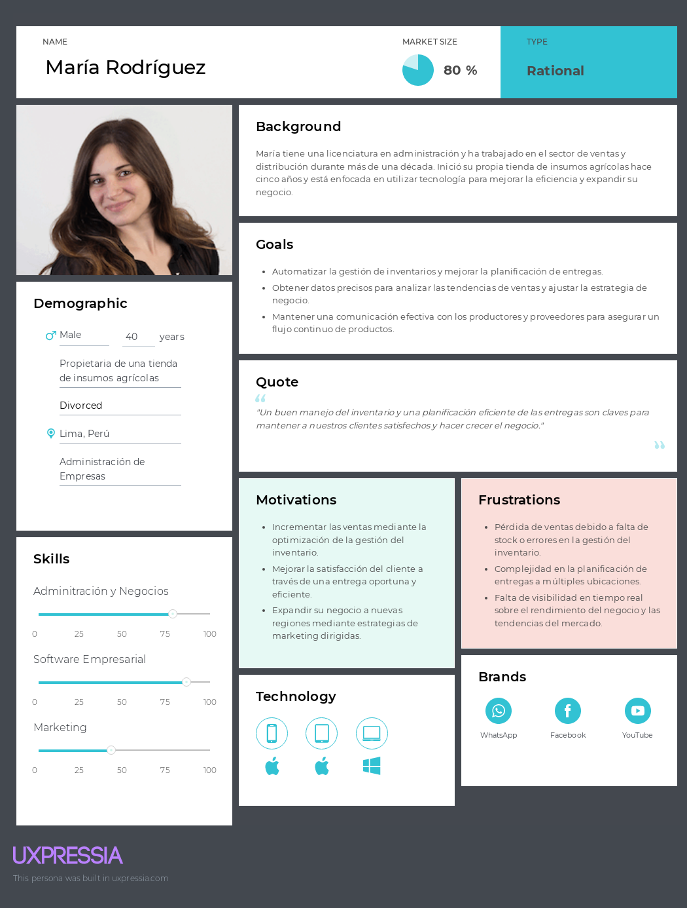

# Capítulo II: Requirements Elicitation & Analysis
## 2.3. Needfinding
### 2.3.1. User Personas

**Segmento Productor Agricola:**
Las User Personas desarrolladas para AgroControl representan los perfiles más relevantes de los usuarios identificados a partir de un exhaustivo análisis de entrevistas y estudios de la competencia. Estas personas capturan las motivaciones, desafíos, y comportamientos de los productores agrícolas y distribuidores, quienes son los usuarios principales de la plataforma.

El perfil de María Rodríguez, una distribuidora, resalta la necesidad de mejorar la gestión de inventarios y la planificación de entregas, motivada por el deseo de incrementar ventas y optimizar su negocio. Por otro lado, Juan Pérez, un productor agrícola, refleja las preocupaciones de los agricultores en la automatización de procesos como riego y fumigación, buscando reducir costos y mejorar la eficiencia operativa. Ambos perfiles fueron construidos para guiar el diseño del sistema, asegurando que la plataforma AgroControl responda adecuadamente a sus necesidades específicas y se alinee con las mejores prácticas del mercado.

**Segmento Distribuidor:**

### 2.3.2. User Task Matrix

| **Task**                             | **Productor Agrícola - Frecuencia** | **Productor Agrícola - Importancia** | **Distribuidor - Frecuencia** | **Distribuidor - Importancia** |
|--------------------------------------|------------------------------------|--------------------------------------|-------------------------------|-------------------------------|
| Monitorear el clima                  | High                               | High                                 |                               |                               |
| Planificar la siembra                | Medium                             | High                                 |                               |                               |
| Aplicar fertilizantes                | Medium                             | High                                 |                               |                               |
| Supervisar el crecimiento de cultivos| High                               | High                                 |                               |                               |
| Registrar la cosecha                 | Low                                | High                                 |                               |                               |
| Realizar análisis de suelo           | Low                                | Medium                               |                               |                               |
| Mantener el equipo agrícola          | Low                                | Medium                               |                               |                               |
| Controlar inventario                 |                                    |                                      | High                          | High                          |
| Programar rutas de entrega           |                                    |                                      | High                          | High                          |
| Coordinar con proveedores            |                                    |                                      | Medium                        | High                          |
| Realizar pedidos a proveedores       |                                    |                                      | Medium                        | High                          |
| Revisar informes de ventas           |                                    |                                      | Low                           | Medium                       |
| Gestionar la logística de transporte |                                    |                                      | High                          | High                          |
| Evaluar el desempeño de entrega      |                                    |                                      | Low                           | Medium                       |

### Explicación del User Task Matrix

El User Task Matrix presenta las tareas clave de los segmentos de Productor Agrícola y Distribuidor, destacando la frecuencia y la importancia de cada actividad para sus operaciones diarias.

**Tareas con Mayor Frecuencia e Importancia:**

- **Productor Agrícola:**
	- **Monitorear el clima:** Es una tarea de alta frecuencia y alta importancia, ya que las condiciones climáticas impactan directamente en la planificación de riego y fumigación, afectando la salud de los cultivos y el rendimiento general.
	- **Supervisar el crecimiento de los cultivos:** Esta tarea también es prioritaria, ya que permite al productor identificar problemas tempranamente y tomar decisiones informadas para corregir cualquier desvío en el crecimiento esperado.

- **Distribuidor:**
	- **Controlar inventario:** Es una tarea de alta frecuencia y alta importancia porque la gestión precisa del inventario es fundamental para evitar pérdidas por falta de stock o exceso de productos, asegurando la continuidad del negocio.
	- **Programar rutas de entrega:** La eficiencia en la planificación de entregas impacta directamente en la satisfacción del cliente y en la reducción de costos operativos, lo cual la convierte en una tarea crucial para el distribuidor.

**Principales Diferencias:**
- Las tareas del **Productor Agrícola** se enfocan en la gestión directa de los cultivos, el control de procesos de siembra, riego, fertilización y la supervisión constante del crecimiento de las plantas. Estas tareas son clave para optimizar la producción y reducir costos operativos.
- En contraste, las tareas del **Distribuidor** se centran más en la logística y la coordinación con proveedores, donde la precisión en el control del inventario y la optimización de rutas son esenciales para el buen funcionamiento del negocio y la satisfacción del cliente.

**Coincidencias:**
- Ambas User Personas comparten la necesidad de procesos eficientes y organizados para gestionar sus operaciones, ya sea en el campo o en la distribución. Ambos segmentos requieren información en tiempo real y sistemas que faciliten la toma de decisiones informadas para optimizar sus recursos y mejorar su productividad.

### 2.3.3. User Journey Mapping

La sección de User Journey Maps muestra el recorrido completo de los usuarios de AgroControl, abarcando desde el primer contacto con la app hasta su abandono. Este mapeo destaca las acciones, metas, emociones, y problemas experimentados por los productores agrícolas y distribuidores, así como oportunidades para mejorar su experiencia.

Para los **Productores Agrícolas**, el journey empieza con el descubrimiento de la app a través de marketing o recomendaciones y avanza hasta su uso para gestionar cultivos. Las emociones varían desde la ansiedad inicial hasta la alegría por mejorar su productividad. Los problemas incluyen dudas sobre los costos y dificultades en la personalización de funciones, lo que sugiere oportunidades como ofrecer pruebas gratuitas y mejorar la capacitación.

**Segmento Productor Agricola:**

El journey de los **Distribuidores** inicia al conocer la app en ferias o a través de socios comerciales. Pasan de la aceptación inicial a la satisfacción al mejorar la gestión de inventarios y entregas, pero pueden experimentar frustración por la falta de funciones avanzadas o personalización. Las oportunidades identificadas incluyen asistentes de configuración y características adaptadas a diferentes tamaños de negocios.

**Segmento Distribuidor:**

### 2.3.4. Empathy Mapping

A continuación se pueden apreciar los Empathy Mapping de los segmentos objetivos.

**Segmento Productor Agricola:**

**Segmento Distribuidor:**

En esta sección, el equipo presenta los Empathy Maps realizados para los User Personas de AgroControl utilizando la herramienta UXPressia. Estos mapas permiten capturar una comprensión detallada de los usuarios al explorar lo que piensan, sienten, ven, oyen, dicen y hacen, junto con sus pains (dolores) y gains (beneficios). A continuación, se detalla el proceso de elaboración para cada uno de los User Personas.

**Proceso de Elaboración:**

1. **Preparación y Enfoque en el User Persona**: Cada mapa comenzó con la identificación del User Persona en el centro:
	- **Juan Pérez**: Productor agrícola en Lima, enfocado en mejorar la gestión de su campo y la adopción de nuevas tecnologías.
	- **Carlos Ramírez**: Distribuidor de insumos agrícolas que busca optimizar la logística de su negocio y satisfacer mejor a sus clientes.

2. **Captura de Observaciones**: Para cada User Persona, se recopilaron observaciones del equipo en las secciones del Empathy Map:

	- **¿Con quién estamos empatizando?**: Juan es un agricultor con desafíos en la gestión eficiente del campo, mientras que Carlos se enfoca en la distribución efectiva de productos agrícolas.

	- **¿Qué necesitan hacer?**:
		- **Juan**: Gestionar eficientemente el campo, controlar los costos y acceder a herramientas para monitorear los cultivos.
		- **Carlos**: Mantener el control del inventario, coordinar con clientes y programar entregas de manera eficiente.

	- **¿Qué están viendo?**:
		- **Juan**: Observa un clima impredecible y una competencia que utiliza tecnología avanzada.
		- **Carlos**: Percibe una creciente demanda de productos y competencia que optimiza la logística.

	- **¿Qué están escuchando?**:
		- **Juan**: Escucha consejos de otros productores y preocupaciones sobre la planificación de recursos.
		- **Carlos**: Recibe comentarios de clientes sobre la rapidez de las entregas y sugerencias de su equipo.

	- **¿Qué están diciendo?**:
		- **Juan**: Expresa dificultades para obtener datos que guíen sus decisiones agrícolas.
		- **Carlos**: Habla sobre la necesidad de mejorar el control del inventario y la organización de las entregas.

	- **¿Qué están haciendo?**:
		- **Juan**: Supervisa el campo y busca formas de reducir costos.
		- **Carlos**: Supervisa la entrada y salida de productos, negociando y ajustando rutas de entrega.

	- **¿Cómo se sienten y qué piensan?**:
		- **Juan**: Siente la necesidad de innovar para reducir costos, pero enfrenta ansiedad por la adopción de nuevas tecnologías.
		- **Carlos**: Siente presión por mejorar la eficiencia y teme perder clientes por problemas logísticos.

3. **Identificación de Pains y Gains**:
	- **Pains**:
		- **Juan**: Tiempo limitado y dificultad para centralizar información y optimizar procesos.
		- **Carlos**: Problemas para mantener un control preciso del inventario y gestionar múltiples pedidos.

	- **Gains**:
		- **Juan**: Incremento de la productividad y mejora en el uso de los recursos.
		- **Carlos**: Mejor control del inventario y reducción del estrés operativo.

Estos Empathy Maps proporcionan una guía visual y detallada sobre las necesidades y desafíos de los usuarios, ayudando a AgroControl a desarrollar soluciones más alineadas con sus expectativas y mejorar la experiencia del usuario en la plataforma.

### 2.3.5. As-is Scenario Mapping

A continuación se pueden apreciar los As-Is Scenario de los segmentos objetivos.

**Segmento Productor Agricola:**

**Segmento Distribuidor:**

# Capítulo III: Requirements Specification
## 3.1. To-Be Scenario Mapping.
En esta sección se presentan los To-Be Scenario Mapping para cada segmento objetivo donde se reflejarán, a partir de los As-is Scenario Mapping, la experiencia de usuario ideal si se resuelven los puntos de dolor y necesidades. La herramienta empleada para su desarrollo ha sido Miro.

Segmento 1: Productor agricola

Segmento 2: Distribuidor

## 3.2. User Stories.
Redactamos historias de usuarios que nos ayuden a generar funciones del software que estamos desarrollando para los usuarios finales. Las épicas identificadas son: Landing page, Autenticación y perfil de usuario, Funcionalidades del productor agricola, Funcionalidades del distribuidor, Preferencias de la aplicación y Backend API

|Epic / Story ID|Título|Descripción|Criterio de aceptación|Relacionado con (Epic ID)|
| :- | :- | :- | :- | :- |
|**Epic 1: Landing page** **Como** visitante **Quiero** visualizar una página **Para** saber acerca de la aplicación e ingresar a la aplicación|||||
|E1-US101|
Barra de navegación en landing page
|**Como** visitante **quiero** una barra de navegación de landing page **para** tener accesos directos a la información de la aplicación |
**Escenario 1: El usuario quiere saber cómo funciona la aplicación**

**Dado que** el visitante se encuentra en el landing page

**Y** se dirige en la barra de navegación

**Cuando** presiona la opción “Características del producto”

**Entonces** es dirigido a la sección de características del producto.

**Escenario 2: El usuario quiere saber los testimonios de usuario que utilizaron la aplicación**
**Dado que** el visitante se encuentra en el landing page

**Y** se dirige en la barra de navegación

**Cuando** presiona la opción “Testimonios”

**Entonces** es dirigido a la sección de Testimonios

**Escenario 3: El usuario quiere hacer preguntas frecuentes de la aplicación**

**Dado que** el visitante se encuentra en el landing page

**Y** se dirige en la barra de navegación

**Cuando** presiona la opción “Preguntas Frecuentes”

**Entonces** es dirigido a la sección de Preguntas Frecuentes.
|1|
|E1-US102|Sección hero de landing page	|**Como** visitante **quiero** visualizar una sección hero en el landing page **para** tener una idea sobre lo que ofrece la aplicación|
**Escenario 1: El usuario se encuentra en la sección de hero**

**Dado que** el visitante se encuentra en el landing page

**Cuando** se encuentra en la sección de hero

**Entonces** visualiza una presentación de la aplicación.
|1|
|E1-US103|Sección de caracteristicas del producto de landing page|**Como** visitante **quiero** visualizar características de la aplicación en el landing page **para** saber sobre las características que ofrece la aplicación

|
**Escenario 1: El usuario se encuentra en la sección de características del producto**

**Dado que** el visitante se encuentra en el landing page

**Cuando** se encuentra en la sección del producto

**Entonces** visualiza características de la aplicación.

|1|
|E1-US104|Sección de testimonios en landing page|**Como** visitante **quiero** visualizar testimonios de usuarios que utilizaron la aplicación **para** saber sobre experiencias reales de usuarios

|
**Escenario 1: El usuario se encuentra en la sección de testimonios**

**Dado** que el visitante se encuentra en el landing page

**Cuando** se encuentra en la sección de testimonios

**Entonces** visualiza testimonios de usuario que utilizaron la aplicación.

|1|
|E1-US105|Sección de planes en landing page|**Como** visitante **quiero** visualizar los planes que ofrece la aplicación **para** considerar adquirir la membresía
|
**Escenario 1: El usuario se encuentra en la sección de planes**

**Dado** que el visitante se encuentra en el landing page

**Cuando** se encuentra en la sección de planes

**Entonces** visualiza los planes que la aplicación ofrece para funciones premium.

|1|
|E1-US106|Sección de footer a la aplicación en landing page|**Como** visitante **quiero** visualizar la sección de footer **para** acceder a links de la página
|
**Escenario 1: El usuario se encuentra en la sección de footer en landing page**

**Dado** que el visitante se encuentra en el landing page

**Cuando** se encuentra en la sección de footer

**Entonces** visualiza links de navegación.

|1|
|E1-US107|Sección para conocer al equipo de trabajo|**Como** visitante **quiero** conocer más sobre el equipo que desarrolla la aplicación **para** adquirir confianza de dicho equipo de trabajo.|
**Escenario 1: Visualización correcta**

**Dado que** el visitante se encuentra en el landing page

**Cuando** seleccione la sección “Sobre Nosotros” en la barra de navegación

**Entonces** se muestra la sección para conocer más sobre el equipo de trabajo.
|1|
|**Epic 2: Autenticación y perfil del usuario** **Como** productor agricola o distribuidor **Quiero** autenticar y configurar mi perfil del usuario **Para** ingresar a la aplicación|||||
|E2-US101|Registro e inicio de sesión|**Como** usuario **quiero** tener en la app un apartado de inicio de sesión **para** que se guarde mi información|
**Escenario 1: Usuario ingresa a la aplicación, y se encuentra con el inicio de sesión**

**Dado que** el usuario ya está en el inicio de sesión 

**Cuando** el usuario haga click en registrarse 

**Entonces** el sistema le mostrará un apartado donde podrá llenar su información

**Escenario 2: Usuario se registra** 

**Dado que** el usuario ya se encuentra en el apartado de registro 

**Cuando** el usuario complete todo el formulario de registro

**Entonces** el sistema guardará todos sus datos
|2|
|E2-US102|Formulario de login|**Como** usuario de la página web **quiero** ingresar con mi cuenta con la cual me registre **para** usar las herramientas a mi disposición.|
**Escenario 1: Iniciar sesión**

**Dado que** el usuario se encuentra en el formulario “Login”

**Cuando** ingrese el correo electrónico y contraseña

**Entonces** puede ingresar a la app de manera exitosa
|2|
|E2-US103|Recuperación de contraseñas |**Como** usuario **quiero** que la aplicación tenga un apartado que me permita recuperar mi contraseña en caso me olvide **para** ingresar a mi cuenta de usuario|
**Escenario 1: Usuario recupera su contraseña** 

**Dado que** el usuario está en la parte de inicio en el log in 

**Cuando** coloque una contraseña errónea más de 4 veces 

**Entonces** la aplicación mostrará un aviso de recuperación de contraseña con el correo brindado anteriormente 

**Escenario 2: Usuario olvidó su contraseña y no puede entrar a su cuenta**

**Dado que** el usuario olvida su contraseña y no puede entrar a su cuenta

**Cuando** el usuario entre a su correo y no logre cambiar su contraseña 

**Entonces** la aplicación mostrará un mensaje para que se contacte con soporte técnico  
|2|
|**Epic 3: Funcionalidades del productor agricola** **Como** productor agricola  **Quiero** funcionalidades de apoyo en la gestión del ciclo agrícola **Para** mejorar el rendimiento de los cultivos       |||||
|E3-US101|Pantalla de inicio productor agricola |**Como** productor agricola  **quiero** visualizar todos los registros de los cultivos que he creado **para** poder ver fácilmente el progreso de los mismos|
**Escenario 1: Visualización de los cultivos en la pantalla de inicio**

**Dado que** el productor agricola inicia sesion en la aplicación

**Cuando** está en la pantalla de inicio

**Entonces** puede ver todos los registros de cultivos que ha creado
|3|
|E3-US102|Barra de navegación del productor agricola |**Como** productor agricola **quiero** una barra de navegación **para** poder tener acceso directos a la informacion de la web app|
**Escenario 1: El productor agrícola quiere ver los campos registrados**

**Dado que** el productor agrícola ingresa a la aplicación **Y** se dirige a la barra de navegación

**Cuando** presiona la opción "Campos"

**Entonces** es dirigido a la sección de Campos

**Escenario 2: El productor agrícola quiere acceder a la tienda**
**Dado que** el productor agrícola ingresa a la aplicación **Y** se dirige a la barra de navegación

**Cuando** presiona la opción "Tienda"

**Entonces** es dirigido a la sección de Tiendas

**Escenario 3: El productor agrícola quiere gestionar el sistema de riego**

**Dado que** el productor agrícola ingresa a la aplicación **Y** se dirige en la barra de navegación

**Cuando** presiona la opción "Riego"

**Entonces** es dirigido a la sección de Riego.

**Escenario 4: El productor agrícola quiere gestionar el tratamiento**

**Dado que** el productor agrícola ingresa a la aplicación **Y** se dirige en la barra de navegación

**Cuando** presiona la opción "Tratamiento"

**Entonces** es dirigido a la sección de Tratamiento.

**Escenario 5: El productor agrícola quiere gestionar la cosecha**

**Dado que** el productor agrícola ingresa a la aplicación **Y** se dirige en la barra de navegación

**Cuando** presiona la opción "Cosecha"

**Entonces** es dirigido a la sección de Cosecha

**Escenario 6:El productor agrícola quiere gestionar sus finanzas**

**Dado que** el productor agrícola ingresa a la aplicación **Y** se dirige en la barra de navegación

**Cuando** presiona la opción "Finanzas"

**Entonces** es dirigido a la sección de Finanzas

**Escenario 7:El productor agrícola quiere salir de la aplicación**

**Dado que** el productor agrícola ingresa a la aplicación **Y** se dirige en la barra de navegación

**Cuando** presiona la opción "Salir"

**Entonces** saldra de la aplicación
|3|
|E3-US103|Crear campos de cultivo|**Como** productor agricola **quiero** crear campos de cultivo **para** poder monitorear facilmente el proceso agricola del campo|
**Escenario 1: Creación del campo de cultivo**

**Dado que** el productor agricola inicia sesion en la aplicación 

**Cuando** esta en la pantalla de inicio, debe ver la opción "+”, al seleccionarla, se muestra un formulario a completar que incluye: nombre de la semilla, cantidad de semillas sembradas, costo total de las semillas, nombre de los trabajadores y pago total de los trabajadores

**Y** después de completar el formulario y confirmar la publicación

**Entonces** puede ver la información del formulario creado.

**Escenario 2: Edición del campo de cultivo**

**Dado que** el productor agricola inicia sesion en la aplicación

**Cuando**  esta en la pantalla de inicio y ya ha creado el campo

**Entonces** se muestra la opción “Editar” con el cual puede editar la información del campo
|3|
|E3-US104|Programacion de fecha de riego de cultivos|**Como** productor agricola **quiero** funcionalidades de apoyo en el riego de cultivos **para** mejorar el cuidado de los cultivos|

**Escenario 1: Creación de fechas de riego de cultivo**

**Dado que** el productor agricola inicia sesion en la aplicación

**Cuando** accede a la opción “Riego” y presiona el boton "Agregar", se muestra un formulario y un calendario donde debe ingresar: las fechas de riego (de color celeste), nombre del campo, nombre de los trabajadores y el pago total de los trabajadores

**Y** después de completar el formulario y confirmar la publicación

**Entonces** se muestra una lista con la informacion del formulario

**Escenario 2: Eliminacion de fechas de riego de cultivo**

**Dado que** el productor agricola inicia sesion en la aplicación

**Cuando** accede a la opción “Riego” y ya ha programado las fechas de riego, se muestra la opción “Borrar” **Y** al seleccionarlo

**Entonces** se elimina de la lista la fecha seleccionada 
|3|
|E3-US105|Compra de productos para cultivos|**Como** productor agricola **quiero** realizar compras de manera online **para** usarlos en mis cultivos|

**Escenario 1: Compra exitosa del producto**

**Dado que** el productor agricola inicia sesion en la aplicación

**Cuando**acceda a la opción “Tienda”, los productos tienen la opción “Comprar” **Y** si el agricultor tiene el monto suficiente 

**Entonces** la compra es exitosa

**Escenario 2: Compra no exitosa del producto**
**Dado que** el productor agricola inicia sesion en la aplicación

**Cuando** acceda a la opción “Comprar productos”, los productos tienen la opción “Comprar” **Y** si el agricultor no tiene el monto suficiente

**Entonces** la compra no es exitosa
|3|
|E3-US106|Programacion de fechas de tratamiento|**Como** productor agricola **quiero** funcionalidades de apoyo en el proceso de tratamiento **para** mejorar el cuidado de los cultivos|
**Escenario 1: Creación de las fechas de fumigación**

**Dado que** el productor agricola inicia sesion en la aplicación

**Cuando** accede a la opción “Tratamiento” **Y** presiona el boton "Agregar", se mostrará un calendario y un formulario donde debera ingresar: las fechas de fumigacion(color gris),el tiempo, el nombre de los trabajadores, el pago total de los trabajadores y el tipo debe ser fumigación **Y** después de completar el formulario y confirmar la publicación

**Entonces** se muestra en la lista la informacion del formulario

**Escenario 2: Creación de las fechas de fertilización**

**Dado que** el productor agricola inicia sesion en la aplicación

**Cuando** accede a la opción “Tratamiento” **Y** presiona el boton "Agregar", se mostrará un calendario y un formulario donde debera ingresar: las fechas de fumigacion(color verde),el tiempo, el nombre de los trabajadores, el pago total de los trabajadores y el tipo debe ser fertilización **Y** después de completar el formulario y confirmar la publicación

**Entonces** se muestra en la lista la informacion del formulario

**Escenario 2: Eliminación de las fechas del tratamiento**

**Dado que** el productor agricola inicia sesion en la aplicación

**Cuando** accede a la opción “Tratamiento” y ya ha creado las fechas de Tratamiento, se muestra la opción "Borrar" **Y** al seleccionarlo

**Entonces** se elimina de la lista la fecha seleccionada
|3|
|E3-US107|Proceso de recolección de la cosecha|**Como** productor agricola  **quiero** funcionalidades de apoyo en la recolección de la cosecha **para** ver la productividad del trabajo elaborado|
**Escenario 1: Visualización de la información de recolección de la cosecha**

**Dado que** el productor agricola inicia sesion en la aplicación

**Cuando** acceda a la opción “Recolección”, se muestra un formulario donde debe ingresar: el nombre de la caja, el peso de la caja y la fecha de recolección

**Y** después de haber completado el formulario y confirmado la publicación

**Entonces** puede visualizar en la lista la información del formulario
|3|
|E3-US108|Proceso de análisis financiero de los cultivos|**Como** productor agricola **quiero** un análisis financiero **para** visualizar la utilidad del trabajo elaborado|
**Escenario 1: Añadir ganancia del producto**

**Dado que** el productor agricola inicia sesion en la aplicación

**Cuando** acceda a la opción “Finanzas”, debe registrar en la lista: el nombre del producto, la fecha de siembra, el peso de la caja y el precio por kg

**Y** después de haber completado el formulario y confirmado la publicación

**Entonces** puede visualizar la utilidad obtenida

**Escenario 2: Eliminación de la ganacia del producto**

**Dado que** el productor agricola inicia sesion en la aplicación

**Cuando** acceda a la opción “Finanzas” y ya ha registrado la ganacia del producto, se muestra la opcion "Borrar" **Y** al seleccionarlo

**Entonces** se elimina de la lista el producto seleccionado
|3|
|**Epic 4: Funcionalidades del distribuidor** **Como** distribuidor **Quiero** funcionalidades que me ayuden a gestionar mi tienda **Para** mejorar las ventas de los productos de mi tienda|||||
|E4-US101|Pantalla de inicio del distribuidor|**Como** distribuidor **quiero** gestionar mi tienda virtual **para** administrar de manera eficiente el inventario y los precios.|
**Escenario 1: Visualización de los productos de la tienda**

**Dado que** el distribuidor inicia sesion en la aplicación

**Cuando** esta en la pantalla de inicio

**Entonces** puede visualizar todos los productos que ha creado
|4|
|E4-US102|Crear productos en la tienda|**Como** distribuidor **quiero** crear productos en la tienda virtual **para** poder venderlos|
**Escenario 1: Creacion de productos en de la tienda**

**Dado que** el distribuidor inicia sesion en la aplicación

**Cuando** esta en la pantalla de inicio, se muestra la opción “Añadir producto”, al seleccionarlo se muestra un formulario donde debe ingresar: nombre del producto, cantidad del producto y coste total del producto

**Y** después de haber  completado el formulario y confirmado la publicación

**Entonces** puede visualizar todos los productos que ha ingresado

**Escenario 2: Edición de los productos**

**Dado que** el distribuidor inicia sesion en la aplicación

**Cuando** ya ha registrado sus productos, se muestra la opción “editar producto”, al seleccionarlo, puede editar el precio del producto o añadir más cantidad

**Y**  después de haber  completado el formulario y confirmado la publicación

**Entonces** puede visualizar los cambios que ha realizado
|4|
|E4-US103|Análisis de producto de la tienda|**Como** distribuidor **quiero** analizar los productos de mi tienda y su disponibilidad **para** optimizar mis decisiones de compra y maximizar mis ventas|
**Escenario 1: Visualización de los productos más vendidos**

**Dado que** el distribuidor inicia sesion en la aplicación

**Cuando** acceda a la opción “Productos más vendidos”

**Entonces** puede visualizar  todos los productos ordenados del más vendido al menos vendido

**Escenario 2: Visualización de disponibilidad del producto**

**Dado que** el distribuidor inicia sesion en la aplicación

**Cuando** acceda a la opción “Baja disponibilidad”

**Entonces** visualizará los productos ordenados de menor cantidad a mayor cantidad
|4|
|E4-US104|Proceso de análisis financiero de la tienda|**Como** distribuidor **quiero** un análisis financiero **para** visualizar la utilidad de mi tienda|
**Escenario 1: Visualización de la utilidad**

**Dado que** el distribuidor inicia sesion en la aplicación

**Cuando** acceda a la opción “Análisis financiero”

**Entonces** puede visualizar la utilidad obtenida
|4|
|E4-US105|Ofertas de la tienda de distribuidores|**Como** distribuidor **quiero** crear ofertas **para** captar el interés de mi público|
**Escenario 1: Creación de oferta**

**Dado que** el distribuidor inicia sesion en la aplicación

**Cuando** acceda a la opción “Crear ofertas”, al seleccionarlo tendrá que ingresar: los productos, la cantidad del producto y el nuevo precio

**Entonces** puede visualizar la información de la oferta creada

**Escenario 2: Análisis de ofertas**

**Dado que** soy distribuidor **Y** he iniciado sesión en la aplicación

**Cuando** acceda a la opción “Análisis de ofertas”

**Entonces** puede ver las ofertas más vendidas y la cantidad de comprada
|4|
|**Epic 5: Preferencias en la aplicación** **Como** usuario **Quiero** configurar preferencias en la aplicación **Para** tener una mejor experiencia en la aplicación según mis preferencias|||||
|E5-US101|Preferencia de idioma|**Como** usuario **quiero** configurar preferencias de idioma **para** utilizar la aplicación según mi preferencia de idioma|
**Escenario 1: Modo predeterminado de preferencia de idioma**

**Dado que** el usuario no haya realizado cambios de preferencias de idioma a la aplicación

**Cuando** ingrese a la aplicación 

**Entonces** el idioma predeterminado es inglés

**Escenario 2: Cambio de preferencias de idioma en la aplicación**

**Dado que** el usuario se encuentra en la sección de configuraciones de idioma

**Cuando** selecciona un idioma

**Entonces** la idioma de la aplicación se cambia al idioma seleccionado.
|5|
|E5-US102|Página no encontrada|**Como** usuario **quiero** ser informado de una página no encontrada en la aplicación **para** darme cuenta que estoy en una pagina errónea y volver al inicio. |
**Escenario 1: Error 404**

**Dado que** el usuario se encuentre en la aplicación

**Cuando** ingrese a una ruta que no existe

**Entonces** aparece una página que informa al usuario que la página no ha sido encontrada

**Y** aparece una opción para ser redirigido a la página principal.
|5|
|**Epic 6: Backend API** **Como** desarrollador **Quiero** utilizar un backend api **Para** que los usuarios puedan interactuar con la aplicación |||||
|E6-US101|Crear API Fake|**Como** desarrollador **quiero** crear una API fake **para** poder avanzar el desarrollo de la web app|
**Escenario 1: Creación de la API Fake**

**Dado que** desarrollador crea una API Fake

**Cuando** realice el consumo del API Fake

**Entonces** recibe datos simulados correctamente desde la API Fake y puede usarlos para desarrollar la web app 
|6|

## 3.3. Impact Mapping.
A continuación, toca analizar cómo se relacionan nuestras metas de negocios con los principales entregables de nuestro proyecto. Se eligieron las user stories de mayor importancia para el proceso de nuestro aplicativo y su impacto a futuro.

**Segmento Objetivo: Productor Agricola**

**Segmento Objetivo: Distribuidores**

## 3.4. Product Backlog.
Captura del tablero de Product Backlog en Trello:

**Link de Trello:** [Product Backlog WebWorks Trello](https://trello.com/b/UmnID3DF/webworks-product-backlog)
|# Orden|User story ID|Título|Descripción|Story Points (1 / 2 / 3 / 5 / 8)|
| :- | :- | :- | :- | :- |
|1|E1-US101|Barra de navegación en landing page|**Como** visitante **quiero** una barra de navegación de landing page **para** tener accesos directos a la información de la aplicación |1|
|2|E1-US102|Sección hero de landing page|**Como** visitante **quiero** visualizar una sección hero en el landing page **para** tener una idea sobre lo que ofrece la aplicación|2|
|3|E1-US103|Sección caracteristicas del producto de landing page|**Como** visitante **quiero** visualizar características de la aplicación en el landing page **para** saber sobre las características que ofrece la aplicación|2|
|4|E1-US104|Sección de testimonios en landing page|**Como** visitante **quiero** visualizar testimonios de usuarios que utilizaron la aplicación **para** saber sobre experiencias reales de usuarios|2|
|5|E1-US105|Sección de planes en landing page|**Como** visitante **quiero** visualizar los planes que ofrece la aplicación **para** considerar adquirir la membresía|2|
|6|E1-US106|Sección de footer a la aplicación en landing page|**Como** visitante **quiero** visualizar la sección de footer **para** acceder a links de la página|2|
|7|E1-US107|Sección para conocer al equipo de trabajo|**Como** visitante **quiero** conocer más sobre el equipo que desarrolla la aplicación **para** adquirir confianza de dicho equipo de trabajo.|2|
|8|E6-US101|Crear API Fake|**Como** desarrollador **quiero** crear una API fake **para** poder avanzar el desarrollo de la web app|2|
|9|E2-US101|Registro e inicio de sesión|**Como** usuario **quiero** tener en la app un apartado de inicio de sesión **para** que se guarde mi información|3|
|10|E2-US102|Formulario de login|**Como** usuario de la página web, **quiero** ingresar con mi cuenta con la cual me registre **para** usar las herramientas a mi disposición.|3|
|11|E2-US103|Recuperación de contraseñas |**Como** usuario **quiero** que la aplicación tenga un apartado que me permita recuperar mi contraseña en caso me olvide **para** ingresar a mi cuenta de usuario|3|
|12|E3-US101|Pantalla de inicio productor agrícola|**Como** productor agrícola **quiero** visualizar todos los registros de los cultivos que he creado **para** poder ver fácilmente el progreso de los mismos|3|
|13|E3-US102|Barra de navegación del productor agricola|**Como** productor agrícola **quiero** una barra de navegación **para** poder tener acceso directos a la informacion de la web app |3|
|14|E3-US103|Crear campos de cultivo|**Como** productor agricola **quiero** crear campos de cultivo **para** poder monitorear facilmente el proceso agricola del campo|3|
|15|E3-US104|Programacion de fecha de riego de cultivos|**Como** productor agrícola **quiero** funcionalidades de apoyo en el riego de cultivos **para** mejorar el cuidado de los cultivos|5|
|16|E3-US105|Compra de productos para cultivos|**Como** productor agrícola **quiero** realizar compras de manera online **para** usarlos en mis cultivos|5|
|17|E3-US106|Programacion de fechas de tratamiento|**Como** productor agrícola **quiero** funcionalidades de apoyo en el proceso de fumigación **para** mejorar el cuidado de los cultivos|5|
|18|E3-US107|Proceso de recolección de la cosecha|**Como** productor agrícola **quiero** funcionalidades de apoyo en la recolección de la cosecha **para** gestionar de manera eficiente el inventario y los preciosver la productividad del trabajo elaborado.|5|
|19|E3-US108|Proceso de análisis financiero de los cultivos|**Como** productor agrícola **quiero**un análisis financiero **para** visualizar la utilidad del trabajo elaborado |5|
|20|E5-US101|Preferencia de idioma|**Como** usuario **quiero**un análisis financiero **para** visualizar la utilidad del trabajo elaborado |2|
|21|E5-US102|Página no encontrada|**Como** usuario **quiero** ser informado de una página no encontrada en la aplicación **para** darme cuenta que estoy en una pagina errónea y volver al inicio|2|
|22|E4-US101|Pantalla de inicio del distribuidor|**Como** distribuidor **quiero** gestionar mi tienda virtual **para** administrar de manera eficiente el inventario y los precios|5|
|23|E4-US102|Análisis de producto de la tienda|**Como** distribuidor **quiero** analizar los productos de mi tienda y su disponibilidad **para** optimizar mis decisiones de compra y maximizar mis ventas|5|
|24|E4-US103|Proceso de análisis financiero de la tienda|**Como** distribuidor **quiero** un análisis financiero **para** visualizar la utilidad de mi tienda|5|
|25|E4-US104|Ofertas de la tienda de distribuidores|**Como** distribuidor **quiero** crear ofertas **para** captar el interés de mi público|3|